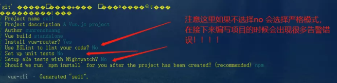
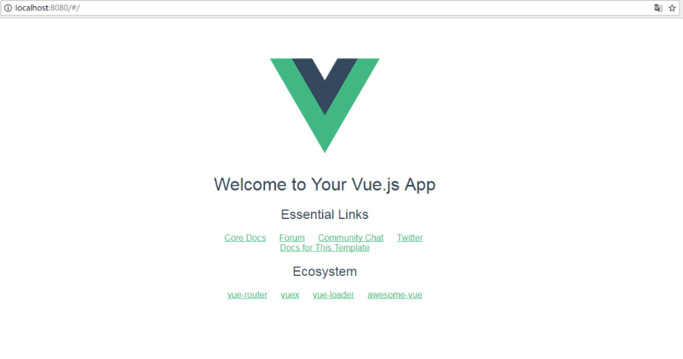

## 第一节 npm 常用命令

* 查看版本号
```
npm -v
```

* 全局安装Vue-cli
```
npm install -g vue-cli --registry=https://registry.npm.taobao.org
```

* 创建项目
```
npm install
```

* 启动项目
```
npm run dev
```

* 打包项目
```
npm run build
```


## 第二节 vue的安装

Vue-cli是VueJS的项目脚手架，使用Vue-cli可以快速创建Vue项目

一、Windows+R输入cmd打开命令行工具

二、安装node官方下载地址http://nodejs.cn/download/

三、命令行输入node -v 和npm -v查看是否出现版本号出现即为安装成功

四、全局安装Vue-cli使用命令npm install -g vue-cli下载完成后使用，
由于npm网站在国内速度非常慢，所以可以在命令后面加上淘宝的镜像 
即：npm install -g vue-cli --registry=https://registry.npm.taobao.org 

vue -V(大写)查看版本同上

五、创建项目 首先使用cd 进入到项目文件夹使用

vue init webpack  web-chat（自己定义）



六、cd web-chat 进入到项目文件下载依赖

npm install

七、启动项目

npm run dev

八、访问：localhost:8080

