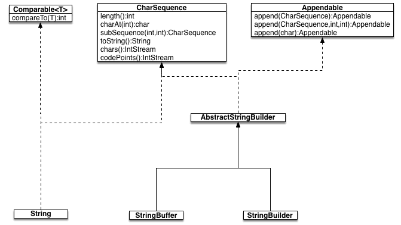
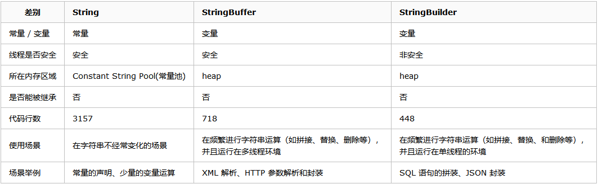

# String，StringBuffer，StringBuilder源码分析

## 1、String，StringBuffer，StringBuilder类关系图



## 2、三者之间的区别




## 3、String 常量池

为了减少在JVM中创建的字符串的数量，字符串类维护了一个字符串池，每当代码创建字符串常量时，JVM会首先检查字符串常量池。如果字符串已经存在池中，就返回池中的实例引用。如果字符串不在池中，就会实例化一个字符串并放到池中。


## 4、String创建对象示例
```
String s0 = "111";              //pool
String s1 = new String("111");  //heap
final String s2 = "111";        //pool
String s3 = "sss111";           //pool
String s4 = "sss" + "111";      //pool
String s5 = "sss" + s0;         //heap 
String s6 = "sss" + s1;         //heap
String s7 = "sss" + s2;         //pool
String s8 = "sss" + s0;         //heap

System.out.println(s3 == s4);   //true
System.out.println(s3 == s5);   //false
System.out.println(s3 == s6);   //false
System.out.println(s3 == s7);   //true
System.out.println(s5 == s6);   //false
System.out.println(s5 == s8);   //false
```
### 说明

* String str1 = new String("abc");  实际上创建两个对象，堆中创建新对象,常量池中创建"abc"。然后将引用给str1。**运行期完成创建。**
* String str2 = "abc";然后通过符号引用去字符串常量池里找有没有"abc",如果没有，则将"abc"存放进字符串常量池，并令str2指向”abc”，如果已经有”abc” 则直接令str2指向“abc”。“abc”存于常量池在**编译期间完成**
* 使用只包含常量的字符串连接符如"aa" + "aa"创建的也是常量,编译期就能确定,已经确定存储到String Pool中,String pool中存有“aaaa”；但不会存有“aa”。
* 使用包含变量的字符串连接符如"aa" + s1创建的对象是运行期才创建的,存储在heap中；只要s1是变量，不论s1指向池中的字符串对象还是堆中的字符串对象，运行期s1 + “aa”操作实际上是编译器创建了StringBuilder对象进行了append操作后通过toString()返回了一个字符串对象存在heap上。
* String s2 = "aa" + s1; String s3 = "aa" + s1; 这种情况，虽然s2,s3都是指向了使用包含变量的字符串连接符如"aa" + s1创建的存在堆上的对象，并且都是s1 + "aa"。但是却指向两个不同的对象，两行代码实际上在堆上new出了两个StringBuilder对象来进行append操作。在Thinking in java一书中285页的例子也可以说明。
* 对于final String s2 = "111"。s2是一个用final修饰的变量，在编译期已知，在运行s2+"aa"时直接用常量“111”来代替s2。所以s2+"aa"等效于“111”+ "aa"。在编译期就已经生成的字符串对象“111aa”存放在常量池中。

> 参考地址：   https://blog.csdn.net/xdugucc/article/details/78193805

### 总结
在运行速度方面StringBuffer<StringBuilder，这是因为StringBuffer由于线程安全的特性，常常应用于多线程的程序中，为了保证多线程同步一些线程就会遇到阻塞的情况，这就使得StringBuffer的运行时间增加，从而使得运行速度减慢；而StringBuilder通常不会出现多线程的情况，所以运行时就不会被阻塞，运行速度也自然就比StringBuffer快了。