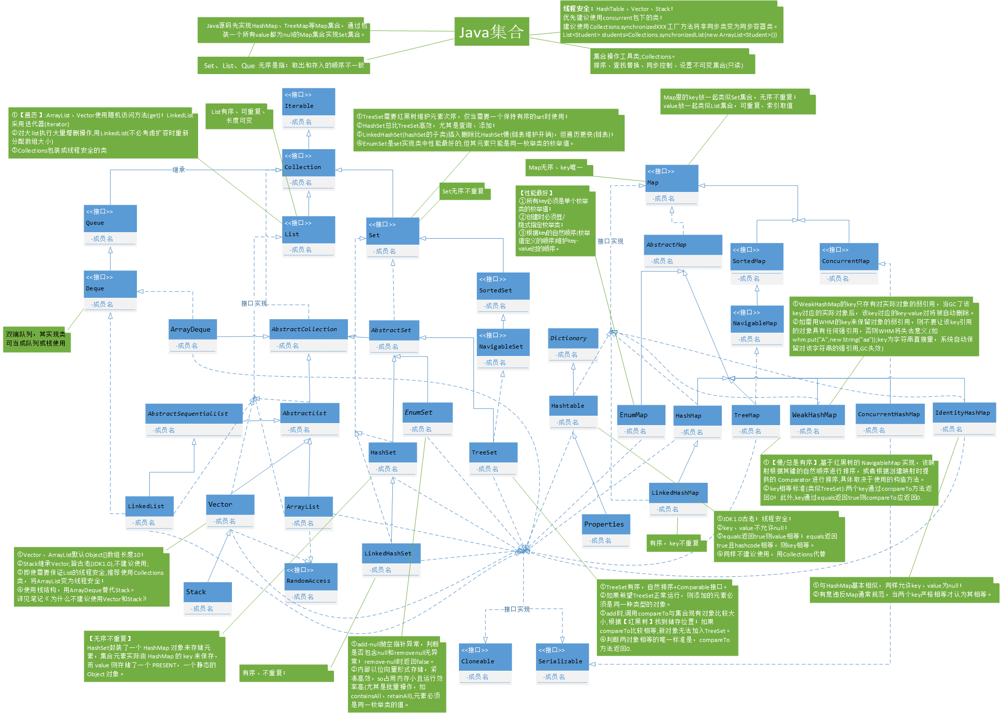
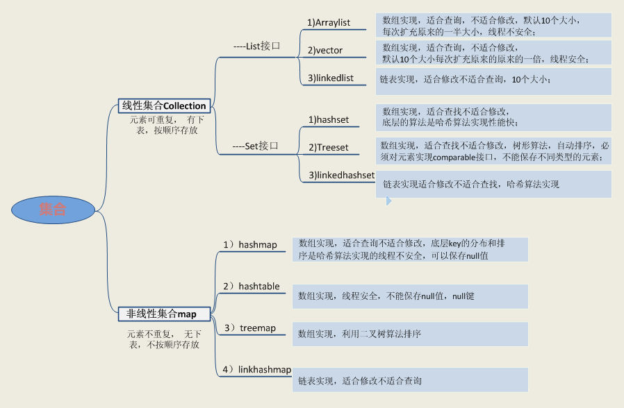
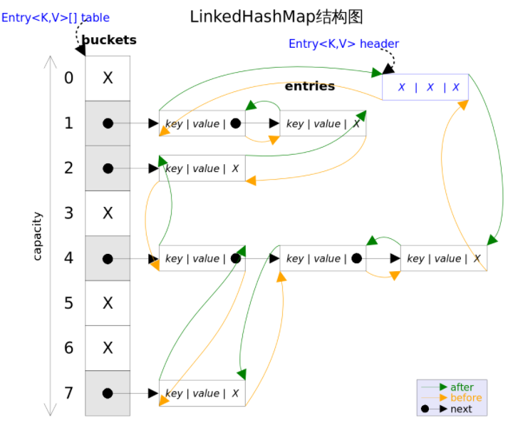
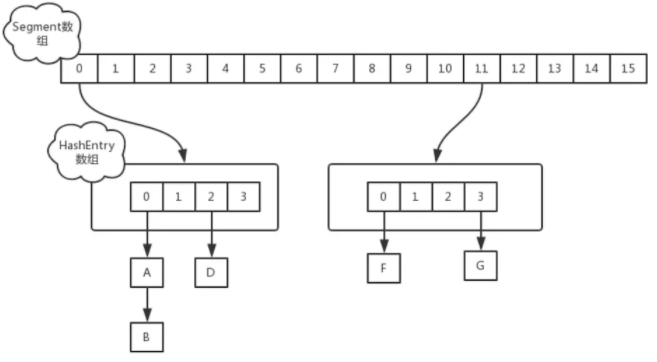
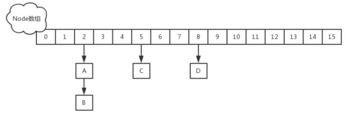

# java集合





**注意：**

①、集合只能存放对象。比如你存一个 int 型数据 1放入集合中，其实它是自动转换成 Integer 类后存入的，Java中每一种基本类型都有对应的引用类型。

②、集合存放的是多个对象的引用，对象本身还是放在堆内存中。

③、集合可以存放不同类型，不限数量的数据类型。

## 第一章 List集合

### 第一节 Arraylist类
* 底层是数组实现
* 初始容量为10，扩容原来的**一半**
* 按照添加的顺序存取，内部不自动再进行排序
* 查询为O(1)
* **线程非安全**


### 第二节 Vector类
* 底层是数组实现
* 初始容量为10，扩容原来的**一倍**
* 按照添加的顺序存取，内部不自动再进行排序
* 查询为O(1)
* **线程安全**效率低

### 第三节 LinkedList类
* 底层是双向循环链表
* 按照添加的顺序存取，内部不自动再进行排序
* 增删为O(1)，查找O(n)
* **线程非安全** 

**问题：如何解决LinkedList线程安全问题？**  
需要加锁处理。

**线程安全的：**
ConcurrentLinkedQueue  
它采用了“wait－free”算法来实现
>参考地址：：：http://ifeve.com/concurrentlinkedqueue/


## 第二章 Set集合

### 第一节 HashSet类
* 底层是 HashMap 默认初始容量是 16，加载因子是 0.75
* 存取顺序不一致，对象不能重复
* HashMap的key来实现各种特性，而HashMap的value始终都是PRESENT
* 允许null值，非线程安全。
* 元素的唯一性是靠所存储元素类型是否重写hashCode()和equals()方法来保证的，如果没有重写这两个方法，则无法保证元素的唯一性。
* **注意：如果equal方法判定是相同的对象，则不进行覆盖操作**
* **线程非安全**

**注意：在存取对象的时候， 要让哈希表存储不重复的元素，就必须重写hasCode和equals方法**
```
判断【如果equal方法判定是相同的对象，则不进行覆盖操作】依据的代码：

public class TestTreeSet {
    public static void main(String[] args) {
//        Set<Person2> person2s = new HashSet<>();
        Set<Person2> person2s = new TreeSet<>();
        person2s.add(new Person2("张山1", 20));
        person2s.add(new Person2("张山2", 16));
        person2s.add(new Person2("张山3", 13));
        person2s.add(new Person2("张山4", 17));
        person2s.add(new Person2("张山5", 20));
        person2s.forEach(System.out::println);
    }
}

class Person2 implements Comparable<Person2> {
    // 属性
    String name;
    int age;

    public Person2(String name, int age) {
        super();
        this.name = name;
        this.age = age;
    }

    // 要让哈希表存储不重复的元素，就必须重写hasCode和equals方法
    @Override
    public int hashCode() {
        return 1;
    }

    @Override
    public boolean equals(Object obj) {
        if (this.age == ((Person2) obj).age) {
            return true;
        } else {
            return false;
        }
    }

    @Override
    public String toString() {
        return "Person [name=" + name + ", age=" + age + "]";
    }

    @Override
    public int compareTo(Person2 o) {
        int result = this.age - o.age;

        return result;
    }
}
```


### 第二节 LinkedHashSet类
* 基于LinkedHashMap来实现的，初始容量16，加载因子0.75
* 存取顺序一致，元素唯一
* 可以存放null
* 非线程安全

### 第三节 TreeSet类
* 底层数据是TreeMap,只是我们操作的是TreeMap的Key
* TreeMap底层是 红黑树实现,默认按照asic码表的自然顺序排序
* 元素不允许为null值（但是可以通过写比较器实现）
* 存取顺序不一致，对象不能重复，如果出现重复就覆盖，添加元素的时候自动进行排序
* 数据越多越慢,TreeSet是依靠TreeMap来实现的

**应用：**  
在存储了大量的需要进行快速检索的排序信息的情况下，TreeSet是一个很好的选择

TreeSet保证元素的唯一性是有两种方式：  
>1、自定义对象实现Comparable接口，重写comparaTo方法，该方法返回0表示相等，小于0表示准备存入的元素比被比较的元素小，否则大于0；   

>2、在创建TreeSet的时候向构造器中传入比较器Comparator接口实现类对象，实现Comparator接口重写compara方法。   

>如果向TreeSet存入自定义对象时，自定义类没有实现Comparable接口，或者没有传入Comparator比较器时，会出现ClassCastException异常   

```
1)对象实现Comparable接口:

public class Person implements Comparable<Person>{
    // 属性
    private String name;
    private int age;
    
    // 构造方法
    public Person() {
        super();
        
    }
    public Person(String name, int age) {
        super();
        this.name = name;
        this.age = age;
    }
    
    // 要让哈希表存储不重复的元素，就必须重写hasCode和equals方法
    @Override
    public int hashCode() {
        final int prime = 31;
        int result = 1;
        result = prime * result + age;
        result = prime * result + ((name == null) ? 0 : name.hashCode());
        return result;
    }
    @Override
    public boolean equals(Object obj) {
        if (this == obj)
            return true;
        if (obj == null)
            return false;
        if (getClass() != obj.getClass())
            return false;
        Person other = (Person) obj;
        if (age != other.age)
            return false;
        if (name == null) {
            if (other.name != null)
                return false;
        } else if (!name.equals(other.name))
            return false;
        return true;
    }
    
    @Override
    public String toString() {
        return "Person [name=" + name + ", age=" + age + "]";
    }
    // getter & setter
   ...
    
    @Override
    public int compareTo(Person o) {
        int result = this.age - o.age;
        if (result == 0){
            return this.name.compareTo(o.name);
        }
        return result;
    }
}

```

```
2)比较器
public static void main(String[] args) {
    // 利用TreeSet来存储自定义类Person对象
    // 创建TreeSet对象的时候传入Comparator比较器，使用匿名内部类的方式
    // 比较规则是先按照 年龄排序，年龄相等的情况按照年龄排序
    TreeSet<Person> treeSet = new TreeSet<Person>(new Comparator<Person>() {
        @Override
        public int compare(Person o1, Person o2) {
            if (o1 == o2){
                return 0;
            }
            int result = o1.getAge() - o2.getAge();
            if (result == 0){
                return o1.getName().compareTo(o2.getName());
            }
            return result;
        }
        
    });
```

## 第三章 Collections

* static <T> boolean addAll(Collection<? super T> c, T... elements) 
  将所有指定的元素添加到指定的集合。  
* static <T> void copy(List<? super T> dest, List<? extends T> src) 
  将所有元素从一个列表复制到另一个列表中。  
* static boolean disjoint(Collection<?> c1, Collection<?> c2) 
  如果两个指定的集合没有共同的元素，则返回 true  
* static <T> void fill(List<? super T> list, T obj) 
  用指定的元素代替指定列表的所有元素。  
* static int frequency(Collection<?> c, Object o) 
  返回指定集合中与指定对象相等的元素数。  
* static <T> T max(Collection<? extends T> coll, Comparator<? super T> comp) 
  根据指定的比较器引发的顺序返回给定集合的最大元素。  
* static <T extends Object & Comparable<? super T>> T min(Collection<? extends T> coll) 
  根据其元素的 自然顺序返回给定集合的最小元素。  
* static void shuffle(List<?> list) 
  使用默认的随机源随机排列指定的列表。 
* static <T extends Comparable<? super T>> void sort(List<T> list) 
  根据其元素的natural ordering对指定的列表进行排序。  
* static <T> void sort(List<T> list, Comparator<? super T> c) 
  根据指定的比较器引起的顺序对指定的列表进行排序。  

## 第四章 Map集合

### 第一节 HashMap类
* 底层是hash表实现（数组+链表实现），速度特别快
* 初始size为16，扩容：newsize = oldsize*2，size一定为2的n次幂，加载因子0.75，扩容针对整个Map，每次扩容时，原来数组中的元素依次重新计算存放位置，并重新插入
* 最多只允许一条记录的键为null，允许多条记录的值为null
* 计算index方法：index = hash & (tab.length – 1)
* 相同key是做覆盖操作
* 存取无序，不会自动进行排序
* 非线程安全的
* 元素操作的复杂度，在不考虑hash碰撞的理想情况下为O(1),遇见hash冲突链表的数量小于8，复杂度为O(n),大于8链表转换红黑树复杂度降为O(logn)---jdk1.8
* 数据存储：先根据key的hashCode（使用key的hashCode()方法获取）重新计算hash值，根据hash值算出这个元素在数组中的位置（即下标）， 如果数组该位置上已经存放有其他元素了，那么在这个位置上的元素将以链表的形式存放，新加入的放在链头，最先加入的放在链尾。如果数组该位置上没有元素，就直接将该元素放到此数组中的该位置上。
* 数据读取：首先根据key的hashCode，找到其数组中对应位置的数据(可能只有一个数据，也可能是多个数据，其表现形式是一个链表)，然后通过key的equals方法在对应位置的链表中找到需要的元素。
* HashMap的迭代器（Iterator）是fail-fast迭代器，但是Hashtable的迭代器（enumerator）不是fail-fast的。如果有其它线程对HashMap进行的添加/删除元素，将会抛出ConcurrentModificationException，但迭代器本身的remove方法移除元素则不会抛出异常。这条同样也是Enumeration和Iterator的区别。
* 说明：jdk1.8中，如果同一个格子里的key不超过8个，使用链表结构存储；如果超过了8个，那么会调用treeifyBin函数，将链表转换为红黑树。  
* 哈希冲突：若干Key的哈希值按数组大小取模后，如果落在同一个数组下标上，将组成一条Entry链，对Key的查找需要遍历Entry链上的每个元素执行equals()比较。
* 加载因子：为了降低哈希冲突的概率，默认当HashMap中的键值对达到数组大小的75%时，即会触发扩容。因此，如果预估容量是100，即需要设定100/0.75＝134的数组大小。
* 空间换时间：如果希望加快Key查找的时间，还可以进一步降低加载因子，加大初始大小，以降低哈希冲突的概率。

**注意：如果HashMap的键(key)是自定义的对象，那么需要按规则定义它的equals()和hashCode()方法。**

**解决冲突主要有三种方法：**  
定址法，拉链法，再散列法。HashMap是采用拉链法解决哈希冲突的。 
注： 链表法是将相同hash值的对象组成一个链表放在hash值对应的槽位；    
* 开放定址法解决冲突的做法是：当冲突发生时，使用某种探查(亦称探测)技术在散列表中形成一个探查(测)序列。 
沿此序列逐个单元地查找，直到找到给定 的关键字，或者碰到一个开放的地址(即该地址单元为空)为止（若要插入，
在探查到开放的地址，则可将待插入的新结点存人该地址单元）。   
* 拉链法解决冲突的做法是： 将所有关键字为同义词的结点链接在同一个单链表中 。
若选定的散列表长度为m，则可将散列表定义为一个由m个头指针组成的指针数 组T[0..m-1]。
凡是散列地址为i的结点，均插入到以T[i]为头指针的单链表中。T中各分量的初值均应为空指针。
在拉链法中，装填因子α可以大于1，但一般均取α≤1。拉链法适合未规定元素的大小。   


### 第二节 Hashtable类
* 底层是hash表实现（数组+链表实现），因为是线程安全的所以效率较低
* 初始size为11，扩容：newsize = olesize*2+1，加载因子0.75
* hashtable的key和value都不允许为null。
* 计算index的方法：index = (hash & 0x7FFFFFFF) % tab.length


### 第二节 LinkedHashMap类
* LinkedHashMap是HashMap的子类，所以HashMap 有的特性，LinkedHashMap基本上都有。但是内部还有一个双向链表维护键值对的顺序，每个键值对既位于哈希表中，也位于双向链表中。LinkedHashMap支持两种顺序插入顺序 、 访问顺序
* key和值都允许为null
* key重复会进行值的覆盖，value允许重复
* 因为内部维护了一个链表，所以遍历的时候是存时候的顺序（有序）
* 非线程安全
* 如果需要同步，可以用 Collections的synchronizedMap方法使HashMap具有同步的能力

* 

* 参考网址：https://blog.csdn.net/woshixiazaizhe/article/details/83303990


### 第三节 TreeMap类
* 底层红黑树实现的,默认会对键进行排序，所以键必须实现Comparable接口或者使用外部比较器
* TreeMap实现SortedMap接口
* key不能为null，key不允许重复，value允许重复
* 查找、移除、添加操作的时间复杂度为log(n)
* 它的iterator 方法返回的迭代器是fail-fastl的。
* 线程非安全
* TreeMap也有两种排序方式：
>自然排序：TreeMap的所有key必须实现Comparable接口，而且所有key应该是同一个类的对象，否则将会抛出ClassCastException异常

>定制排序：创建TreeMap时，传入一个Comparator对象，该对象负责对TreeMap中所有key进行排序。采用定制排序时不要求Map的key实现Comparable接口

* 参考网址：https://www.imooc.com/article/72213  http://www.cnblogs.com/chenssy/p/3746600.html  https://www.cnblogs.com/skywang12345/p/3310928.html


### 第四节 CurrentHashMap类

* JDK5中添加了新的concurrent包，采用了分段锁技术
* 数据结构是由一个Segment数组和多个HashEntry组成，
Segment数组的意义就是将一个大的table分割成多个小的table来进行加锁，它即类似于HashMap的结构，即内部拥有一个Entry数组，数组中的每个元素又是一个链表,同时又是一个ReentrantLock（Segment继承了ReentrantLock）。
* 在JDK1.7中ConcurrentHashMap采用了数组+Segment+分段锁的方式实现。JDK8中ConcurrentHashMap参考了JDK8 HashMap的实现，采用了数组+链表+红黑树的实现方式来设计，内部大量采用CAS操作，这里我简要介绍下CAS。
* ConcurrentHashMap主要有三个实体类：ConcurrentHashMap（整个Hash表）,Segment（桶），HashEntry（节点）。
* val与next用volatile修饰，保证了可见性,volatile只能保证变量对各个线程的可见性，但不能保证原子性
* ConcurrentHashMap 与HashMap和Hashtable 最大的不同在于：put和 get 两次Hash到达指定的HashEntry，第一次hash到达Segment,第二次到达Segment里面的Entry,然后在遍历entry链表.
* 因为ssize用位于运算来计算（ssize <<=1），所以Segment的大小取值都是以2的N次方，无关concurrencyLevel的取值，当然concurrencyLevel最大只能用16位的二进制来表示，即65536，换句话说，Segment的大小最多65536个，没有指定concurrencyLevel元素初始化，Segment的大小ssize默认为 DEFAULT_CONCURRENCY_LEVEL =16

1、为什么使用ConcurrentHashMap
在多线程环境中使用HashMap的put方法有可能导致程序死循环，因为多线程可能会导致HashMap形成环形链表，即链表的一个节点的next节点永不为null，就会产生死循环。这时，CPU的利用率接近100%，所以并发情况下不能使用HashMap。

2、不同版本实现对比：  
在JDK1.7版本中，ConcurrentHashMap的数据结构是由一个Segment数组和多个HashEntry组成，主要实现原理是实现了锁分离的思路解决了多线程的安全问题，如下图所示：



jdk 1.8 取消了基于 Segment 的分段锁思想，改用 CAS + synchronized 控制并发操作，在某些方面提升了性能。并且追随 1.8 版本的 HashMap 底层实现，使用数组+链表+红黑树进行数据存储。


3、文章参考地址：    
https://www.jianshu.com/p/a7767e6ff2a2  https://www.cnblogs.com/Mainz/p/3546347.html  https://www.cnblogs.com/fsychen/p/9361858.html  https://blog.csdn.net/programerxiaoer/article/details/80040090 

4、应用场景：  
当有一个大数组或集合需要多个线程共享

**拓展：**  
CopyOnWriteArrayList和CopyOnWriteArraySet分别代替List和Set，主要是在遍历操作为主的情况下来代替同步的List和同步的Set，这也就是上面所述的思路：迭代过程要保证不出错，除了加锁，另外一种方法就是"克隆"容器对象。

ConcurrentLinkedQuerue是一个先进先出的队列。它是非阻塞队列。

ConcurrentSkipListMap可以在高效并发中替代SoredMap（例如用Collections.synchronzedMap包装的TreeMap）。

ConcurrentSkipListSet可以在高效并发中替代SoredSet（例如用Collections.synchronzedSet包装的TreeMap）。


## 第五章 集合排序以及去重


## 第四章 集合的应用场景


