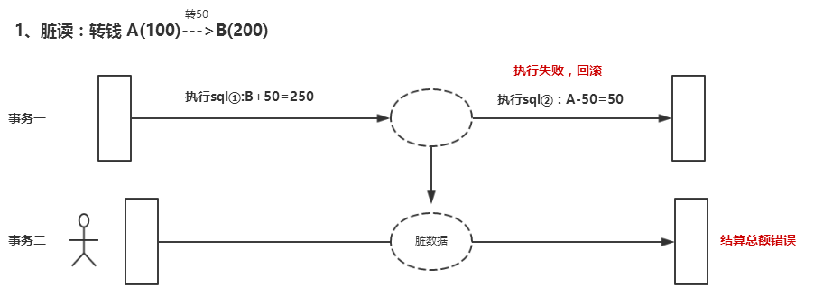
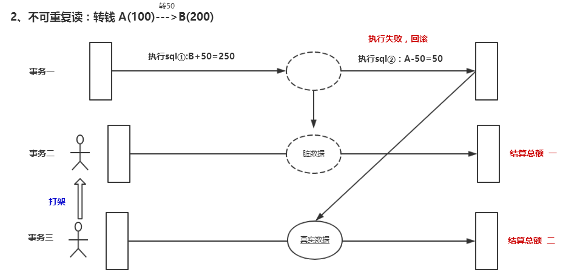
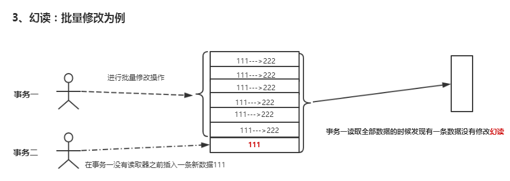

# spring事务
### 1、首先声明
````
* 在 MySQL 中只有使用了 Innodb 数据库引擎的数据库或表才支持事务。
* 事务处理可以用来维护数据库的完整性，保证成批的 SQL 语句要么全部执行，要么全部不执行。
* 事务用来管理 insert,update,delete 语句
````
 
### 2、事务的四个特性

**⑴ 原子性（Atomicity）**
　　原子性是指事务包含的所有操作要么全部成功，要么全部失败回滚，这和前面两篇博客介绍事务的功能是一样的概念，因此事务的操作如果成功就必须要完全应用到数据库，如果操作失败则不能对数据库有任何影响。

**⑵ 一致性（Consistency）**
　　一致性是指事务必须使数据库从一个一致性状态变换到另一个一致性状态，也就是说一个事务执行之前和执行之后都必须处于一致性状态。

　　拿转账来说，假设用户A和用户B两者的钱加起来一共是5000，那么不管A和B之间如何转账，转几次账，事务结束后两个用户的钱相加起来应该还得是5000，这就是事务的一致性。

**⑶ 隔离性（Isolation）**
　　隔离性是当多个用户并发访问数据库时，比如操作同一张表时，数据库为每一个用户开启的事务，不能被其他事务的操作所干扰，多个并发事务之间要相互隔离。

　　即要达到这么一种效果：对于任意两个并发的事务T1和T2，在事务T1看来，T2要么在T1开始之前就已经结束，要么在T1结束之后才开始，这样每个事务都感觉不到有其他事务在并发地执行。

　　关于事务的隔离性数据库提供了多种隔离级别，稍后会介绍到。

**⑷ 持久性（Durability）**
　　持久性是指一个事务一旦被提交了，那么对数据库中的数据的改变就是永久性的，即便是在数据库系统遇到故障的情况下也不会丢失提交事务的操作。

　　例如我们在使用JDBC操作数据库时，在提交事务方法后，提示用户事务操作完成，当我们程序执行完成直到看到提示后，就可以认定事务以及正确提交，即使这时候数据库出现了问题，也必须要将我们的事务完全执行完成，否则就会造成我们看到提示事务处理完毕，但是数据库因为故障而没有执行事务的重大错误。


### 3、事务属性

事务属性描述了事务策略如何应用到方法上事务属性包含5个方面：传播行为，隔离级别，回滚规则，事务超时，是否只读
* **传播行为：**
传播行为定义了客户端与被调用方法之间的事务边界，即传播规则回答了这样的一个问题，新的事务应该被启动还是挂起，或者方法是否要在事务环境中运行。

* **隔离级别：**
隔离级别定义了一个事务可能受其他并发事务影响的程度。多事务并发可能会导致脏读、幻读、不可重复读等各种读现象
ISOLATION_DEFAULT:使用后端数据库默认的规则
ISOLATION_READ_UNCOMMITTED:允许读取尚未提交的数据变更，可能会导致脏读，幻读或不可重复读
ISOLATION_READ_COMMITTED:允许读取并发事务已经提交的数据，可以防止脏读，但是幻读或不可重复读仍有可能发生
ISOLATION_REPEATABLE_READ:对同意字段的多次读取结果是一致的，除非数据是被本事务自己所修改，看阻止脏读和不可重复读，但幻读仍有可能发生
ISOLATIOM_SERIALIZABLE:完全服从ACID的隔离级别，确保阻止脏读，不可重复读以及幻读，这是最慢的数据隔离级别

* **回滚规则：**
事务回滚规则定义了哪些异常会导致事务回滚而哪些不会。默认情况下，（重）事务只有在遇到运行时期异常才回滚，而在遇到检查型异常时不会回滚。

* **事务超时：**
为了使应用程序很好地运行，事务不能运行太长时间。因为超时时钟会在事务开始时启动，所以只有对那些具备可能启动一个新事务的传播行为（PROPAGATION_REQUIRED,PROPAGATION_REQUIRED_NEW,PROPAGATION_NESTED）的方法来说，才有意义。

* **是否只读：**
如果事务只对后端的数据库进行读操作，数据库可以利用事务ID只读特性来进行一些特定的优化。通过将事务设置为只读，你就可以给数据库一个机会，让他应用它认为合适的优化措施。因为是否只读是在事务启动的时候由数据库实施的，所以只有对那些具备可能启动一个新事务的传播行为（PROPAGATION_REQUIRED,PROPAGATION_REQUIRED_NEW,PROPAGATION_NESTED）的方法来说，才有意义。


### 4、事务的隔离级别为了处理如下三种情况： 

  **1，脏读**
  
  
  　　脏读是指在一个事务处理过程里读取了另一个未提交的事务中的数据。
  
  　　当一个事务正在多次修改某个数据，而在这个事务中这多次的修改都还未提交，这时一个并发的事务来访问该数据，就会造成两个事务得到的数据不一致。例如：用户A向用户B转账100元，对应SQL命令如下
  
      update account set money=money+100 where name=’B’;  (此时A通知B)
  
      update account set money=money - 100 where name=’A’;
  　　当只执行第一条SQL时，A通知B查看账户，B发现确实钱已到账（此时即发生了脏读），而之后无论第二条SQL是否执行，只要该事务不提交，则所有操作都将回滚，那么当B以后再次查看账户时就会发现钱其实并没有转。
  
  
  **2，不可重复读**
  
  　　不可重复读是指在对于数据库中的某个数据，一个事务范围内多次查询却返回了不同的数据值，这是由于在查询间隔，被另一个事务修改并提交了。
  
  　　例如事务T1在读取某一数据，而事务T2立马修改了这个数据并且提交事务给数据库，事务T1再次读取该数据就得到了不同的结果，发送了不可重复读。
  
  　　不可重复读和脏读的区别是，脏读是某一事务读取了另一个事务未提交的脏数据，而不可重复读则是读取了前一事务提交的数据。
  
  　　在某些情况下，不可重复读并不是问题，比如我们多次查询某个数据当然以最后查询得到的结果为主。但在另一些情况下就有可能发生问题，例如对于同一个数据A和B依次查询就可能不同，A和B就可能打起来了……
  
  **3，虚读(幻读)**
  
  
  　　幻读是事务非独立执行时发生的一种现象。例如事务T1对一个表中所有的行的某个数据项做了从“1”修改为“2”的操作，这时事务T2又对这个表中插入了一行数据项，而这个数据项的数值还是为“1”并且提交给数据库。而操作事务T1的用户如果再查看刚刚修改的数据，会发现还有一行没有修改，其实这行是从事务T2中添加的，就好像产生幻觉一样，这就是发生了幻读。
  
  　　幻读和不可重复读都是读取了另一条已经提交的事务（这点就脏读不同），所不同的是不可重复读查询的都是同一个数据项，而幻读针对的是一批数据整体（比如数据的个数）。
### 5、事务的4种隔离级别
   
   　　① Serializable (串行化)：可避免脏读、不可重复读、幻读的发生。
   
   　　② Repeatable read (可重复读)：可避免脏读、不可重复读的发生。
   
   　　③ Read committed (读已提交)：可避免脏读的发生。
   
   　　④ Read uncommitted (读未提交)：最低级别，任何情况都无法保证。
   
   以上四种隔离级别最高的是Serializable级别，最低的是Read uncommitted级别，当然级别越高，执行效率就越低。像Serializable这样的级别，就是以锁表的方式(类似于Java多线程中的锁)使得其他的线程只能在锁外等待，所以平时选用何种隔离级别应该根据实际情况。在MySQL数据库中默认的隔离级别为Repeatable read (可重复读)。
   
    在MySQL数据库中，支持上面四种隔离级别，默认的为Repeatable read (可重复读)；而在Oracle数据库中，只支持Serializable (串行化)级别和Read committed (读已提交)这两种级别，其中默认的为Read committed级别。
    
### 6、事务的传播行为
常量名称常量解释

PROPAGATION_REQUIRED
>假如当前正要执行的事务不在另外一个事务里，那么就起一个新的事务   
比如说，ServiceB.methodB的事务级别定义为PROPAGATION_REQUIRED, 那么由于执行ServiceA.methodA的时候  
>>1、如果ServiceA.methodA已经起了事务，这时调用ServiceB.methodB，ServiceB.methodB看到自己已经运行在ServiceA.methodA的事务内部，就不再起新的事务。这时只有外部事务并且他们是共用的，所以这时ServiceA.methodA或者ServiceB.methodB无论哪个发生异常methodA和methodB作为一个整体都将一起回滚。  
>
>>2、如果ServiceA.methodA没有事务，ServiceB.methodB就会为自己分配一个事务。这样，在ServiceA.methodA中是没有事务控制的。只是在ServiceB.methodB内的任何地方出现异常，ServiceB.methodB将会被回滚，不会引起ServiceA.methodA的回滚  

PROPAGATION_SUPPORTS
>如果当前在事务中，即以事务的形式运行，如果当前不再一个事务中，那么就以非事务的形式运行 

PROPAGATION_MANDATORY
>必须在一个事务中运行。也就是说，他只能被一个父事务调用。否则，他就要抛出异常

PROPAGATION_REQUIRES_NEW
>启动一个新的, 不依赖于环境的 "内部" 事务. 这个事务将被完全 commited 或 rolled back 而不依赖于外部事务, 它拥有自己的隔离范围, 自己的锁, 等等. 当内部事务开始执行时, 外部事务将被挂起, 内务事务结束时, 外部事务将继续执行.   
 比如我们设计ServiceA.methodA的事务级别为PROPAGATION_REQUIRED，ServiceB.methodB的事务级别为PROPAGATION_REQUIRES_NEW，那么当执行到ServiceB.methodB的时候，ServiceA.methodA所在的事务就会挂起，ServiceB.methodB会起一个新的事务，等待ServiceB.methodB的事务完成以后，他才继续执行。他与PROPAGATION_REQUIRED 的事务区别在于事务的回滚程度了。因为ServiceB.methodB是新起一个事务，那么就是存在两个不同的事务。
>>1、如果ServiceB.methodB已经提交，那么ServiceA.methodA失败回滚，ServiceB.methodB是不会回滚的。
>
>>2、如果ServiceB.methodB失败回滚，如果他抛出的异常被ServiceA.methodA的try..catch捕获并处理，ServiceA.methodA事务仍然可能提交；如果他抛出的异常未被ServiceA.methodA捕获处理，ServiceA.methodA事务将回滚。

使用场景：
>不管业务逻辑的service是否有异常，Log Service都应该能够记录成功，所以Log Service的传播属性可以配为此属性。最下面将会贴出配置代码。

PROPAGATION_NOT_SUPPORTED
>当前不支持事务。比如ServiceA.methodA的事务级别是PROPAGATION_REQUIRED ，而ServiceB.methodB的事务级别是PROPAGATION_NOT_SUPPORTED ，那么当执行到ServiceB.methodB时，ServiceA.methodA的事务挂起，而他以非事务的状态运行完，再继续ServiceA.methodA的事务。

PROPAGATION_NEVER
>不能在事务中运行。假设ServiceA.methodA的事务级别是PROPAGATION_REQUIRED， 而ServiceB.methodB的事务级别是PROPAGATION_NEVER ，那么ServiceB.methodB就要抛出异常了。 

PROPAGATION_NESTED
>开始一个 "嵌套的" 事务,  它是已经存在事务的一个真正的子事务. 潜套事务开始执行时,  它将取得一个 savepoint. 如果这个嵌套事务失败, 我们将回滚到此 savepoint. 潜套事务是外部事务的一部分, 只有外部事务结束后它才会被提交. 

>比如我们设计ServiceA.methodA的事务级别为PROPAGATION_REQUIRED，ServiceB.methodB的事务级别为PROPAGATION_NESTED，那么当执行到ServiceB.methodB的时候，ServiceA.methodA所在的事务就会挂起，ServiceB.methodB会起一个新的子事务并设置savepoint，等待ServiceB.methodB的事务完成以后，他才继续执行。。因为ServiceB.methodB是外部事务的子事务，那么
>>1、如果ServiceB.methodB已经提交，那么ServiceA.methodA失败回滚，ServiceB.methodB也将回滚。
>
>>2、如果ServiceB.methodB失败回滚，如果他抛出的异常被ServiceA.methodA的try..catch捕获并处理，ServiceA.methodA事务仍然可能提交；如果他抛出的异常未被ServiceA.methodA捕获处理，ServiceA.methodA事务将回滚。


>理解Nested的关键是savepoint。他与PROPAGATION_REQUIRES_NEW的区别是：
PROPAGATION_REQUIRES_NEW 完全是一个新的事务,它与外部事务相互独立； 而 PROPAGATION_NESTED 则是外部事务的子事务, 如果外部事务 commit, 嵌套事务也会被 commit, 这个规则同样适用于 roll back. 


### 7、事物配置方式
事务属性的配置方式通过以下关键字来指定：
```
关键字        含义
isolation    指定事务的隔离级别
propagation    定义事务的传播规则
read-only    指定事务为只读
rollback-for
no-rollback-for    rollback-for指定事务对哪些检查型异常应当回滚而不提交
no-rollback-for指定事务对哪些异常应当继续执行而不回滚
timeout    对于长时间运行的事务定义超时时间
```

XML中AOP事务属性的配置方式如下：
```
<!-- 2.基于xml配置的声明事务范围及类型  定义通知， 通知中要处理的就是事务 -->
 <tx:advice id="txAdvice" transaction-manager="txManager">
    <tx:attributes>
        <!-- 配置具体方法事务属性
            isolation:事务隔离级别，默认为数据库隔离级别   
            propagation:事务传播行为：默认是同一事务
            timeout="-1":事务超时时间，默认值使用数据库的超时时间
            read-only="false":事务是否只读，默认是可读写
            rollback-for:遇到那些异常就回滚，其他都不回滚
            no-rollback-for:遇到那些异常不会滚， 其他都回滚        
         -->
        <tx:method name="save"  propagation="REQUIRED" isolation="DEFAULT" 
            read-only="false" rollback-for="java.lang.NullPointException"/>
        <!-- 支持通配符 -->
        <tx:method name="find*" read-only="true"/>
        <tx:method name="add*"/>
        <tx:method name="update*"/>
        <tx:method name="delete*"/>
    </tx:attributes>
  </tx:advice>
注解中事务属性的配置方式如下：
@Transaction(propagation=Propagation. REQUIRED,readOnly=true)
public void add(String username){
    //...
}
```

### 8、springboot进行@Transactional配置说明
https://www.cnblogs.com/caoyc/p/5632963.html