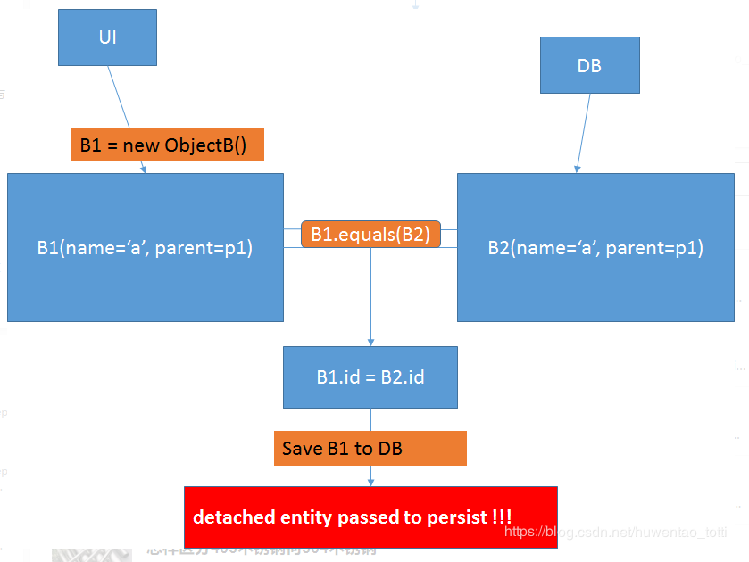

# JPA的多对多保存的问题

## 折磨了我5个小时的问题。必须记录一下

ave。
JPA save对象的时候有时候会遇到如题的错误，可能有两种原因：

1.该对象定义的是自动生成id的方式，insert的时候写入的id在数据库中已存在。

    网上搜到的比较多的都是这种情况，但个人认为，实际项目中这么玩的情况很少，生成新对象谁会自己写入id。

2.笔者实际项目遇到的场景：对象A与对象B为一对多关系，即A中包含一个Set<B>类型成员，前端传来一堆数据，后台把这些数据组装成B对象，save到数据库中，然后将生成的对象set到A下面的这个Set<B>成员中。

但是，由于中间有某些复杂逻辑原因，这里不是直接拿数据库里save成功的B对象来set的，而是拿一开始组装出来的List<B>（即根据前端传来的数据new出来的对象）跟数据库数据对比，业务上的主键相同则认为已存在，然后拿出id set到前面的List<B>中，误以为只要往里面设置了主键，数据库就会知道这是一个已存在的对象，save会自动变成merge。其实不然，这个B对象虽然设置了一个已存在的主键，但这个对象任然处于一种detach的状态（关于hibernate中的几种状态，参考深入hibernate的三种状态），不被sessio托管，save的时候还是当成一个新对象进行insert。

一张图表示：

解决方案当然时用数据库中查询出来的对象来代替new出来的对象进行save.

总结：自己对hibernate的session以及对象状态不清楚