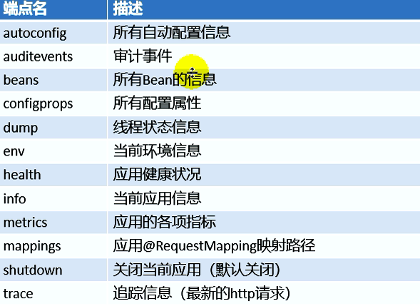

# springboot学习笔记—（下）

## 第一章 缓存的使用

### 第一节注解说明
**1）@EnableCaching**

>添加在主控制类上，开启缓存

**2）@Cacheable**
>添加在方法上，将查询的结果添加进缓存中，第二次查询直接缓存中获取结果

**属性说明：**
```  
cacheNames/value：指定缓存组件的名字;将方法的返回结果放在哪个缓存中，是数组的方式，可以指定多个缓存；

key：缓存数据使用的key；可以用它来指定。默认是使用方法参数的值  1-方法的返回值
                     编写SpEL； #id;参数id的值   #a0  #p0  #root.args[0]
                     getEmp[2]

keyGenerator：key的生成器；可以自己指定key的生成器的组件id
                  key/keyGenerator：二选一使用;

cacheManager：指定缓存管理器；或者cacheResolver指定获取解析器

condition：指定符合条件的情况下才缓存；
     condition = "#id>0"
     condition = "#a0>1"：第一个 参数的值大于1的时候才进行缓存
     
     
unless:否定缓存；当unless指定的条件为true，方法的返回值就不会被缓存；可以获取到结果进行判断
    unless = "#result == null"
    unless = "#a0==2":如果第一个参数的值是2，结果不缓存；
    
sync：是否使用异步模式
```

**3）@CachePut**
>先调用目标方法，然后将目标方法的返回值放到缓存中

>注意：key要保证和缓存数据中的key保持一致，否则更新失败。
```
key = "#employee.id":使用传入的参数的员工id；
key = "#result.id"：使用返回后的id
@Cacheable的key是不能用#result
```
        

**4）@CacheEvict**

>缓存清除
``` 
*  key：指定要清除的数据
*  allEntries = true：指定清除这个缓存中所有的数据
*  beforeInvocation = false：缓存的清除是否在方法之前执行
*      默认代表缓存清除操作是在方法执行之后执行;如果出现异常缓存就不会清除
*
*  beforeInvocation = true：
*      代表清除缓存操作是在方法运行之前执行，无论方法是否出现异常，缓存都清除
```

**5）@Caching** 
>定义复杂的缓存规则
```
@Caching(
         cacheable = {
             @Cacheable(/*value="emp",*/key = "#lastName")
         },
         put = {
             @CachePut(/*value="emp",*/key = "#result.id"),
             @CachePut(/*value="emp",*/key = "#result.email")
         }
    )
```

**6）@CacheConfig(cacheNames = "emp")**
>将公共方法提取出来
```
//@CacheConfig(cacheNames = "emp")
@Service
public class EmpService {
```
### 第二节  运行原理

```
原理：
     *   1、自动配置类；CacheAutoConfiguration
     *   2、缓存的配置类
     *   org.springframework.boot.autoconfigure.cache.GenericCacheConfiguration
     *   org.springframework.boot.autoconfigure.cache.JCacheCacheConfiguration
     *   org.springframework.boot.autoconfigure.cache.EhCacheCacheConfiguration
     *   org.springframework.boot.autoconfigure.cache.HazelcastCacheConfiguration
     *   org.springframework.boot.autoconfigure.cache.InfinispanCacheConfiguration
     *   org.springframework.boot.autoconfigure.cache.CouchbaseCacheConfiguration
     *   org.springframework.boot.autoconfigure.cache.RedisCacheConfiguration
     *   org.springframework.boot.autoconfigure.cache.CaffeineCacheConfiguration
     *   org.springframework.boot.autoconfigure.cache.GuavaCacheConfiguration
     *   org.springframework.boot.autoconfigure.cache.SimpleCacheConfiguration【默认】
     *   org.springframework.boot.autoconfigure.cache.NoOpCacheConfiguration
     *   3、哪个配置类默认生效：SimpleCacheConfiguration；
     *
     *   4、给容器中注册了一个CacheManager：ConcurrentMapCacheManager
     *   5、可以获取和创建ConcurrentMapCache类型的缓存组件；他的作用将数据保存在ConcurrentMap中；

```

### 第三节  运行流程
```
运行流程：
     *   @Cacheable：
     *   1、方法运行之前，先去查询Cache（缓存组件），按照cacheNames指定的名字获取；
     *      （CacheManager先获取相应的缓存），第一次获取缓存如果没有Cache组件会自动创建。
     *   2、去Cache中查找缓存的内容，使用一个key，默认就是方法的参数；
     *      key是按照某种策略生成的；默认是使用keyGenerator生成的，默认使用SimpleKeyGenerator生成key；
     *          SimpleKeyGenerator生成key的默认策略；
     *                  如果没有参数；key=new SimpleKey()；
     *                  如果有一个参数：key=参数的值
     *                  如果有多个参数：key=new SimpleKey(params)；
     *   3、没有查到缓存就调用目标方法；
     *   4、将目标方法返回的结果，放进缓存中
     *
     *   @Cacheable标注的方法执行之前先来检查缓存中有没有这个数据，默认按照参数的值作为key去查询缓存，
     *   如果没有就运行方法并将结果放入缓存；以后再来调用就可以直接使用缓存中的数据；
     *
     *   核心：
     *      1）、使用CacheManager【ConcurrentMapCacheManager】按照名字得到Cache【ConcurrentMapCache】组件
     *      2）、key使用keyGenerator生成的，默认是SimpleKeyGenerator
     *
```

### 第四节 使用示例
```
第一步：启动类开启缓存
@MapperScan(value = "com.songjn.springboot_cache.mapper")
@EnableCaching
@SpringBootApplication
public class SpringbootCacheApplication {
    public static void main(String[] args) {
        SpringApplication.run(SpringbootCacheApplication.class, args);
    }
}

第二步：service层使用缓存
//@CacheConfig(cacheNames = "emp")//将公共属性提取出来
@Service
public class EmpService {
    @Resource
    private EmployeeMapper empDao;

    //将查询到的数据进行缓存
    @Cacheable(value = "emp"/*, keyGenerator = "myKeyGenerator", condition = "#id==2"*/)
    public String findEmpById(Integer id) {
        System.out.println("---EmpService---findEmpById()---");
        Employee emp = empDao.getEmpById(id);
        String empJson = JSON.toJSONString(emp);
        System.out.println("emp：：：" + emp);
        return empJson;
    }

    /**
     * 注意：key要保证和缓存数据中的key保持一致，否则更新失败。
     * 应该是更新后的员工；
     * key = "#employee.id":使用传入的参数的员工id；
     * key = "#result.id"：使用返回后的id
     *
     * @param employee
     * @return
     * @Cacheable的key是不能用#result
     */
    @CachePut(value = "emp", key = "#employee.id")
    public String updateEmp(Employee employee) {
        System.out.println("---EmpService---updateEmp()---");
        Integer integer = empDao.updateEmp(employee);
        System.out.println("int=" + integer);
        return JSON.toJSONString(employee);
    }

    @CacheEvict(value = "emp", key = "#id")
    public String delEmp(Integer id) {
        System.out.println("---EmpService---delEmp()---");
        Integer integer = empDao.delEmp(id);
        System.out.println("int=" + integer);
        String response = integer > 0 ? "success" : "失败";
        return response;
    }
    // @Caching 定义复杂的缓存规则
    @Caching(
            cacheable = {
                    @Cacheable(value="emp",key = "#lastName")
            },
            put = {
                    @CachePut(value="emp",key = "#result.id"),
                    @CachePut(value="emp",key = "#result.email")
            }
    )
    public Employee getEmpByLastName(String lastName){
        System.out.println("---EmpService---getEmpByLastName()---");
        Employee emp = empDao.getEmpByLastName(lastName);
        return emp;
    }
}

```

## 第二章 springbooot整合redis
redis中文网：`http://redis.cn/`
### 第一节 docker安装redis

1）连接docker中国，下载命令：
```
docker pull registry.docker-cn.com/library/镜像名称
docker pull registry.docker-cn.com/library/redis
```
2）启动redis
```
docker run -d -p 6379:6379 --name=myredis  registry.docker-cn.com/library/redis
```
4）工具连接 redis  
RedisDesktopManager工具进行连接

5）进行简单命令测试

### 第二节 项目中引入redis
1）添加pom文件依赖
```
<dependency>
    <groupId>org.springframework.boot</groupId>
    <artifactId>spring-boot-starter-redis</artifactId>
</dependency>
```

2）yml文件中配置redis

```
spring:
  redis:
    host: 192.168.0.104
```
### 第三节 项目中使用redis

1）注入两个操作redis对象：

```
@Autowired
private RedisTemplate redisTemplate;

@Autowired
private StringRedisTemplate stringRedisTemplate;

```

2）对redis常见数据类型进行操作测试

```
 * Redis常见的五大数据类型
 *  String（字符串）、List（列表）、Set（集合）、Hash（散列）、ZSet（有序集合）
 *  stringRedisTemplate.opsForValue()[String（字符串）]
 *  stringRedisTemplate.opsForList()[List（列表）]
 *  stringRedisTemplate.opsForSet()[Set（集合）]
 *  stringRedisTemplate.opsForHash()[Hash（散列）]
 *  stringRedisTemplate.opsForZSet()[ZSet（有序集合）]
```

3）对字符串进行存储
```
Integer append = stringRedisTemplate.opsForValue().append("msg", "hello");
String msg = stringRedisTemplate.opsForValue().get("msg");
```
4）对集合类型存储
```
stringRedisTemplate.opsForList().leftPush("myList", "1");
stringRedisTemplate.opsForList().leftPush("myList", "3");
```
5）对对象存储
```
//存在缓存中是java序列化器进行序列化
redisTemplate.opsForValue().set("emp-songjn", JSON.toJSONString(emp));
Object o = redisTemplate.opsForValue().get("emp-songjn");

```

```
//使用自定义json序列化器存到redis中
empRedisTemplate.opsForValue().set("emp-songjn", emp);
Employee employee = empRedisTemplate.opsForValue().get("emp-songjn");

需要进行序列化器的配置
@Configuration
public class MyRedisConfig {
    @Bean
    public RedisTemplate<Object, Employee> redisTemplate(RedisConnectionFactory redisConnectionFactory) throws UnknownHostException {
        RedisTemplate<Object, Employee> template = new RedisTemplate();
        template.setConnectionFactory(redisConnectionFactory);
        Jackson2JsonRedisSerializer<Employee> employeeJackson2JsonRedisSerializer = new Jackson2JsonRedisSerializer<Employee>(Employee.class);
        template.setDefaultSerializer(employeeJackson2JsonRedisSerializer);
        return template;
    }
}
```
### 第四节 redis作为缓存
```
三、整合redis作为缓存
 * Redis 是一个开源（BSD许可）的，内存中的数据结构存储系统，它可以用作数据库、缓存和消息中间件。
 * 	1、安装redis：使用docker；
 * 	2、引入redis的starter
 * 	3、配置redis
 * 	4、测试缓存
 * 		原理：CacheManager===Cache 缓存组件来实际给缓存中存取数据
 *		1）、引入redis的starter，容器中保存的是 RedisCacheManager；
 *		2）、RedisCacheManager 帮我们创建 RedisCache 来作为缓存组件；RedisCache通过操作redis缓存数据的
 *		3）、默认保存数据 k-v 都是Object；利用序列化保存；如何保存为json
 *   			1、引入了redis的starter，cacheManager变为 RedisCacheManager；
 *   			2、默认创建的 RedisCacheManager 操作redis的时候使用的是 RedisTemplate<Object, Object>
 *   			3、RedisTemplate<Object, Object> 是 默认使用jdk的序列化机制
 *      4）、自定义CacheManager；
 ```
## 第三章 springbooot整合RabbitMQ
### 第一节 RabbitMQ原理 

```
视频：
13、消息-JMS&AMQP简介
14、消息-RabbitMQ基本概念简介
15、消息-RabbitMQ运行机制
```
### 第二节 RabbitMQ安装
1）查找RabbitMQ，地址：`https://hub.docker.com/`

2）寻找标签带management的，有管理界面，然后进行下载
```
docker pull registry.docker-cn.com/library/rabbit:3-management 
```
3）启动运行镜像
```
docker run -d -p 5672:5672 -p 15672:15672 --name=myrabbit_0325  4d6576293cb8 

5672:客户端和mq通讯端口
15672：管理界面端口
```
4）进入管理界面
```
访问地址：主机IP+15672
用户名/密码：guest
```
|Overview|Connections|Channels|Exchanges|Queues|Admin|
|:--------|:---|:---| :---| :---| :---| 
|概览信息|监控当前连接|信道|交换器|消息队列|管理控制台（添加账户、虚拟主机）|

5）创建三个交换器（exchange）
```
name：exchange.direct
type:direct
Durability(是否是持久化):Durable(持久化，下次重启交换器还在)

最后添加队列
exchange.direct 点对点
exchange.topic 发布订阅
exchange.fanout 广播
```
6）创建队列
songjn
songjn.news
songjn.emps
lenovo.news

7）将队列和交换器进行绑定

8）进行发送消息接收消息的测试

### 第三节 Rabbit的使用
1）引入依赖
```
<dependency>
    <groupId>org.springframework.boot</groupId>
    <artifactId>spring-boot-starter-amqp</artifactId>
</dependency>
```
2）进行测试
```
public class SpringbootRabbitmqApplicationTests {

    @Autowired
    private RabbitTemplate rabbitTemplate;

    @Test
    public void contextLoads() {
        //Message需要自己构造一个;定义消息体内容和消息头
        //rabbitTemplate.send(exchage,routeKey,message);

        //object默认当成消息体，只需要传入要发送的对象，自动序列化发送给rabbitmq；
        //rabbitTemplate.convertAndSend(exchage,routeKey,object);
        Map<String, Object> map = new HashMap<>();
        map.put("msg", "这是第一个消息");
        map.put("data", Arrays.asList("helloworld", 123, true));
        //对象被默认序列化以后发送出去
        rabbitTemplate.convertAndSend("exchange.direct", "songjn", map);
    }
}


/**
 * 广播
 */
@Test
public void sendMsg(){
    rabbitTemplate.convertAndSend("exchange.fanout","",new Book("红楼梦","曹雪芹"));
}


发送数据
//对象被默认序列化以后发送出去
rabbitTemplate.convertAndSend("exchange.direct", "songjn", map);
 
 
接收数据
Object obj = rabbitTemplate.convertSendAndReceive("songjn");
System.out.println(obj.getClass());

```

3）配置，存储为json格式数据
```
/**
 * @author songjn
 * @create 2019-03-25 23:16
 * @desc rabbitMQ存储对象为json格式
 **/
@Configuration
public class MyRabbitMqConfig {
    @Bean
    public MessageConverter messageConverter() {
        return new Jackson2JsonMessageConverter();
    }
}
```

### 第四节  添加rabbit监听
1）rabbit监听，只要有消息进入队列，就会执行方法
```
@Service
public class RabbitService {

    @RabbitListener(queues = "lenovo.news")
    public void receive(Map<String, Object>  map) {
        System.out.println(map.getClass());
        System.out.println(map);
    }
}
```
2）主配置类添加`@EnableRabbit`注解
```
@EnableRabbit
@SpringBootApplication
public class SpringbootRabbitmqApplication {

	public static void main(String[] args) {
		SpringApplication.run(SpringbootRabbitmqApplication.class, args);
	}
}
```
### 第五节  自动配置说明
```
自动配置
 *  1、RabbitAutoConfiguration
 *  2、有自动配置了连接工厂ConnectionFactory；
 *  3、RabbitProperties 封装了 RabbitMQ的配置
 *  4、 RabbitTemplate ：给RabbitMQ发送和接受消息；
 *  5、 AmqpAdmin ： RabbitMQ系统管理功能组件;
 *  	AmqpAdmin：创建和删除 Queue，Exchange，Binding
 *  6、@EnableRabbit +  @RabbitListener 监听消息队列的内容
```
    
## 第四章 Elasticsearch
中文文档  
https://www.elastic.co/guide/cn/elasticsearch/guide/current/index.html

### 第一节 Elasticsearch安装
1）dacker命令
```
docker pull registry.docker-cn.com/library/elasticsearch
```
2）启动Elasticsearch
```
docker run -e ES_JAVA_OPTS="-Xms256m -Xmx256m" -d -p 9200:9200 -p 9300:9300 --name ES02_0326 registry.docker-cn.com/library/elasticsearch

说明：
ES_JAVA_OPTS="-Xms256m -Xmx256m"：因为Elasticsearch安装默认占用内存2G，所以设置最小最大内存，以免启动报错
9200：访问端口
9300：节点通信端口
```
3）访问IP+9200,查看返回，正确返回如下
```
{
  "name" : "y7Fdz5e",
  "cluster_name" : "elasticsearch",
  "cluster_uuid" : "zKZsmqt-RbytsV9XUDiiNg",
  "version" : {
    "number" : "5.6.12",
    "build_hash" : "cfe3d9f",
    "build_date" : "2018-09-10T20:12:43.732Z",
    "build_snapshot" : false,
    "lucene_version" : "6.6.1"
  },
  "tagline" : "You Know, for Search"
}
```

### 第二节，主要概念说明
1）面向文档  
ElasticSearch 会存储整个对象或者文档，然后对文档进行，排序，检索，索引。  
Es中以json作为文档的序列化格式

2）索引 对应数据库中的【库】

3）类型 对应数据库的【表】

4）文档 对应数据库中【每条数据】

5）属性 对应数据库中【字段】


### 第三节，Elasticsearch简单测试使用（利用工具postman）

1）保存(更新)数据（3条）
```
put请求地址：
http://192.168.0.100:9200/megacorp/employee/1

请求数据：
{
    "first_name" : "John",
    "last_name" :  "Smith",
    "age" :        25,
    "about" :      "I love to go rock climbing",
    "interests": [ "sports", "music" ]
}

返回：
{
    "_index": "megacorp",
    "_type": "employee",
    "_id": "2",
    "_version": 1,
    "result": "created",
    "_shards": {
        "total": 2,
        "successful": 1,
        "failed": 0
    },
    "created": true
}
```
2）获取数据
```
get请求地址：
http://192.168.0.100:9200/megacorp/employee/1

返回：
{
    "_index": "megacorp",
    "_type": "employee",
    "_id": "1",
    "_version": 1,
    "found": true,
    "_source": {
        "first_name": "John",
        "last_name": "Smith",
        "age": 25,
        "about": "I love to go rock climbing",
        "interests": [
            "sports",
            "music"
        ]
    }
}
```
3）检查是否有某条数据

```
Head请求地址：
http://192.168.0.100:9200/megacorp/employee/1

检查是否有1号员工，如果有返回200码。
```

4）删除员工
```
Delete请求地址：
http://192.168.0.100:9200/megacorp/employee/1
删除1号员工
```

**总结：** 只需要改变请求方式，来改变请求的意图。

5）查询所有员工
```
get请求地址：
http://192.168.0.100:9200/megacorp/employee/_search
```

6）按照条件查找
```
get请求地址：
http://192.168.0.100:9200/megacorp/employee/_search?q=last_name:Smith
搜索last_name:Smith员工
;```

7）查询表达式
```
get/post请求地址：
http://192.168.0.100:9200/megacorp/employee/_search

请求参数01：
{
    "query" : {
        "match" : {
            "last_name" : "Smith"
        }
    }
}

请求参数02：
{
    "query" : {
        "bool": {
            "must": {
                "match" : {
                    "last_name" : "smith" 
                }
            },
            "filter": {
                "range" : {
                    "age" : { "gt" : 30 } 
                }
            }
        }
    }
}
```
8）全文检索
```
get/post请求地址：
http://192.168.0.100:9200/megacorp/employee/_search

请求参数：
{
    "query" : {
        "match" : {
            "about" : "rock climbing"
        }
    }
}
```
### 第四节，springboot集成Elasticsearch 之 Jest配置及使用说明

springboot支持两种技术来和ES进行交互  
>第一种：Jest（默认不生效）  需要导入工具包（io.searchbox.client.jestClient）

>第二种：springdata Elasticsearch


先说第一种 Jest配置及使用说明

1）添加对应版本依赖，大版本和ES版本相同
```
<dependency>
    <groupId>io.searchbox</groupId>
    <artifactId>jest</artifactId>
    <version>6.3.1</version>
</dependency>
```
2）将需要保存的类上面添加@JestId注解，用来标识主键。
```
public class Article {
    @JestId //标识为主键
    private Integer id;
    private String author;
    private String title;
    private String content;
```

3）数据的保存测试

```
/**
 * Jest测试保存数据
 */
@Test
public void testJest01() {
    //1)创建要保存的对象
    Article article = new Article(1, "罗贯中", "《红楼梦》", "1234");
    //2）构建一个索引
    Index build = new Index.Builder(article).index("songjn").type("news").build();

    //3)执行
    try {
        jestClient.execute(build);
    } catch (IOException e) {
        e.printStackTrace();
    }

    //4)查询
    //http://192.168.0.100:9200/songjn/news/1
    //{"_index":"songjn","_type":"news","_id":"1","_version":1,"found":true,"_source":{"id":1,"author":"罗贯中","title":"《红楼梦》","content":"1234"}}
}
```
4）数据的读取
```
/**
 * Jest测试搜索数据
 */
@Test
public void testJest02() {
    //1)查询表达式
    String query = "";

    //2)构建搜索功能
    Search build = new Search.Builder(query).addIndex("songjn").addType("news").build();

    //3)执行
    try {
        SearchResult result = jestClient.execute(build);
        System.out.println(result.getJsonString());
    } catch (IOException e) {
        e.printStackTrace();
    }
}
```


### 第五节，springboot集成Elasticsearch 之 继承 ElasticsearchRepository<Book,Integer>

springboot支持两种技术来和ES进行交互  
>第一种：Jest（默认不生效）  需要导入工具包（io.searchbox.client.jestClient）

>第二种：springdata Elasticsearch


springboot提供两种使用Elasticsearch方法，一种是使用模板，另一种是继承ElasticsearchRepository接口类似JPA进行使用。  

**注意：** 可能出现，springboot-data-ES和安装的Elasticsearch版本不怕匹配的情况


实现ElasticsearchRepository操作示例：

1）写实体类的接口然后继承ElasticsearchRepository
```
public interface BookRepository extends ElasticsearchRepository<Book,Integer>{
    //按照书名模糊查询
    List<Book> findByNameLike(String name);
}
```
2）实体类需要增加@Document(indexName = "songjn",type = "book")注解，标注数据存储的位置
```
@Document(indexName = "songjn",type = "book")
public class Book {
    private Integer id;
    private String name;
    private String author;

```
3）保存数据示例
```
@Test
public void testESRepository03() {
    Book book = new Book(1, "《西游记》", "罗贯中");
    bookRepository.index(book);
    System.out.println("运行成功");
}
```
4）读取数据示例
```
@Test
public void testESRepository04() {
    List<Book> 西游记 = bookRepository.findByNameLike("西游记");
    西游记.forEach(System.out::println);
}
```

## 第五章 异步任务
**调用直接返回，延迟方法滞后执行。**  

1）启动类配置@EnableAsync开启异步任务
```
@EnableAsync
@SpringBootApplication
public class SpringbootTaskApplication {
	public static void main(String[] args) {
		SpringApplication.run(SpringbootTaskApplication.class, args);
	}
}
```
2）需要异步执行的方法上面@Async标注异步
```
@Service
public class TaskService {
    @Async
    public void taskTest() throws InterruptedException {
            Thread.sleep(3000);
        System.out.println("处理中。。。。");
    }
}
```
## 第六章 定时任务


1）启动类配置@EnableScheduling注解
```
@EnableScheduling
@SpringBootApplication
public class SpringbootTaskApplication {
	public static void main(String[] args) {
		SpringApplication.run(SpringbootTaskApplication.class, args);
	}
}
```
2）定时任务类添加注解@Scheduled(cron = "0/4 * * * * MON-SAT")  //每4秒执行一次
```
@Service
public class ScheduledService {
    /**
     * second(秒), minute（分）, hour（时）, day of month（日）, month（月）, day of week（周几）.
     * 0 * * * * MON-FRI
     *  【0 0/5 14,18 * * ?】 每天14点整，和18点整，每隔5分钟执行一次
     *  【0 15 10 ? * 1-6】 每个月的周一至周六10:15分执行一次
     *  【0 0 2 ? * 6L】每个月的最后一个周六凌晨2点执行一次
     *  【0 0 2 LW * ?】每个月的最后一个工作日凌晨2点执行一次
     *  【0 0 2-4 ? * 1#1】每个月的第一个周一凌晨2点到4点期间，每个整点都执行一次；
     */
    // @Scheduled(cron = "0 * * * * MON-SAT")
    //@Scheduled(cron = "0,1,2,3,4 * * * * MON-SAT")
    // @Scheduled(cron = "0-4 * * * * MON-SAT")
    @Scheduled(cron = "0/4 * * * * MON-SAT")  //每4秒执行一次
    public void test() {
        System.out.println("hello...");
    }
}
```

## 第七章 邮件任务

1）引入依赖
```
<dependency>
    <groupId>org.springframework.boot</groupId>
    <artifactId>spring-boot-starter-mail</artifactId>
</dependency>
```
2）配置文件进行邮件基本信息的配置
```
spring.mail.username=jianan_song@163.com
spring.mail.password=XXX(生成的密码)
spring.mail.host=smtp.163.com
spring.mail.properties.mail.smtp.ssl.enable=true（安全认证）
```
3）邮件的发送测试
```
@RunWith(SpringRunner.class)
@SpringBootTest
public class SpringbootTaskApplicationTests {
    @Autowired
    private JavaMailSenderImpl mailSender;

    /**
     * 测试简单邮件的发送
     */
    @Test
    public void sendEmail() {
        SimpleMailMessage simpleMailMessage = new SimpleMailMessage();
        simpleMailMessage.setSubject("今晚开会");
        simpleMailMessage.setText("七点，会议室B开会。");
        simpleMailMessage.setTo("1139610926@qq.com");
        simpleMailMessage.setFrom("jianan_song@163.com");

        mailSender.send(simpleMailMessage);
    }
    /**
     * 测试复杂邮件的发送
     */
    @Test
    public void sendEmail2() throws MessagingException {

        MimeMessage mimeMessage = mailSender.createMimeMessage();
        MimeMessageHelper helper = new MimeMessageHelper(mimeMessage, true);

        helper.setSubject("今晚开会");
        helper.setText("七点，会议室B开会。");
        helper.setTo("1139610926@qq.com");
        helper.setFrom("jianan_song@163.com");
        helper.setText("<b style='color:red'>今天 7:30 开会</b>",true);
        helper.addAttachment("定时任务.png",new File("C:\\Users\\Administrator\\Desktop\\定时任务.png"));
        mailSender.send(mimeMessage);
    }
}

```

## 第八章 Spring Boot与安全
Spring Security是针对Spring项目的安全框架，也是Spring Boot底层安全模
块默认的技术选型。他可以实现强大的web安全控制。对于安全控制，我们仅
需引入spring-boot-starter-security模块，进行少量的配置，即可实现强大的
安全管理。

几个类：  
WebSecurityConfigurerAdapter：自定义Security策略
AuthenticationManagerBuilder：自定义认证策略
@EnableWebSecurity：开启WebSecurity模式
> • 应用程序的两个主要区域是“认证”和“授权”（或者访问控制）。
这两个主要区域是Spring Security 的两个目标。

> • “认证” ，是建立一个他声明的主体的过程（一个“主体”一般是指
用户，设备或一些可以在你的应用程序中执行动作的其他系统）。
 
> • “授权” 指确定一个主体是否允许在你的应用程序执行一个动作的过
程。为了抵达需要授权的店，主体的身份已经有认证过程建立。

> • 这个概念是通用的而不只在Spring Security中。


实现步骤：  
1）添加依赖
```
<dependency>
    <groupId>org.springframework.boot</groupId>
    <artifactId>spring-boot-starter-security</artifactId>
</dependency>
```
2）添加配置类
```
@EnableWebSecurity
public class MySecurityConfig extends WebSecurityConfigurerAdapter {

    @Override
    protected void configure(HttpSecurity http) throws Exception {
        //super.configure(http);
        //定制请求的授权规则
        http.authorizeRequests().antMatchers("/").permitAll()
                .antMatchers("/level1/**").hasRole("VIP1")
                .antMatchers("/level2/**").hasRole("VIP2")
                .antMatchers("/level3/**").hasRole("VIP3");

        //开启自动配置的登陆功能，效果，如果没有登陆，没有权限就会来到登陆页面
        http.formLogin().usernameParameter("user").passwordParameter("pwd")
                .loginPage("/userlogin");
        //1、/login来到登陆页
        //2、重定向到/login?error表示登陆失败
        //3、更多详细规定
        //4、默认post形式的 /login代表处理登陆
        //5、一但定制loginPage；那么 loginPage的post请求就是登陆


        //开启自动配置的注销功能。
     //   http.logout().logoutSuccessUrl("/");//注销成功以后来到首页
        //1、访问 /logout 表示用户注销，清空session
        //2、注销成功会返回 /login?logout 页面；

        //开启记住我功能
      //  http.rememberMe().rememberMeParameter("remeber");
        //登陆成功以后，将cookie发给浏览器保存，以后访问页面带上这个cookie，只要通过检查就可以免登录
        //点击注销会删除cookie

    }

    //定义认证规则
    @Override
    protected void configure(AuthenticationManagerBuilder auth) throws Exception {
        //super.configure(auth);
        auth.inMemoryAuthentication()
                .withUser("zhangsan").password("123456").roles("VIP1","VIP2")
                .and()
                .withUser("lisi").password("123456").roles("VIP2","VIP3")
                .and()
                .withUser("wangwu").password("123456").roles("VIP1","VIP3");
    }
}
```

## 第九章 Spring Boot与分布式

### 第一节 安装zookeeper
1）安装命令
```
docker pull registry.docker-cn.com/library/zookeeper
```


2）启动命令
```
docker run -d -p 2181:2181 --name=zk01 --restart always zookeeper
说明：
2181：
2888：集群
3888：选举
```

### 第二节 测试dubbo
以生产者和消费者两个系统为例，生产者卖票，消费者买票。

1）两个系统引入dubbo和zookeeper依赖。
```
<dependency>
    <groupId>com.alibaba.spring.boot</groupId>
    <artifactId>dubbo-spring-boot-starter</artifactId>
    <version>2.0.0</version>
</dependency>
<dependency>
    <groupId>com.github.sgroschupf</groupId>
    <artifactId>zkclient</artifactId>
    <version>0.1</version>
</dependency>
```


2）生产者卖票接口的实现类。  
注意：@Service接口是dubbo的注解。
```
import com.alibaba.dubbo.config.annotation.Service;
import com.songjn.provider_ticket.service.TicketService;
import org.springframework.stereotype.Component;

@Component
@Service//将服务发布出去
public class TicketServiceImpl implements TicketService {
    @Override
    public String getTicket() {
        return "《厉害了，我的国！》";
    }
}
```

3）生产者的zk配置文件中配置。
```
dubbo.application.name=provider-ticket
dubbo.registry.address=zookeeper://192.168.0.104:2181
dubbo.scan.base-packages=com.songjn.provider_ticket.service
```

4）启动生产者。

5）在消费者里面添加相同目录的生产者接口。
```
/**
 * @author songjn
 * @create 2019-04-09 23:16
 * @desc 卖票接口
 **/
public interface TicketService {
    String getTicket();
}
```

6）消费者  
@service注解是spring的注解  
@Reference 引用TicketService service的时候用到
```
import com.alibaba.dubbo.config.annotation.Reference;
import com.songjn.provider_ticket.service.TicketService;
import org.springframework.stereotype.Service;

@Service
public class UserService {
    @Reference
    private TicketService service;
    public void hello(){
        String ticket = service.getTicket();
        System.out.println("买到票:"+ticket);
    }
}
```


7）消费者的zk配置
```
dubbo.application.name=consumer-user
dubbo.registry.address=zookeeper://192.168.0.104:2181
dubbo.scan.base-packages=com.songjn.consumer_user.service
```

8）测试消费者

```
@RunWith(SpringRunner.class)
@SpringBootTest
public class ConsumerUserApplicationTests {
    @Autowired
    private UserService service;
    @Test
    public void contextLoads() {
        service.hello();
    }
}
```
9）测试暂时没有成功，需要查找问题。


## 第十章  Spring Cloud
Spring Cloud是一个分布式的整体解决方案。 Spring Cloud 为开发者提供了在分布式系统（配
置管理，服务发现，熔断，路由，微代理，控制总线，一次性token，全局琐，leader选举，分
布式session，集群状态）中快速构建的工具，使用Spring Cloud的开发者可以快速的启动服务
或构建应用、同时能够快速和云平台资源进行对接。

```
SpringCloud分布式开发五大常用组件
    • 服务发现——Netflix Eureka
    • 客服端负载均衡——Netflix Ribbon
    • 断路器——Netflix Hystrix
    • 服务网关——Netflix Zuul
    • 分布式配置——Spring Cloud Config
```

### 第一节 创建测试模块
1）创建空工程，然后创建模块eureka-server，选择依赖的时候Eureka Server。注册中心，其他服务都注册到注册中心上


2）创建provider-ticket，生产者，选择依赖的时候Eureka Didcover,去注册中心注册自己。


3）创建consumer-user，消费者，选择依赖的时候Eureka Didcover,去注册中心注册自己。


### 第二节 实现注册中心

1）application.yml文件中配置信息
```
server:
  port: 8761
eureka:
  instance:
    hostname: eureka-server #eureka示实例主机名
  client:
    register-with-eureka: false #不去注册中心注册自己
    fetch-registry: false #不从eureka上面获取服务注册信息（不去获取生产者等注册信息）
    service-url:
      defaultZone: http://127.0.0.1:8761/eureka/  #指定注册中心地址，其服务在这里注册
```
2）启动类添加注解 @EnableEurekaServer
```
@EnableEurekaServer
@SpringBootApplication
public class EurekaServerApplication {
	public static void main(String[] args) {
		SpringApplication.run(EurekaServerApplication.class, args);
	}
}
```
3）启动注册中心，并打开网页http://127.0.0.1:8761/  查看注册节点


### 第二节  实现生产者
1）卖票服务类
```
@Service
public class TicketService {
    public String getTicket(){
        System.out.println("---TicketService---getTicket()---");
        return "《厉害了，我的国》";
    }
}
```
2）模块之间的通信接口，可以http://127.0.0.1:8001/ticket进行测试请求
```
@RestController
public class TicketController {
    @Autowired
    TicketService ticketService;
    @GetMapping("/ticket")
    public String getTicket(){
        return ticketService.getTicket();
    }
}
```
3）application.yml进行配置
```
server:
  port: 8001
spring:
  application:
    name: provider-ticket
eureka:
  instance:
    prefer-ip-address: true # 注册服务的时候使用服务的ip地址
  client:
    service-url:
      defaultZone: http://localhost:8761/eureka/
```
4）启动生产者模块


### 第三节  实现消费者
1）实现消费者controller
```
@RestController
public class UserController {
    @Autowired
    RestTemplate restTemplate;
    @GetMapping("/buy")
    public String buyTicket(String name){
        String s = restTemplate.getForObject("http://PROVIDER-TICKET/ticket", String.class);
        return name+"购买了"+s;
    }
}
```

2）启动类添加注解@EnableEurekaClient，并且 注册RestTemplate进行模块间的http请求
```
@EnableEurekaClient //开启发现功能
@SpringBootApplication
public class ConsumerUserApplication {

    public static void main(String[] args) {

        SpringApplication.run(ConsumerUserApplication.class, args);
    }

    @LoadBalanced  //启用负载均衡
    @Bean
    public RestTemplate restTemplate() {//帮忙发送http请求的
        return new RestTemplate();
    }
}

```
3）application.yml配置文件
```
spring:
  application:
    name: consumer-user
server:
  port: 8200

eureka:
  instance:
    prefer-ip-address: true # 注册服务的时候使用服务的ip地址
  client:
    service-url:
      defaultZone: http://localhost:8761/eureka/

```

4）启动消费者模块，并且访问http://127.0.0.1:8200/buy?name=haha

```
请求结果：
haha购买了《厉害了，我的国》
```

## 第十一章  热部署
引入依赖，修改之后按ctrl+F9,进行build。
```
<dependency>
    <groupId>org.springframework.boot</groupId>
    <artifactId>spring-boot-devtools</artifactId>
    <optional>true</optional>
</dependency>
```
## 第十二章  监管端点

1）引入监管依赖
```
<dependency>
    <groupId>org.springframework.boot</groupId>
    <artifactId>spring-boot-starter-actuator</artifactId>
</dependency>
```
2）安全管理设置false。
```
management.security.enabled=false
```



