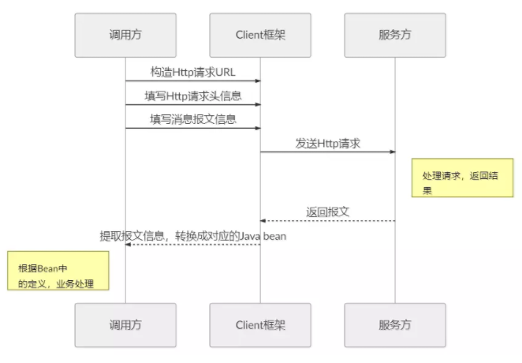
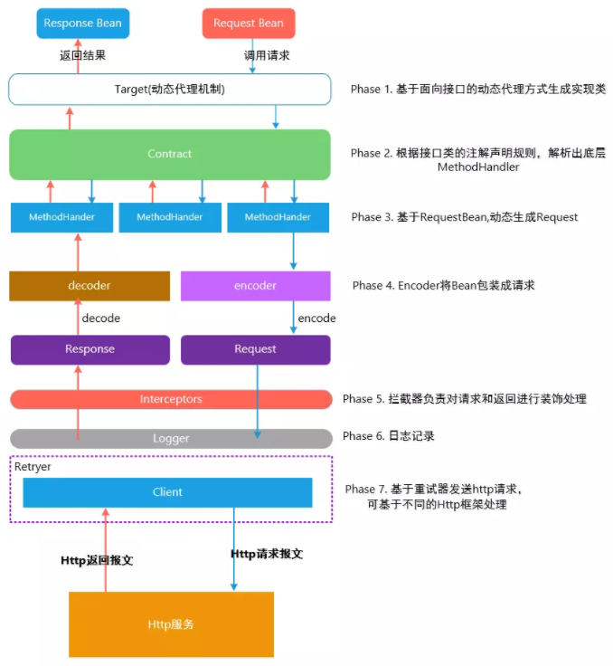

# springcloud-Feign

>参考地址：https://github.com/yoyogrape/springcloud_pro/tree/master/springcloud-feign

## 第一节 Feign简介
>Feign是Netflix开发的声明式、模板化的HTTP客户端， Feign可以帮助我们更快捷、优雅地调用HTTP API。

Feign是一个声明式的伪Http客户端，它使得写Http客户端变得更简单。使用Feign，只需要创建一个接口并注解。
  
Feign默认集成了Ribbon，并和Eureka结合，默认实现了负载均衡的效果。

简而言之：
Feign 采用的是基于接口的注解

**RestTemplate和feign区别**

* 使用 RestTemplate时 ，URL参数是以编程方式构造的，数据被发送到其他服务。
* Feign是Spring Cloud Netflix库，用于在基于REST的服务调用上提供更高级别的抽象。Spring Cloud Feign在声明性
原则上工作。使用Feign时，我们在客户端编写声明式REST服务接口，并使用这些接口来编写客户端程序。开发人员
不用担心这个接口的实现。
* 再说，就是简化了编写，RestTemplate还需要写上服务器IP这些信息等等，而FeignClient则不用。

**Feign解决了什么问题？**
>封装了Http调用流程，更适合面向接口化的变成习惯

在服务调用的场景中，我们经常调用基于Http协议的服务，而我们经常使用到的框架可能有HttpURLConnection、Apache HttpComponnets、OkHttp3 、Netty等等，这些框架在基于自身的专注点提供了自身特性。而从角色划分上来看，他们的职能是一致的提供Http调用服务。具体流程如下：


**Feign是如何设计的？**



## 第二节 Feign demo实现


1、引入依赖
```
<dependency>
    <groupId>org.springframework.cloud</groupId>
    <artifactId>spring-cloud-starter-openfeign</artifactId>
</dependency>
```

2、在启动类添加注解`@EnableFeignClients`
```
@SpringBootApplication
@EnableEurekaClient
@EnableFeignClients
public class OrderClientApp {
```

3、在order-demo中增加FeignService接口，接口中直接调用user-demo中`getUser()`方法
```
@FeignClient(value = "yidiankt-user")
public interface FeignService {
    @RequestMapping(value = "/user/{id}", method = RequestMethod.GET)
    String getUser(@PathVariable("id") int id);
}
```

4、controller中编写测试方法
```
@Autowired
FeignService feignService;

@GetMapping("/order2/{id}")
public String addOrder2(@PathVariable int id) {
    // 调用用户，查询用户信息，
    String result = feignService.getUser(id);
    return  "生成订单：" + result;
}
```
5、启动注册中心--》启动user-demo--》启动order-demo

访问地址：http://localhost:8811/order2/1

通过order-demo中的调用直接调用user-demo中的`getUser()`方法
