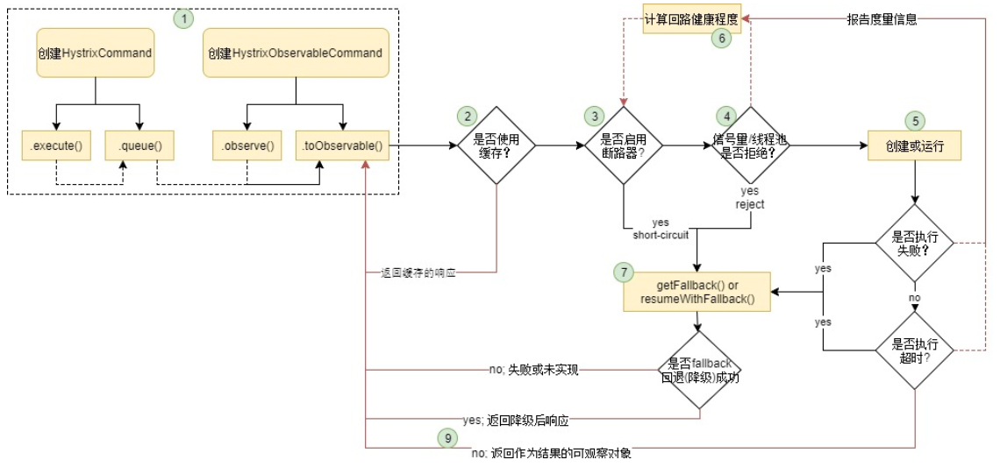

# springcloud-Hystrix

## 第一节 Hystrix简介

1、Hystrix是Netflix开源的一款容错框架，包含常用的容错方法：线程池隔离、信号量隔离、熔断、降级回退。在高并发访问下，系统所依赖的服务的稳定性对系统的影响非常大，依赖有很多不可控的因素，比如网络连接变慢，资源突然繁忙，暂时不可用，服务脱机等。我们要构建稳定、可靠的分布式系统，就必须要有这样一套容错方法。

2、Hystrix原理：


**执行逻辑：**
```
1.每次调用创建一个新的HystrixCommand,把依赖调用封装在run()方法中.

2.执行execute()/queue做同步或异步调用.

3.判断熔断器(circuit-breaker)是否打开,如果打开跳到步骤8,进行降级策略,如果关闭进入步骤.

4.判断线程池/队列/信号量是否跑满，如果跑满进入降级步骤8,否则继续后续步骤.

5.调用HystrixCommand的run方法.运行依赖逻辑

依赖逻辑调用超时,进入步骤8.

6.判断逻辑是否调用成功。返回成功调用结果；调用出错，进入步骤8.

7.计算熔断器状态,所有的运行状态(成功, 失败, 拒绝,超时)上报给熔断器，用于统计从而判断熔断器状态.

8.getFallback()降级逻辑。以下四种情况将触发getFallback调用：

* run()方法抛出非HystrixBadRequestException异常。
* run()方法调用超时
* 熔断器开启拦截调用
* 线程池/队列/信号量是否跑满
* 没有实现getFallback的Command将直接抛出异常，fallback降级逻辑调用成功直接返回，降级逻辑调用失败抛出异常.

9.返回执行成功结果
```

3、Hystrix特性：

1） 请求熔断： 当Hystrix Command请求后端服务失败数量超过一定比例(默认50%), 断路器会切换到开路状态
(Open). 这时所有请求会直接失败而不会发送到后端服务. 断路器保持在开路状态一段时间后(默认5秒), 自动切
换到半开路状态(HALF-OPEN).
这时会判断下一次请求的返回情况, 如果请求成功, 断路器切回闭路状态(CLOSED), 否则重新切换到开路状态
(OPEN). Hystrix的断路器就像我们家庭电路中的保险丝, 一旦后端服务不可用, 断路器会直接切断请求链, 避免发
送大量无效请求影响系统吞吐量, 并且断路器有自我检测并恢复的能力.


2） 服务降级：Fallback相当于是降级操作. 对于查询操作, 我们可以实现一个fallback方法, 当请求后端服务出现异
常的时候, 可以使用fallback方法返回的值. fallback方法的返回值一般是设置的默认值或者来自缓存.告知后面的
请求服务不可用了，不要再来了。

3） 依赖隔离(采用舱壁模式，Docker就是舱壁模式的一种)：在Hystrix中, 主要通过线程池来实现资源隔离。通常
在使用的时候我们会根据调用的远程服务划分出多个线程池。比如说，一个服务调用两外两个服务，你如果调
用两个服务都用一个线程池，那么如果一个服务卡在哪里，资源没被释放，后面的请求又来了，导致后面的请
求都卡在哪里等待，导致你依赖的A服务把你卡在哪里，耗尽了资源，也导致了你另外一个B服务也不可用了。
这时如果依赖隔离，某一个服务调用A B两个服务，如果这时我有100个线程可用，我给A服务分配50个，给B服
务分配50个，这样就算A服务挂了，我的B服务依然可以用。

4） 请求缓存：比如一个请求过来请求我userId=1的数据，你后面的请求也过来请求同样的数据，这时我不会继续
走原来的那条请求链路了，而是把第一次请求缓存过了，把第一次的请求结果返回给后面的请求。
请求缓存是在同一请求多次访问中保证只调用一次这个服务提供者的接口，在这同一次请求第一次的结果
会被缓存，保证同一请求中同样的多次访问返回结果相同。5. 请求合并：我依赖于某一个服务，我要调用N次，比如说查数据库的时候，我发了N条请求发了N条SQL然后拿
到一堆结果，这时候我们可以把多个请求合并成一个请求，发送一个查询多条数据的SQL的请求，这样我们只需
查询一次数据库，提升了效率


4、拓展说明：
```
一、Hystrix说明
1.服务雪崩效应：是一种因 服务提供者 的不可用导致 服务调用者 的不可用,并将不可用 逐渐放大 的过程。

1） A为服务提供者, B为A的服务调用者, C和D是B的服务调用者. 当A的不可用,引起B的不可用,并将不可用逐渐放大C和D时, 服务雪崩就形成了


2.雪崩原因：
    1) 服务提供者不可用
         a.硬件故障
             a1.硬件损坏造成的服务器主机宕机
             a2.网络硬件故障造成的服务提供者的不可访问
         b.程序Bug
         c.缓存击穿：缓存应用重启, 所有缓存被清空时,以及短时间内大量缓存失效时. 大量的缓存不命中, 使请求直击后端,造成服务提供者超负荷运行,引起服务不可用
         d.用户大量请求：在秒杀和大促开始前,如果准备不充分,用户发起大量请求造成服务提供者的不可用
     2) 重试加大流量
         a.用户重试：用户由于忍受不了界面上长时间的等待,而不断刷新页面甚至提交表单
          b.代码逻辑重试：服务调用端的会存在大量服务异常后的重试逻辑
     3) 服务调用者不可用
         a.同步等待造成的资源耗尽：使用 同步调用 时, 会产生大量的等待线程占用系统资源. 一旦线程资源被耗尽,服务调用者提供的服务也将处于不可用状态, 造成服务雪崩效应产生

3.雪崩应对策略：
     1) 流量控制
         a.网关限流
              因为Nginx的高性能, 目前一线互联网公司大量采用Nginx+Lua的网关进行流量控制, 由此而来的OpenResty也越来越热门.
         b.用户交互限流
              具体措施:
             a21. 采用加载动画,提高用户的忍耐等待时间.
             a22. 提交按钮添加强制等待时间机制.
         c.关闭重试
      2) 改进缓存模式
             a.缓存预加载
             b.同步改为异步刷新
      3) 服务自动扩容
             a.AWS的auto scaling
      4) 服务调用者降级服务
             a.资源隔离：主要是对调用服务的线程池进行隔离.
             b.对依赖服务进行分类依赖服务分为: 强依赖和若依赖. 强依赖服务不可用会导致当前业务中止,而弱依赖服务的不可用不会导致当前业务的中止. 
             c.不可用服务的调用快速失败
一般通过 超时机制, 熔断器 和熔断后的 降级方法 来实现

4.解决方案：
1)使用Hystrix预防服务雪崩
2)Netflix的 Hystrix 是一个帮助解决分布式系统交互时超时处理和容错的类库, 它同样拥有保护系统的能力
3)Hystrix的设计原则包括：资源隔离、熔断器、命令模式

二、Hystrix解决方式
Hystrix：通过服务熔断(也可以称为断路)、降级、限流(隔离)、异步RPC等手段控制依赖服务的延迟与失败
1.Circuit Breaker ：熔断器，熔断只是作用在服务调用这一端，只需改consumer端
1)熔断器开关相互转换的逻辑
a.服务的健康状况 = 请求失败数 / 请求总数. 
b.熔断器开关由关闭到打开的状态转换是通过当前服务健康状况和设定阈值比较决定的
b1.关闭时, 请求被允许通过熔断器. 如果当前健康状况高于设定阈值, 开关继续保持关闭. 如果当前健康状况低于设定阈值, 开关则切换为打开状态
b2.打开状态, 经过一段时间后, 熔断器会自动进入半开状态, 这时熔断器只允许一个请求通过. 当该请求调用成功时, 熔断器恢复到关闭状态. 若该请求失败, 熔断器继续保持打开状态, 接下来的请求被禁止通过
c.保证服务调用者在调用异常服务时, 快速返回结果, 避免大量的同步等待
d.在一段时间后继续侦测请求执行结果, 提供恢复服务调用的可能
2)参数设
a.circuitBreaker.requestVolumeThreshold //滑动窗口的大小，默认为20
b.circuitBreaker.sleepWindowInMilliseconds //过多长时间，熔断器再次检测是否开启，默认为5000，即5s钟
c.circuitBreaker.errorThresholdPercentage //错误率，默认50%
每当20个请求中，有50%失败时，熔断器就会打开，此时再调用此服务，将会直接返回失败，不再调远程服务。直到5s钟之后，重新检测该触发条件，判断是否把熔断器关闭，或者继续打开

2.downgrade：降级，fallback
1)当某个服务熔断之后，服务器将不再被调用，此时客户端可以自己准备一个本地的fallback回调，返回一个缺省值

3.Isolation：限流(隔离)
1)可在服务端做这个限流逻辑，也可在客户端做
2)采用线程/信号的方式,通过隔离限制依赖的并发量和阻塞扩散
a.线程隔离：
a1.即将每个依赖服务分配独立的线程池进行资源隔离, 从而避免服务雪崩
a2.线上建议线程池不要设置过大，否则大量堵塞线程有可能会拖慢服务器
a3.优点：
a31.使用线程可以完全隔离第三方代码,请求线程可以快速放回
a32.当一个失败的依赖再次变成可用时，线程池将清理，并立即恢复可用，而不是一个长时间的恢复
a33.可以完全模拟异步调用，方便异步编程
a4.缺点：
a41.线程池的主要缺点是它增加了cpu，因为每个命令的执行涉及到排队(默认使用SynchronousQueue避免排队)，调度和上下文切换
a42.对使用ThreadLocal等依赖线程状态的代码增加复杂性，需要手动传递和清理线程状态
注：Netflix公司内部认为线程隔离开销足够小，不会造成重大的成本或性能的影响
b.信号隔离：
b1.用于限制并发访问，防止阻塞扩散, 与线程隔离最大不同在于执行依赖代码的线程依然是请求线程（该线程需要通过信号申请）
b2.如果客户端是可信的且可以快速返回，可以使用信号隔离替换线程隔离,降低开销
b3.信号量的大小可以动态调整, 线程池大小不可以
缺点：不能设置超时和实现异步访问，所以，只有在依赖服务是足够可靠的情况下才使用信号量
3)除了HystrixBadRequestException异常之外，所有从run()方法抛出的异常都算作失败，并触发降级getFallback()和断路器逻辑
4)HystrixBadRequestException用在非法参数或非系统故障异常等不应触发回退逻辑的场景
5)参数解释
a.CommandKey：依赖命名
a1.每个CommandKey代表一个依赖抽象,相同的依赖要使用相同的CommandKey名称
a2.依赖隔离的根本就是对相同CommandKey的依赖做隔离.
b.CommandGroupKey:依赖分组
b1.命令分组用于对依赖操作分组,便于统计,汇总
b2.CommandGroup是每个命令最少配置的必选参数，在不指定ThreadPoolKey的情况下，字面值用于对不同依赖的线程池/信号区分
c.ThreadPoolKey:线程池/信号
c1.当对同一业务依赖做隔离时使用CommandGroup做区分,但是对同一依赖的不同远程调用如(一个是Redis一个是http),可以使用HystrixThreadPoolKey做隔离区分
c2.在业务上都是相同的组，但是需要在资源上做隔离时，可以使用HystrixThreadPoolKey区分
d.Request-Cache:请求缓存
d1.重写getCacheKey方法,实现区分不同请求的逻辑
d2.请求缓存可以让(CommandKey/CommandGroup)相同的情况下,直接共享结果，降低依赖调用次数，在高并发和CacheKey碰撞率高场景下可以提升性能
e.SEMAPHORE：信号量隔离
e1.隔离本地代码或可快速返回远程调用(如memcached,redis)可以直接使用信号量隔离,降低线程隔离开销

4.asynchronous：异步RPC

三、Hystrix metrics：容错计数
1.Metrics：
1)Hystrix的Metrics中保存了当前服务的健康状况, 包括服务调用总次数和服务调用失败次数等
2)根据Metrics的计数, 熔断器从而能计算出当前服务的调用失败率, 用来和设定的阈值比较从而决定熔断器的状态切换逻辑
2.1.5之后的滑动窗口实现
1)使用Rx实现滑动窗口

四、配置参数说明
1.HystrixCommandProperties：HystrixProperty类型
1)Metrics
a.metricsRollingStatisticalWindowInMilliseconds：统计滚动的时间窗口,默认:5000毫秒（取自circuitBreakerSleepWindowInMilliseconds）
b.metricsRollingStatisticalWindowBuckets：统计窗口的Buckets的数量,默认:10个,每秒一个Buckets统计
c.metrics.rollingPercentile.enabled：是否开启监控统计功能,默认:true
d.metrics.rollingStats.timeInMilliseconds：
e.metrics.rollingStats.numBuckets:
f.metrics.rollingPercentile.timeInMilliseconds：
h.metrics.rollingPercentile.numBuckets:
i.metrics.rollingPercentile.bucketSize：
g.metrics.healthSnapshot.intervalInMilliseconds
h.circuitBreaker.requestVolumeThreshold：断路器请求阈值，熔断器在整个统计时间内是否开启的阀值，默认20。也就是在metricsRollingStatisticalWindowInMilliseconds（默认10s）内至少请求20次，熔断器才发挥起作用
2)Circuit Breaker
a.circuitBreaker.sleepWindowInMilliseconds：断路器休眠时间，熔断时间窗口，默认:5秒.熔断器中断请求5秒后会进入半打开状态,放下一个请求进来重试，如果该请求成功就关闭熔断器，否则继续等待一个熔断时间窗口
b.circuitBreaker.enabled：断路器开关，是否启用熔断器,默认true. 启动
c.circuitBreaker.errorThresholdPercentage：断路器错误请求百分比,默认:50%。当出错率超过50%后熔断器启动
d.circuitBreaker.forceOpen：断路器强制开启，是否强制开启熔断器阻断所有请求,默认:false,不开启。置为true时，所有请求都将被拒绝，直接到fallback
e.circuitBreaker.forceClosed：断路器强制关闭，是否允许熔断器忽略错误,默认false, 不开启
3)Execution
a.execution.isolation.semaphore.maxConcurrentRequests：使用信号量隔离时，命令调用最大的并发数,默认:10
b.execution.isolation.strategy：使用命令调用隔离方式,默认:采用线程隔离,ExecutionIsolationStrategy.THREAD
c.execution.isolation.thread.timeoutInMilliseconds：使用线程隔离时，调用超时时间，默认:1秒
d.executionIsolationThreadPoolKeyOverride：线程池的key,用于决定命令在哪个线程池执行
e.execution.isolation.thread.interruptOnTimeout：使用线程隔离时，是否对命令执行超时的线程调用中断（Thread.interrupt()）操作.默认:true
f.execution.timeout.enabled：
4)Fallback
a.fallback.isolation.semaphore.maxConcurrentRequests：使用信号量隔离时，命令fallback(降级)调用最大的并发数,默认:10
b.fallback.enabled：是否开启fallback降级策略 默认:true
5)Request Context
a.requestLogEnabled：是否开启请求日志,默认:true
b.requestCacheEnabled：是否开启请求缓存,默认:true

2.HystrixCollapserProperties：HystrixProperty类型
1)maxRequestsInBatch：请求合并是允许的最大请求数,默认: Integer.MAX_VALUE
2)timerDelayInMilliseconds：批处理过程中每个命令延迟的时间,默认:10毫秒
3)requestCache.enabled：批处理过程中是否开启请求缓存,默认:开启

3.HystrixThreadPoolProperties：
1)corePoolSize：配置线程池大小,默认值10个. 建议值:请求高峰时99.5%的平均响应时间 + 向上预留一些即可
2)maxQueueSize：配置线程值等待队列长度,默认值:-1,建议值:-1,表示不等待直接拒绝,测试表明线程池使用直接决绝策略+ 合适大小的非回缩线程池效率最高.所以不建议修改此值。当使用非回缩线程池时，queueSizeRejectionThreshold,keepAliveTimeMinutes 参数无效
3)queueSizeRejectionThreshold：队列大小拒绝阈值
4)keepAliveTimeMinutes
5)metrics.rollingStats.timeInMilliseconds
6)metrics.rollingStats.numBuckets


```

## 第二节 Hystrix 熔断降级demo演示

1）order-demo中添加依赖
```
<!-- hystrix断路器 -->
<dependency>
    <groupId>org.springframework.cloud</groupId>
    <artifactId>spring-cloud-starter-netflix-hystrix</artifactId>
</dependency>
```

2）配置文件中开启断路器功能
```
feign:
  hystrix:
    enabled: true
```

3）启动类添加注解`@EnableHystrix`
```
@SpringBootApplication
@EnableEurekaClient
@EnableFeignClients
@EnableHystrix
public class OrderClientApp {
    public static void main(String[] args) {
        SpringApplication.run(OrderClientApp.class, args);
    }

    @Bean
    @LoadBalanced
    RestTemplate restTemplate() {
        return new RestTemplate();
    }
}
```

4）添加FeignService调用接口实现类，相当于双实现，如果调用不成功，执行MyFallback中的备选方案。
```
//降级处理方法1
@Component
public class MyFallback implements FeignService {
    @Override
    public String getUser(int id) {
        return "error getUser";
    }
}

//降级处理方法2
@HystrixCommand(fallbackMethod = "userFallback")
public String getUser(int id) {
    // 获取用户信息？？？
    String url = "http://yidiankt-user/user/{id}";
    String info = restTemplate.getForObject(url, String.class, id);
    return info;
}

// 添加服务器降级处理方法
public String userFallback(int id) {
    return "error user fallback";
}
```

5）接口中声明`fallback = MyFallback.class`说明降级方案
```
@FeignClient(value = "yidiankt-user", fallback = MyFallback.class)
public interface FeignService {
    @RequestMapping(value = "/user/{id}", method = RequestMethod.GET)
    String getUser(@PathVariable("id") int id);
}
```

6）测试：启动注册中心--》启动user-demo--》启动order-demo。

第一次访问：http://localhost:8811/order2/1
>正常

关闭服务user-demo，第二次访问：http://localhost:8811/order2/1
>生成订单：error getUser,执行降级方案


## 第二节 Hystrix 依赖隔离demo演示

思路：就是创建两个线程池，然后服务service中对线程池进行调用，每个线程执行一个远程调用的方法。
利用多个线程池实现线程的隔离。


1、增加两个线程池OrderCommand和UserCommand。
```
/**
 * @author: songjn1
 * @create: 2019-08-16
 * @desc: Hystrix 依赖隔离:每个服务启动一个线程池，当此线程池满了的时候，不影响其他服务的线程池，起到隔离作用
 **/
public class OrderCommand extends HystrixCommand<String> {
    private String value;

    public OrderCommand(String value) {
        super(Setter.withGroupKey(
                //服务分组
                HystrixCommandGroupKey.Factory.asKey("OrderGroup"))
                //线程分组
                .andThreadPoolKey(HystrixThreadPoolKey.Factory.asKey("OrderPool"))
                //线程池配置
                .andThreadPoolPropertiesDefaults(HystrixThreadPoolProperties.Setter()
                        .withCoreSize(10)
                        .withKeepAliveTimeMinutes(5)
                        .withMaxQueueSize(10)
                        .withQueueSizeRejectionThreshold(10000))
                //线程池隔离
                        .andCommandPropertiesDefaults(HystrixCommandProperties.Setter()
                        .withExecutionIsolationStrategy(HystrixCommandProperties.ExecutionIsolationStrategy.THREAD)));
        this.value = value;
    }

    /**
     * 实现调用业务逻辑的地方
     * @return
     * @throws Exception
     */
    @Override
    protected String run() throws Exception {
        // String url = "http://yidiankt-user/user/{id}";
        // String info = restTemplate.getForObject(url, String.class, id);
        String threadName = Thread.currentThread().getName();
        return threadName + " || " + value;
    }
}
```

2、service中进行线程池的线程调用
```
    // 测试依赖隔离
    public String testPool() throws ExecutionException, InterruptedException {
        UserCommand userCommand = new UserCommand("库里");
        OrderCommand orderCommand1 = new OrderCommand("篮球");
        OrderCommand orderCommand2 = new OrderCommand("足球");
        // 同步调用
//        String val1 = userCommand.execute();
//        String val2 = orderCommand1.execute();
//        String val3 = orderCommand2.execute();
        // 异步调用
        Future<String> f1 = userCommand.queue();
        Future<String> f2 = orderCommand1.queue();
        Future<String> f3 = orderCommand2.queue();
//        return "val1=" + val1 + "val2=" + val2 + "val3=" + val3;
        return "f1=" + f1.get() + "f2=" + f2.get() + "f3=" + f3.get();
    }
```

3、增加接口
```
@GetMapping("/pool")
public String pool() throws ExecutionException, InterruptedException {
    System.out.println("...pool()...");
    return  orderService.testPool();
}
```

4、测试`http://localhost:8811/pool`

返回，说明调用不同的线程池
```
f1=hystrix-UserPool-5 || 库里f2=hystrix-OrderPool-9 || 篮球f3=hystrix-OrderPool-10 || 足球
```

>参考学习地址：https://www.bilibili.com/video/av54584960?from=search&seid=1651237162981311945

