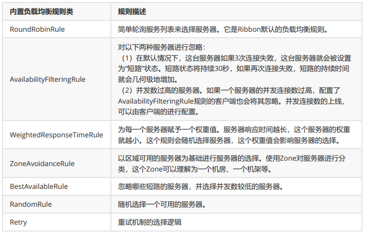

# springcloud-Ribbon
>参考项目地址：https://github.com/yoyogrape/springcloud_pro/tree/master/springcloud_ribbon
## 第一节 Ribbon简介
Ribbon是Netflix发布的开源项目，主要功能是提供客户端的软件负载均衡算法，将Netflix的中间层服务连接在一起。

**Ribbon工作时分为两步：**

* 第一步先选择Eureka Server，它优先选择在同一个Zone且负载较少的Server。

* 第二部再根据用户指定的策略，再从Server取到的服务注册列表中选择一个地址。其中Ribbon提供了多种策略，例如轮询round robin，随机Random，根据相应时间加权等。

ribbon的负载均衡算法：  


修改负载均衡策略配置:
```
yidiankt-user:
  ribbon:
    NFLoadBalancerRuleClassName: com.netflix.loadbalancer.RoundRobinRule
```

## 第二节 Ribbon演示代码
在第一章的基础上，增加订单模块order-demo，然后启动多个user-demo模块，进行负载均衡调用

1、创建订单模块order-demo

1）添加依赖eureka-client和netflix-ribbon
```
<?xml version="1.0" encoding="UTF-8"?>
<project xmlns="http://maven.apache.org/POM/4.0.0"
         xmlns:xsi="http://www.w3.org/2001/XMLSchema-instance"
         xsi:schemaLocation="http://maven.apache.org/POM/4.0.0 http://maven.apache.org/xsd/maven-4.0.0.xsd">
    <parent>
        <artifactId>parent-demo</artifactId>
        <groupId>com.lenovo</groupId>
        <version>1.0-SNAPSHOT</version>
        <relativePath>../parent-demo/pom.xml</relativePath>
    </parent>
    <modelVersion>4.0.0</modelVersion>

    <artifactId>order-demo</artifactId>
    <dependencies>
        <dependency>
            <groupId>org.springframework.cloud</groupId>
            <artifactId>spring-cloud-starter-netflix-eureka-client</artifactId>
        </dependency>
        <dependency>
            <groupId>org.springframework.boot</groupId>
            <artifactId>spring-boot-starter-web</artifactId>
        </dependency>
        <dependency>
            <groupId>org.springframework.cloud</groupId>
            <artifactId>spring-cloud-starter-netflix-ribbon</artifactId>
        </dependency>
    </dependencies>

</project>
```

2）配置文件
```
##服务启动端口号
server:
  port: 8811
##服务名称(服务注册到eureka名称)
spring:
  application:
    name: yidiankt-order
##服务注册到eureka地址
eureka:
# instance:
# prefer-ip-address: true
# instance-id: 192.168.3.2:${server.port}
# hostname: localhost
  client:
    service-url:
        defaultZone: http://127.0.0.1:8888/eureka
##因为该应用为注册中心
    register-with-eureka: true
##是否需要从eureka上获取注册信息
    fetch-registry: true
```

3）启动类中除了需要添加@EnableEurekaClient注解外，还需要注册RestTemplate类，放到容器中。
```
@SpringBootApplication
@EnableEurekaClient
public class OrderClientApp {
    public static void main(String[] args) {
        SpringApplication.run(OrderClientApp.class, args);
    }
    @Bean
    @LoadBalanced
    RestTemplate restTemplate() {
        return new RestTemplate();
    }
}
```

4）提供调用接口
```
@RestController
public class OrderController {
    @Autowired
    OrderService orderService;

    @RequestMapping("/order/{id}")
    public String addOrder(@PathVariable int id) {
        String name = orderService.getUser(id);
        // 调用用户，查询用户信息，
        return "生成订单：" + name;
    }
}
```

5）提供服务调用
```
@Service
public class OrderService {
    @Autowired
    RestTemplate restTemplate;

    public String getUser(int id) {
        // 获取用户信息？？？
        String url = "http://yidiankt-user/user/{id}";
        String info = restTemplate.getForObject(url, String.class, id);
        return info;
    }
}
```


2、启动顺序：注册中心--》三个user-demo--》order-demo

然后再页面进行服务的调用测试，地址

http://127.0.0.1:8811/order/3

http://127.0.0.1:8811/order/3

http://127.0.0.1:8811/order/3

调用三次分别在不同的user-demo服务器上运行的代码（默认负载均衡规则：轮询）。

>参考学习地址：https://www.bilibili.com/video/av54584960?from=search&seid=1651237162981311945