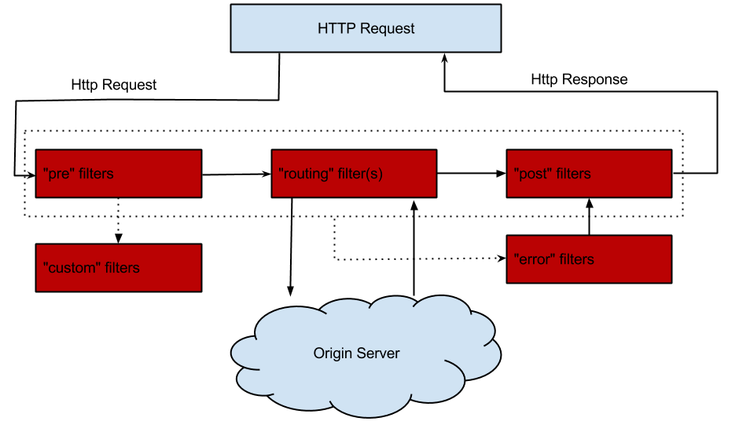
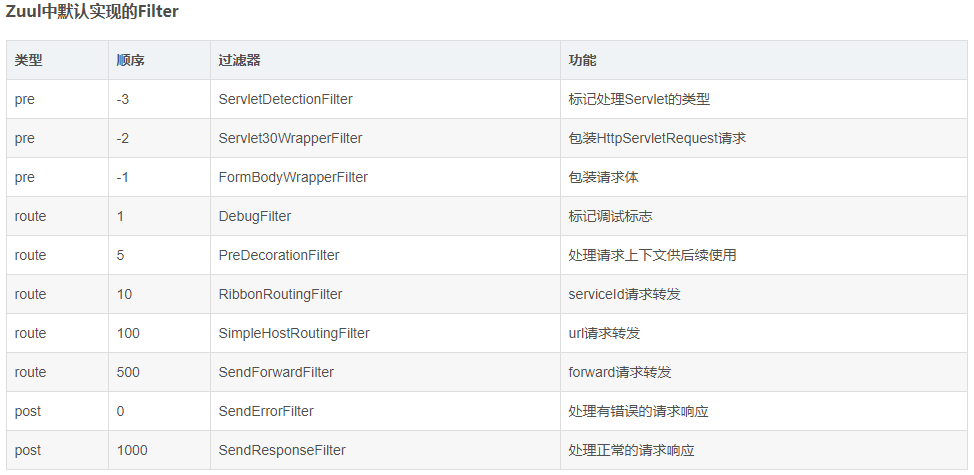

# springcloud-Zuul
>参考地址：https://github.com/yoyogrape/springcloud_pro/tree/master/springcloud-zuul
## 第一节 zuul简介
Zuul 是 Spring Cloud 微服务体系中担任很重要的角色--服务网关，是基于JVM的路由器和负载均衡器。


**zuul应用：**
* 身份认证和安全: 识别每一个资源的验证要求，并拒绝那些不符的请求
* 审查与监控：
* 动态路由：动态将请求路由到不同后端集群
* 压力测试：逐渐增加指向集群的流量，以了解性能
* 负载分配：为每一种负载类型分配对应容量，并弃用超出限定值的请求
* 静态响应处理：边缘位置进行响应，避免转发到内部集群
* 限流
* 文件上传处理


Filter是Zuul的核心，用来实现对外服务的控制。Filter的生命周期有4个，分别是“PRE”、“ROUTING”、“POST”、“ERROR”，整个生命周期可以用下图来表示。



Zuul大部分功能都是通过过滤器来实现的，这些过滤器类型对应于请求的典型生命周期。

* PRE： 这种过滤器在请求被路由之前调用。我们可利用这种过滤器实现身份验证、在集群中选择请求的微服务、记录调试信息等。
* ROUTING：这种过滤器将请求路由到微服务。这种过滤器用于构建发送给微服务的请求，并使用Apache HttpClient或Netfilx Ribbon请求微服务。
* POST：这种过滤器在路由到微服务以后执行。这种过滤器可用来为响应添加标准的HTTP Header、收集统计信息和指标、将响应从微服务发送给客户端等。
* ERROR：在其他阶段发生错误时执行该过滤器。 除了默认的过滤器类型，Zuul还允许我们创建自定义的过滤器类型。例如，我们可以定制一种STATIC类型的过滤器，直接在Zuul中生成响应，而不将请求转发到后端的微服务。




**zuul高可用**
>https://blog.csdn.net/hongwei15732623364/article/details/82050304

# 多区域弹性：跨域AWS Region进行请求路由，旨在实现ELB(ElasticLoad Balancing)使用多样化
## 第二节 zuul演示demo
1、添加依赖
```
<dependencies>
    <dependency>
        <groupId>org.springframework.cloud</groupId>
        <artifactId>spring-cloud-starter-netflix-eureka-client</artifactId>
    </dependency>
    <dependency>
        <groupId>org.springframework.cloud</groupId>
        <artifactId>spring-cloud-starter-netflix-zuul</artifactId>
    </dependency>
</dependencies>
```


2、配置文件application.yml
```
eureka:
  client:
    serviceUrl:
      defaultZone: http://localhost:8888/eureka/
server:
  port: 9000
spring:
  application:
    name: yidiankt-zuul
zuul:
  routes:
    #路由名称随意命名api-order
    api-order:
      # ‘/**’任意字符
      path: /api-order/**
      serviceId: yidiankt-order
    api-user:
      path: /api-user/**
      serviceId: yidiankt-user
```

3、启动类上添加注解`@EnableZuulProxy`和@`EnableEurekaClient`
```
@SpringBootApplication
// 开启zuul功能
@EnableZuulProxy
@EnableEurekaClient
public class ZuulApp {
public static void main(String[] args) {
SpringApplication.run(ZuulApp.class, args);
}
}
```
4、启动测试：注册中心--》user-demo--》zuul-demo

测试：
>http://localhost:8803/user/1

>http://localhost:9000/api-user/user/2

两者效果相同，路由成功。


## 第三节 其他相关配置
1、 配置统一前缀访问`prefix: /yidiankt`
```
zuul:
  routes:
    #路由名称随意命名api-order
    api-order:
      # ‘/**’任意字符
      path: /api-order/**
      serviceId: yidiankt-order
    api-user:
      path: /api-user/**
      serviceId: yidiankt-user
  ignored-services: "*"

```
2、配置统一前缀
```
zuul:
  routes:
    #路由名称随意命名api-order
    api-order:
      # ‘/**’任意字符
      path: /api-order/**
      serviceId: yidiankt-order
    api-user:
      path: /api-user/**
      serviceId: yidiankt-user
  prefix: /yidiankt
```

3、配url绑定映射
```
eureka:
  client:
    serviceUrl:
      defaultZone: http://localhost:8888/eureka/
server:
  port: 9000
spring:
  application:
    name: yidiankt-zuul
zuul:
  routes:
    #路由名称随意命名api-order
    api-order:
      # ‘/**’任意字符
      path: /api-order/**
      serviceId: yidiankt-order
    api-user:
      path: /api-user/**
      serviceId: yidiankt-user
     #配url绑定映射 
    douyu:
      url: http://www.douyu.com
      path: /testurl/**
```

4、配置URL映射负载
```
eureka:
  client:
    serviceUrl:
      defaultZone: http://localhost:8888/eureka/
server:
  port: 9000
spring:
  application:
    name: yidiankt-zuul

ribbon:
  eureka:
    enabled: false
#Ribbon请求的微服务serviceId
soooo:
  ribbon:
    listOfServers: http://www.baidu.com,http://www.douyu.com

zuul:
  routes:
    #路由名称随意命名api-order
    api-order:
      # ‘/**’任意字符
      path: /api-order/**
      serviceId: yidiankt-order
    ttt:
      serviceId: soooo
      path: /ttt/**
```

## 第四节 zuul过滤器
```
import com.netflix.zuul.ZuulFilter;
import com.netflix.zuul.context.RequestContext;
import org.springframework.cloud.netflix.zuul.filters.support.FilterConstants;
import org.springframework.stereotype.Component;
import org.springframework.util.StringUtils;

import javax.servlet.http.HttpServletRequest;
import java.io.IOException;

@Component
public class MyFilter1 extends ZuulFilter {
    /**
     * 类型包含 pre post route error
     * pre 代表在路由代理之前执行
     * route 代表代理的时候执行
     * error 代表出现错的时候执行
     * post 代表在route 或者是 error 执行完成后执行
     */
    @Override
    public String filterType() {
// 路由之前(前置过滤器)
        return FilterConstants.PRE_TYPE;
    }
    @Override
    public int filterOrder() {
// 优先级，数字越大，优先级越低
        return 1;
    }
    @Override
    public boolean shouldFilter() {
// 是否执行该过滤器，true代表需要过滤
        return true;
    }
    @Override
    public Object run() {
        System.out.println("11111111111111111111111111");
        RequestContext currentContext = RequestContext.getCurrentContext();
        HttpServletRequest request = currentContext.getRequest();
        Object token = request.getAttribute("token");
        if(StringUtils.isEmpty(token)){
            currentContext.setSendZuulResponse(false);
            currentContext.setResponseStatusCode(401);
            try {
                currentContext.getResponse().getWriter().print("token error");
            } catch (IOException e) {
                e.printStackTrace();
            }
        }
        //认证逻辑
        return null;
    }
}
```


    
>参考学习地址：https://www.bilibili.com/video/av54584960?from=search&seid=1651237162981311945

