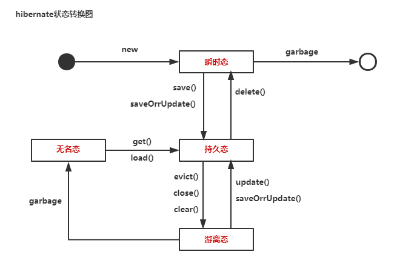
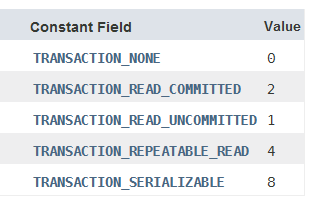

# hibernate

### ORM 对象关系映射
>是一种程序技术,将数据库中的业务数据应用对象等的形式表示出来,并通过面向对象的方式将这些对象组织起来，
>以实现系统的业务逻辑。
>
>>O, Object 对象  
>>R, Realtion 关系（关系型数据库）  
>>M, Mapping 映射

### JPA(Java Persistence API的简称)
是javaEE5的标准ORM接口。他是一种规范，一种接口，但不是实现
用于实现这一规范的ORM很多，Hibernate就是之一。


### JPA、ORM和Hibernate之间的关系。
ORM是一种思想，JPA是哥根据这种思想制定出来的一套接口，
hibernate是具体实现。

### hibernate配置文件头的查找
统一在hibernate-core-5.4.0.Final.jar包中  
①hibernate-mapping-3.0.dtd(类的映射文件)  
②hibernate-configuration-3.0.dtd（hibernate的配置文件）

### hibernate配置数据库属性查找
下载的jar解压后的project目录下的etc中：  
hibernate-release-5.4.0.Final\project\etc\hibernate.properties
````
## MySQL

#hibernate.dialect org.hibernate.dialect.MySQLDialect
#hibernate.dialect org.hibernate.dialect.MySQLInnoDBDialect
#hibernate.dialect org.hibernate.dialect.MySQLMyISAMDialect
#hibernate.connection.driver_class com.mysql.jdbc.Driver
#hibernate.connection.url jdbc:mysql:///test
#hibernate.connection.username gavin
#hibernate.connection.password

## Oracle

#hibernate.dialect org.hibernate.dialect.Oracle8iDialect
#hibernate.dialect org.hibernate.dialect.Oracle9iDialect
#hibernate.dialect org.hibernate.dialect.Oracle10gDialect
#hibernate.connection.driver_class oracle.jdbc.driver.OracleDriver
#hibernate.connection.username ora
#hibernate.connection.password ora
#hibernate.connection.url jdbc:oracle:thin:@localhost:1521:orcl
#hibernate.connection.url jdbc:oracle:thin:@localhost:1522:XE
````
### hibernate配置数据库方言查找
但是上面的数据库的方言不能直接复制，需要在jar中对应查找。
查找位置hibernate-core-5.4.0.Final.jar包中org.hibernate.dialect目录下查找哦对应的方言：MySQL5Dialect.class  
然后复制全类名org.hibernate.dialect.MySQL5Dialect.class（需要去掉.class）
````
<!-- 方言的配置 -->
<property name="hibernate.dialect">
    org.hibernate.dialect.MySQL5Dialect
</property>
````
### hibernate配置文件示例
1）hibernate配置xml文件
```
<?xml version="1.0" encoding="UTF-8"?>
<!DOCTYPE hibernate-configuration PUBLIC
	"-//Hibernate/Hibernate Configuration DTD 3.0//EN"
	"http://www.hibernate.org/dtd/hibernate-configuration-3.0.dtd">
<hibernate-configuration>
<session-factory>
	<!-- DB四要素 -->
	<property name="hibernate.connection.driver_class">
		com.mysql.jdbc.Driver
	</property>
	<property name="hibernate.connection.url">
		jdbc:mysql://127.0.0.1:3306/test
	</property>
	<property name="hibernate.connection.username">root</property>
	<property name="hibernate.connection.password">123456</property>
	<!-- 方言的配置 -->
	<property name="hibernate.dialect">
		org.hibernate.dialect.MySQL5Dialect
	</property>
	<!-- 数据源C3P0：数据库连接池  -->
	<property name="hibernate.connection.provider_class">
		org.hibernate.c3p0.internal.C3P0ConnectionProvider
	</property>
	<!-- 注册当前session上下文
		thread：保证同一个线程里面取到的session是同一个session
		jta:分布式系统用到
		springSessionContext:ssh整合的时候用到
	-->
	<property name="hibernate.current_session_context_class">
		thread
	</property>
	<!-- 自动建表  
		create:每次建表的时候都会将原表删掉创建新表
		update:如果没有表新建表，如果有表直接进行更新操作
	-->
	<property name="hibernate.hbm2ddl.auto">update</property>
	<!-- 显示SQL -->
	<property name="hibernate.show_sql">true</property>
	<!-- 格式化SQL -->
	<property name="hibernate.format_sql">true</property>
	<!-- 注册映射文件 -->
	<mapping resource="com/hibernate/bean/Country.hbm.xml" />
	<mapping resource="com/hibernate/bean/Minister.hbm.xml" />
</session-factory>

</hibernate-configuration>
```

2）hibernate实体类映射xml文件
````
<?xml version="1.0" encoding="UTF-8"?>
<!DOCTYPE hibernate-mapping PUBLIC 
    "-//Hibernate/Hibernate Mapping DTD 3.0//EN"
    "http://www.hibernate.org/dtd/hibernate-mapping-3.0.dtd">
<hibernate-mapping package="com.hibernate.bean">
	<class name="Country">
		<id name="cid">
			<generator class="native" />
		</id>
		<property name="cname" />
		<set name="ministers" cascade="all">
			<key column="countryId" />
			<one-to-many class="Minister" />
		</set>
	</class>
</hibernate-mapping>
````

3）一对多实体类
````
public class Country { //一方
	private Long cid;
	private String cname;
	private Set<Minister> ministers;
	}
	
public class Minister { //多方
    private Long mid;
    private String mname;
    }
````

4）测试类
````
public class BaseTest {
	@Test
	public void testSave() {
		Session session = HbnUtil.getSession();
		Country country = new Country("China");
		country.getMinisters().add(new Minister("haha"));
		country.getMinisters().add(new Minister("gaga"));
		country.getMinisters().add(new Minister("xixi"));
		try {
			session.beginTransaction();
			session.save(country);
			session.getTransaction().commit();
		} catch (Exception e) {
			e.printStackTrace();
			session.getTransaction().rollback();
		}
	}
}
````
5）获取session工具类
````
public class HbnUtil {
	private static SessionFactory sessionFactory;

	public static Session getSession() {
		return getSessionFactory().getCurrentSession();
	}
	
	public static SessionFactory getSessionFactory() {
		if (sessionFactory==null||sessionFactory.isClosed()) {
			sessionFactory = new Configuration().configure().buildSessionFactory();
		}
		return sessionFactory;
	}
}
````

### HQL语言，Hibernate Query Language
>HQL查询语句中使用的是类名和属性名。  
>SQL语言使用的是表名和字段名。

HQL示例：
````
查询全部：
session.beginTransaction();
String hql="from Student";
List<Student> list = session.createQuery(hql).list();
for(Student s:list){
    System.out.println("------");
    System.out.println(s);
}
session.getTransaction().commit();
````
SQL示例
````
查询全部：
session.beginTransaction();
String sql="select * from t_student";
List<Student> list = session.createSQLQuery(sql).addEntity(Student.class).list();
for(Student s:list){
    System.out.println("------");
    System.out.println(s);
}
session.getTransaction().commit();

动态参数绑定：
session.beginTransaction();
//别名必须以：开头。
String sql="select * from t_student where tage>:myage and tscore>:myscore";
List<Student> list = ((SQLQuery) session.createSQLQuery(sql)
                            .setInteger("myage", 25)
                            .setDouble("myscore", 90))
                            .addEntity(Student.class).list();
for(Student s:list){
    System.out.println("------");
    System.out.println(s);
}
session.getTransaction().commit();

分页查询：
session.beginTransaction();
int pageNo=2;
int pageSize=3;
int startIndex=(pageNo - 1)*pageSize;
String sql="select * from t_student";
List<Student> list = session.createSQLQuery(sql)
                    .setFirstResult(startIndex)
                    .setMaxResults(pageSize)
                    .addEntity(Student.class).list();
for(Student s:list){
    System.out.println("------");
    System.out.println(s);
}
session.getTransaction().commit();

模糊查询：
session.beginTransaction();
//别名必须以：开头。
String sql="select * from t_student t where t.tname like :myname";
List<Student> list = ((SQLQuery) session.createSQLQuery(sql)
                            .setString("myname", "%2%"))
                            .addEntity(Student.class)
                            .list();
for(Student s:list){
    System.out.println("------");
    System.out.println(s);
}
session.getTransaction().commit();

````

标准查询（纯面向对象）示例
````
session.beginTransaction();
//按照年龄降序
List<Student> list = session.createCriteria(Student.class).addOrder(Order.desc("age")).list();
//List<Student> list = session.createCriteria(Student.class).list();
for(Student s:list){
    System.out.println("------");
    System.out.println(s);
}
session.getTransaction().commit();
````

**说明：**
 * .list()方法不会从缓存中读取数据，每次都是从数据库中进行数据的读取。
 * .iterate():查询先上缓存中查找，人如果哦没有再去是数据库中进行查找。


### hibernate中.openSession()和getCurrentSession()区别

|   |getCurrentSession()|openSession|
|:---|:---|:---| 
|获取的对象|无论执行多次，只要在同一个线程中，获取的都是同一session对象|每执行一次，获取到的session都是新的session|
|对象的关闭|自动关闭session，无需手动关闭|必须手动关闭session|
|环境的注册|需要注册session的运行环境|无需注册|
|查询对事务的支持|查询必须在事务内进行|查询可以不在事务中进行|

### session中常用的方法
1. save()/persist()
2. update()
3. saveOrUpdate()
4. delete()
5. get(如果该id不存在查出来的为null)/load(如果该id不存在会直接抛出异常)
6. getTransaction()
7. session.createQuery(hql)
8. session.createSQLQuery(sql)  

**注意：**
* 增删改查放到一个事务中会有默认的顺序。
* 默认顺序为：增、改、删，可以用session.flush()去按照自己的顺序执行。

### hibernate主键生成策略
①increment  
>hibernate自己生成主键的策略，   
过程：先生成一条查询表id的语句查询数据库一次，然后加一，再进行数据插入。  
> 查看数据库的表结构id没有递增选项。  

②identity  
>利用数据库的自增长来维护主键id。

③sequence  
>在oracle中创建一个序列，然后通过该序列获取当前主键。  
>mysql默认不支持，但是稍作修改也可以。


④native    
 >由hibernate自己进行选择，如果要是mysql就是identity，要是oracle就是sequence;
 
⑤uuid
>通过算法得到uuid作为主键。数据库中id类型是varchar2。
>优点：不重复。缺点：内存暂用高，查询效率低。

⑥assigned
>程序员手工设置。

### hibernate级联操作
①none：不使用级联操作（默认值）  
②save-update：save(),update(),saveOrUpdate()方法级联  
③delete：删除对象时级联   
④all：全部级联，另外，当对象lock()的时候，也会将关联对象lock()  
⑤delete-orphan:删除孤儿节点    
⑥all-delete-orphan：包含all和delete-orphan的所有级联行为


### hibernate对象的状态


①瞬时态  
>transient状态，对象在内存中存在，但DB中无记录，与session无关，是个过渡状态。

②持久态
>persistent状态，在内存中存在，DB中有记录，与session相关，在session中有相对的副本。

③游离态
>detached 状态，在内存中存在，在DB中有记录。与session无关。

④无名态
>在内存中不存在，在DB中有记录，与session无关。


### hibernate配置一对多关联
**一对多关联单向说明：**

* 运行原理说明：
>一对多关系在进行保存的时候，先保存对方表数据，然后在保存自己表。  
>>①如果save的是一方，那么先保存多方，在保存一方，再更新一方表的外键。update进行维护。  
>
>>②如果save的是多方，那么先保存一方，再保存多方。insert进行维护。  

* 配置示例：
````
一对多，save一方country，那么先插入minister，然后在插入country，最后更行minister的外键。
<!-- 注意：inverse为true，表示一方放弃关联关系的维护权，这是一方的特权，多方不具有  -->
<!-- <set name="ministers" cascade="all" inverse="true">  -->
<set name="ministers" cascade="all">
    <key column="countryId" />
    <one-to-many class="Minister" />
</set>
````

* 不出错原则： 谁维护就save谁。（这里是country进行维护，所以.save(country)）

**一对多关联双向说明：**  
 * 注意：
> ①双向关联的时候toString()时，只要求一方可以输出对方即可。若双方都输出对方，会形成递归，会出错。  
> ②多方在many-to-one的里面需要标明外键countryId，必须和一方表的外键相同。

* 配置示例：
````
<many-to-one name="country" cascade="all" column="countryId"/>
````

### hibernate配置自关联（特殊一对多双向关联）
注意：  
>1）自关联只有一个类并且一对多和多对一的对象都是他自己。  
>2）在toString方法的重写中只能体现一个其中一个，否则形成递归。

示例：
````
//自关联实体类
public class NewsLabel {
	private Long id;
	private String name;
	private String desc;
	private NewsLabel parent;
	private Set<NewsLabel> childrens;
}

//配置文件
<hibernate-mapping package="com.hibernate.bean">
	<class name="NewsLabel">
		<id name="id">
			<generator class="native" />
		</id>
		<property name="name" />
		<many-to-one name="parent" class="NewsLabel" column="pid" cascade="all"></many-to-one>
		<set name="childrens" cascade="all">
			<key column="pid" />
			<one-to-many class="NewsLabel" />
		</set>
	</class>
</hibernate-mapping>

//测试类
@Test
public void testSave1() {//保存一方
    Session session = HbnUtil.getSession();
    NewsLabel child1 = new NewsLabel("篮球", "哈哈");
    NewsLabel child2 = new NewsLabel("足球", "呵呵");
    NewsLabel parent = new NewsLabel("体育", "父类");
    parent.getChildrens().add(child1);
    parent.getChildrens().add(child2);
    try {
        session.beginTransaction();
        session.save(parent);
        session.getTransaction().commit();
    } catch (Exception e) {
        e.printStackTrace();
        session.getTransaction().rollback();
    }
}
@Test
public void testSave2() {//保存多方
    Session session = HbnUtil.getSession();
    NewsLabel child1 = new NewsLabel("篮球", "哈哈");
    NewsLabel child2 = new NewsLabel("足球", "呵呵");
    NewsLabel parent = new NewsLabel("体育", "父类");
    child1.setParent(parent);
    child2.setParent(parent);
    try {
        session.beginTransaction();
        session.save(child1);
        session.save(child2);
        session.getTransaction().commit();
    } catch (Exception e) {
        e.printStackTrace();
        session.getTransaction().rollback();
    }
}
````

### 配置多对多关联

```
学生实体
public class Student {  //一个多方维护关系即可
	private Long sid;
	private String sname;
	private Set<Course> courses;
}
课程实体
public class Course {
	private Long cid;
	private String cname;
}
学生实体xml
<class name="Student">
    <id name="sid">
        <generator class="native" />
    </id>
    <property name="sname" />
    <set name="courses" cascade="all" table="middle">
        <key column="studentId" />
        <many-to-many class="Course" column="courseId"/>
    </set>
</class>

说明：
StudentId：当前类的主键在中间表中对应的外键。
CourseId：另一个表在中间表中的外键

课程实体xml
<class name="Course">
    <id name="cid">
        <generator class="native" />
    </id>
    <property name="cname" />
</class>

测试类
@Test
public void testSave1() {//保存一方
    Session session = HbnUtil.getSession();
    Student s1 = new Student("zhang3");
    Student s2 = new Student("li4");
    s1.getCourses().add(new Course("javaSE"));
    s1.getCourses().add(new Course("msd"));
    s2.getCourses().add(new Course("cad"));
    s2.getCourses().add(new Course("javaEE"));

    try {
        session.beginTransaction();
        session.save(s1);
        session.save(s2);
        session.getTransaction().commit();
    } catch (Exception e) {
        e.printStackTrace();
        session.getTransaction().rollback();
    }
}

```
**声明： 记住，有外键的一方一定是多方。**

### 多对多双向关联关系
在Course的xml中配置
````
<class name="Course">
    <id name="cid">
        <generator class="native" />
    </id>
    <property name="cname" />
    <set name="students" cascade="all" table="middle" inverse="true">
        <key column="courseId" />
        <many-to-many class="Student" column="studentId"/>
    </set>
</class>

说明：其中一方可以放弃关联关系维护权inverse="true"。
````

### hibernate关于级联删除说明
以上面**多对多双向关联关系**为例：
  
情况一：  
>配置学生类的级联删除`cascade="save-update" `   
>删除学生zhang3的同时，级联删除中间表中的对应关系，不删除成绩表中的数据。

情况二：  
>配置学生类的级联删除`cascade="all" `   
>删除学生zhang3的同时，级联删除中间表中的对应关系，同时级联删除成绩表中zhang3对应关系的数据。

情况三（这种情况非常可怕）：  
>配置学生类的级联删除`cascade="all" `  ，同时配置课程类的级联删除`cascade="all" `  
>删除学生zhang3的同时，数据库表被级联清空。

解决方案：
>为了避免级联删除造成的数据丢失，一般增加删除列。0表示删除，1表示存在。  
这样每次进行删除实质上是做的更新操作。从而避免数据丢失。

说明：  
>cascade="delete-orphan":删除孤儿节点  
一对多关联关系中，删除Set<Course> courses集合中对象，  
那么数据库对应表中就会产生没有关联关系的数据，这样的数据称为孤儿数据。 

### 多表连接

* 笛卡尔集  
````
select * from R,S where c=a;
等价  select * from R inner join S on c=a;
````
* 左外连接（保证左表数据不丢失)
````
SELECT * 
FROM R
LEFT JOIN S
ON R.b=S.b;
--R表数据不丢失
````
* 右外连接（保证右表数据不丢失)
````
SELECT * 
FROM R
RIGHT JOIN S
ON R.b=S.b;
--S表数据不丢失
````
### hibernate检索查询（懒加载）
指对查询语句的执行时机进行了细致、严格的把控。
并不是代码中一出现查询语句，后台直接调用select查询数据库。

1）当前对象的检索优化
>get()直接加载，无代理  
load()延迟加载，内部使用代理，当往代理对象里面放null的时候会报错。  
>>两者的区别，首先两个通过id进行查询，get()查询对象不存在的时候直接返回null，load()查询对象不存在的时候抛出异常，
因为load()内部使用的代理，当load()执行完之后返回代理对象，这时候没有抛出异常，这个代理对象没有被初始化；
紧接着当你访问到详情的时候，会执行select查询，查询的结果为null，这时候也没有报错；
最后拿null初始化代理对象的时候爆出异常，因为代理模式中目标对象不能为null。

2）关联对象的检索优化   
①多段加载优化   
一方主加载，多方从加载，基于在一方映射文件中设置lazy和fetch实现。

|lazy取值|意义|
|:---|:---| 
|lazy="false"|直接加载|
|lazy="true"|延迟加载|
|lazy="extra"|特别延迟加载，执行聚合函数可以执行解决的，不进行详情查询|


|fetch取值|意义|
|:---|:---| 
|fetch="join"|采用迫切左外连接查询（HQL专有）|
|fetch="select"|普通select查询|
|fetch="subselect"|采用子查询|

情况一：  
>fetch="join"时lazy失效。多表连接一次查询不涉及懒加载，所以失效。

情况二：
>fetch="select",lazy="false"  
>关联对象直接都查询出来

>fetch="select",lazy="true"  
>关联对象采用懒加载，用到关联对象属性的时候才去数据库里面进行查询。

>fetch="select",lazy="extra"  
>主对象和关联对象采用懒加载，如果用到.size()，采用select count（*）聚合函数进行查询。
只有用到属性的时候才进行详情查询。

情况三：
>fetch="subselect"，lazy="true"   
在做list遍历的时候，子查询可以少查询。


②单端加载优化   
多方主加载，一方从加载,但是lazy和上面的取值不同

|lazy取值|意义|
|:---|:---| 
|lazy="false"|直接加载|
|lazy="proxy"|使用字节码代理，关联属性是否延迟加载，由该类的lazy值决定|
|lazy="no-proxy"|不研究|

### hibernate缓存机制
**缓存：** 数据交换的缓冲区，cache。

**1）缓存分类**  
①事务范围缓存
>一级缓存，是单session缓存。**只能被当前事务访问，** 每个事务都有各自的缓存。
缓存的生命周期依赖于事务的生命周期：当事务结束时，缓存的生命周期也会结束。
事务范围的缓存使用**内存**作为存储介质。 hibernate内置，程序员不能改。只要用hibernate就一定存在一级缓存。
 
_**hibernate一级缓存就属于事务范围**_
 
 一级缓存常用方法：
 * evict(Object o):从session中删除指定对象
 * clear():将session缓存清空
 * contains(Object o):判断指定对象是否在session中
 * flush():将session中对象同步到DB中
②应用范围缓存
>二级缓存，是单sessionFactory缓存。**其可以被应用程序内的所有事务共享访问。**  
缓存的生命周期依赖于应用的生命周期，当应用程序结束时，缓存的生命周期同时结束。  
二级缓存可使用**内存**或**者硬**盘作为存储介质。

_**hibernate二级缓存属于应用范围**_

③集群范围缓存
>集群范围缓存是多sessionFactory缓存。在集群环境中，**缓存被一个机器或者多个机器的进程共享。**  
缓存中的数据被复制到集群环境中的每个进程节点，进程间通过远程通信来保证缓存中数据的一致性。  
缓存中的数据通常采用对象的松散数据形式。

**_有些hibernate的二级缓存第三方插件支持集群范围缓存。_**

**2）快照（副本）**  
hibernate中的快照即数据库的副本。有和hibernate自己维护。
**快照中的数据始终保持与数据库中的数据是一致的**  不能由代码修改。

````
session.beginTransaction();
//session.get()都做了什么工作：
//1.将数据从DB中读出来
//2.将数据转换成对象存到堆内存中
//3.将对象的id放到session缓存的map的key中，
// 将对象的引用放到session缓存的map的value中
//4.将对象详情放到“快照”中
Student student=session.get(Student.class,2);
//修改堆内存中对象数据
student.setName("赵六");
//事务提交做的工作：
//1.将堆内存中的数据和“快照”中的数据进行对比，
//若比较结果不同，则执行update
//若比较相结果相同，则不执行update
session.getTransaction().commit();
````
所以，在执行提交的时候，数据库中id为2的name已经改为“赵六”

**3）session的刷新与同步**  
①session的刷新    
指session缓存中数据更新。  

执行时间点：  
* 执行Query查询
* 执行session.flush()
* 执行事务提交

②session的同步  
指将session中的数据同步到DB中  

执行时间点：  
* 提交事务

**4）增、删、改遇见刷新点的动作**  
* ①删除操作：执行session.delete()后，并不会直接执行delete的SQL语句，
当刷新点到来时才会缓存更新，执行delete语句  
* ②修改操作：到达刷新点是否执行需要和“快照”进行对比，相同，不执行，不同则执行。  
* ③插入操作：与刷新点无关，执行完save后立即执行insert语句，更行session缓存。但是否插入到数据库还要看是否发生回滚。


**5）绕过一级缓存的修改**  
session.createQuery(hql).executeUpdate();  
执行此修改语句会直接绕过一级缓存修改数据库，但是会修改二级缓存的时间戳。  
所以修改以后的查询一级缓存和二级缓存的结果不一致。

### hibernate二级缓存（EHCache）
开启二级缓存：   
```
1）在hibernate主配置文件中添加：
开启二级缓存
<property name="hibernate.cache.use_second_level_cache">true</property>
注册二级缓存区域工厂
<property name="hibernate.cache.region.factory_class">
org.hibernate.cache.ehcache.internal.EhcacheRegionFactory
</property>
2）将ehcache.xml放到根目录（里面有如下配置）
<diskStore path="java.io.tmpdir"/>
<defaultCache
        maxElementsInMemory="10000"
        eternal="false"
        timeToIdleSeconds="120"
        timeToLiveSeconds="120"
        maxElementsOnDisk="10000000"
        diskExpiryThreadIntervalSeconds="120"
        memoryStoreEvictionPolicy="LRU">
    <persistence strategy="localTempSwap"/>
</defaultCache>

3）指定类缓存和缓存方式（主配置文件中添加）
指定类缓存：
<class-cache usage="read-only" class="com.hibernate.bean.Country"/>
<class-cache usage="read-only" class="com.hibernate.bean.Minister"/>
指定集合缓存：
<collection-cache usage="read-only" collection="com.hibernate.bean.Country.ministers"/>

```
**要点：**
* 类缓存对象放在专门的一个称为实体区域的缓存中，缓存对象为对象详情
* 集合缓存存放在专门称为集合区域的缓存中，缓存内容为集合中所包含对象的id

### Query缓存
开启Query缓存：   
```
1）主配置文件中添加：
<property name="hibernate.cache.use_query_cache">true</property>

2）在执行query查询的时候需要将查询结果放进Query缓存中.setCacheable(true)方法
session.createQuery(hql).setCacheable(true).uniqueResult();
```
**要点：**
Query缓存的内容：将查询语句作为key，value存放查询结果。所以Query缓存不大好用。

### 事务处理
数据库的隔离级别：  

* mysql默认4级
* oracle默认2级
* 串行化加的是表级锁，其它的加的都是行级锁。

### 封锁机制
1）乐观锁：加在代码中的封锁机制。
>原理：A、B事务从数据库里面读取数据的同时读出一个数据库版本号。
当A修改并保存的时候版本号+1，B修改提交的时候发现版本号已经升级，因此不能提交。

配置： 
``` 
第一步：主配置文件中增加事务隔离级别属性  
<property name="hibernate.connection.isolation">4</property>
第二步：类中增加版本号属性
public class Student {  
	private Long sid;
	private Long sversion; //版本号属性
	private String sname;
	private Set<Course> courses;
}
第三步：映射文件中增加version标签
<class name="Student">
    <id name="sid">
        <generator class="native" />
    </id>
    <version name="sversion" column="tversion"/>  //配置版本号
    <property name="sname" />
</class>
``` 

2）悲观锁：锁加在数据库中。  
①排它锁，也称X锁，写锁。
>在查询语句后面添加for update,添加完写锁的数据表明正在修改，不能再加其他锁。
（可以读，但是脏数据）

配置：
````
session.get(Student.class,2,LockMode.PESSIMISTIC_WRITE);
````
②共享锁，也称S锁，读锁。
>读锁在查询语句后添加lock in share mode,增加读锁以后可以再继续加读锁，
但不能加写锁，表明数据正在读，请读完在进行修改。\

配置：
````
session.get(Student.class,2,LockMode.PESSIMISTIC_WRITE);
````
### hibernate注解配置
配置一：hibernate自己生成主键的配置。
````
public class Student {  
    @Id
    @GeneratedValue(generator="xxx")
    @GenericGenerator(name="xxx",strategy="native")
	private Long sid;
	private Long sversion; //版本号属性
	private String sname;
	private Set<Course> courses;
}
````

配置二：mappedBy属性说明
````
表示当前一方放弃关联关系维护权，将维护权交给对方的关联属性
@OneToMany(targetEntity=Minister.class,cascade=CascadeType.ALL,mappedBy="country")
private Set<Minister> ministers;
````

配置三：多对多关联关系的配置
````
@ManyToMany(cascade=CascadeType.ALL)
private Set<Course> courses;

//因为双方都维护就会出现两个中间表，所以一方需要放弃关联关系的维护全。
@ManyToMany(cascade=CascadeType.ALL,mappedBy="courses")
private Set<Student> students;
````
配置四：二级缓存的配置
````
@Cache(usage=CacheConcurrencyStrategy.READ_ONLY)
public class Country {
	private Long cid;
	private String cname;
	@Cache(usage=CacheConcurrencyStrategy.READ_ONLY)
	private Set<Minister> ministers;
}
````

说明Query查询缓存没有注解形式。