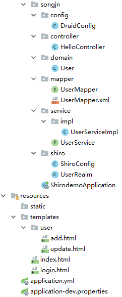

# shiro 结合mybatis从数据库中数据进行验证（连接池druid）

## 1、引入依赖
```
<?xml version="1.0" encoding="UTF-8"?>
<project xmlns="http://maven.apache.org/POM/4.0.0" xmlns:xsi="http://www.w3.org/2001/XMLSchema-instance"
         xsi:schemaLocation="http://maven.apache.org/POM/4.0.0 http://maven.apache.org/xsd/maven-4.0.0.xsd">
    <modelVersion>4.0.0</modelVersion>
    <parent>
        <groupId>org.springframework.boot</groupId>
        <artifactId>spring-boot-starter-parent</artifactId>
        <version>2.1.6.RELEASE</version>
        <relativePath/> <!-- lookup parent from repository -->
    </parent>
    <groupId>com.songjn.shiro</groupId>
    <artifactId>shirodemo</artifactId>
    <version>0.0.1-SNAPSHOT</version>
    <name>shirodemo</name>
    <description>Demo project for Spring Boot</description>

    <properties>
        <java.version>1.8</java.version>
    </properties>

    <dependencies>
        <dependency>
            <groupId>org.springframework.boot</groupId>
            <artifactId>spring-boot-starter-thymeleaf</artifactId>
        </dependency>
        <dependency>
            <groupId>org.springframework.boot</groupId>
            <artifactId>spring-boot-starter-web</artifactId>
        </dependency>

        <dependency>
            <groupId>org.projectlombok</groupId>
            <artifactId>lombok</artifactId>
            <optional>true</optional>
        </dependency>
        <dependency>
            <groupId>org.springframework.boot</groupId>
            <artifactId>spring-boot-starter-test</artifactId>
            <scope>test</scope>
        </dependency>
        <dependency>
            <groupId>org.apache.shiro</groupId>
            <artifactId>shiro-spring</artifactId>
            <version>1.4.0</version>
        </dependency>
        <dependency>
            <groupId>org.crazycake</groupId>
            <artifactId>shiro-redis</artifactId>
            <version>3.2.2</version>
        </dependency>
        <dependency>
            <groupId>com.github.theborakompanioni</groupId>
            <artifactId>thymeleaf-extras-shiro</artifactId>
            <version>2.0.0</version>
        </dependency>
        <dependency>
            <groupId>org.mybatis.spring.boot</groupId>
            <artifactId>mybatis-spring-boot-starter</artifactId>
            <version>1.3.2</version>
        </dependency>
        <!--引入druid数据源-->
        <dependency>
            <groupId>com.alibaba</groupId>
            <artifactId>druid-spring-boot-starter</artifactId>
            <version>1.1.10</version>
        </dependency>
        <dependency>
            <groupId>mysql</groupId>
            <artifactId>mysql-connector-java</artifactId>
            <version>${mysql.version}</version>
        </dependency>
    </dependencies>

    <build>

        <resources>
            <resource>
                <directory>src/main/java</directory>
                <includes>
                    <include>**/*.xml</include>
                </includes>
            </resource>
        </resources>
        <plugins>
            <plugin>
                <groupId>org.springframework.boot</groupId>
                <artifactId>spring-boot-maven-plugin</artifactId>
            </plugin>
        </plugins>
    </build>
</project>
```
## 2、项目目录


## 3、前端页面
index页面
```
<html lang="en" xmlns:th="http://www.thymeleaf.org" xmlns:shiro="http://www.w3.org/1999/xhtml">
<html lang="en">
<head>
    <meta charset="UTF-8">
    <title>index</title>
</head>
<body>
<h1>-----------shiro demo-----------</h1>
<hr>
<h3 th:text="${name}"></h3>
<div shiro:hasPermission="user:add">
    进入用户添加功能： <a href="add">用户添加</a><br/>
</div>
<div shiro:hasPermission="user:update">
    进入用户更新功能： <a href="update">用户更新</a><br/>
</div>
<a href="toLogin">登录</a>

</body>
</html>
```
login页面
```
<html lang="en" xmlns:th="http://www.thymeleaf.org">
<html lang="en">
<head>
    <meta charset="UTF-8">
    <title>登录页面</title>
</head>
<body>
<h1>-----------login-----------</h1>
<hr><br>
<h3 th:text="${msg}" style="color: red"></h3>
<form method="post" action="/login">
    用户名：<input type="text" name="name"><br><br>
    密码：<input type="password" name="pwd"><br><br>
    记住我：<input type="checkbox" name="remember"><br><br>
    <input type="submit" value="login"><br><br>
</form>
</body>
</html>
```

## 4、控制器controller
```
import org.apache.shiro.SecurityUtils;
import org.apache.shiro.authc.IncorrectCredentialsException;
import org.apache.shiro.authc.UnknownAccountException;
import org.apache.shiro.authc.UsernamePasswordToken;
import org.springframework.stereotype.Controller;
import org.springframework.ui.Model;
import org.apache.shiro.subject.Subject;
import org.springframework.web.bind.annotation.RequestMapping;

@Controller
public class HelloController {
    @RequestMapping("/noAuth")
    public String noAuth(Model model) {
        System.out.println("-------controller  noAuth  ------");
        return "user/noauth";
    }

    @RequestMapping("/add")
    public String add(Model model) {
        System.out.println("-------controller  add  ------");
        return "user/add";
    }

    @RequestMapping("/update")
    public String update(Model model) {
        System.out.println("-------controller  update  ------");
        return "user/update";
    }

    @RequestMapping("/toLogin")
    public String toLogin(Model model) {
        System.out.println("-------controller  toLogin  ------");
        return "login";
    }

    @RequestMapping("/login")
    public String login(String name, String pwd, Model model) {
        System.out.println("-------controller  login  ------");
        System.out.println("用户名：" + name + "密码：" + pwd);

        /**
         * 使用Shiro编写认证操作
         */
        //1.获取Subject
        Subject subject = SecurityUtils.getSubject();

        //2.封装用户数据
        UsernamePasswordToken token = new UsernamePasswordToken(name, pwd);

        //3.执行登录方法
        try {
            subject.login(token);
            //登录成功
            //跳转到test.html
            return "redirect:test";
        } catch (UnknownAccountException e) {
            //登录失败:用户名不存在
            model.addAttribute("msg", "用户名不存在");
            return "login";
        } catch (IncorrectCredentialsException e) {
            //登录失败:密码错误
            model.addAttribute("msg", "密码错误");
            return "login";
        }
    }
    
    @RequestMapping("/test")
    public String test(Model model) {
        System.out.println("-------controller  test  ------");
        model.addAttribute("name", "jaja");
        return "index";
    }
}
```

## 5、shiro的UserRealm类（shiro主类）
这个是shiro执行授权逻辑和认证逻辑的地方。  
通过service从数据库中获取密码，然后和前端密码进行比对。
```
import com.songjn.domain.User;
import com.songjn.service.UserService;
import org.apache.shiro.authc.*;
import org.apache.shiro.authz.AuthorizationInfo;
import org.apache.shiro.realm.AuthorizingRealm;
import org.apache.shiro.subject.PrincipalCollection;
import org.springframework.beans.factory.annotation.Autowired;

public class UserRealm extends AuthorizingRealm {

    @Autowired
    private UserService service;

    @Override
    protected AuthorizationInfo doGetAuthorizationInfo(PrincipalCollection principalCollection) {
        System.out.println("执行授权逻辑");
        return null;
    }

    @Override
    protected AuthenticationInfo doGetAuthenticationInfo(AuthenticationToken authenticationToken) throws AuthenticationException {
        System.out.println("执行认证逻辑");
        //编写shiro判断逻辑，判断用户名和密码
        //1.判断用户名
        UsernamePasswordToken token = (UsernamePasswordToken) authenticationToken;

        User user = service.findByName(token.getUsername());//数据库中user数据进行对比
        if (user == null) {
            //用户名不存在
            return null;//shiro底层会抛出UnKnowAccountException
        }
        System.out.println("user:::" + user.toString());
        //2.判断密码
        return new SimpleAuthenticationInfo("", user.getPassword(), "");
    }
}
```
## 6、shiro的ShiroConfig配置类（shiro配置类）
shiro的配置类  
对url进行拦截的地方
>过程：创建UserRealm-->创建DefaultWebSecurityManager-->创建ShiroFilterFactoryBean
>然后通过shiroFilter进行URL的权限过滤
```
import at.pollux.thymeleaf.shiro.dialect.ShiroDialect;
import org.apache.shiro.spring.web.ShiroFilterFactoryBean;
import org.apache.shiro.web.mgt.DefaultWebSecurityManager;
import org.springframework.beans.factory.annotation.Qualifier;
import org.springframework.context.annotation.Bean;
import org.springframework.context.annotation.Configuration;

import java.util.LinkedHashMap;

@Configuration
public class ShiroConfig {

    /**
     * 基本3、创建ShiroFilterFactoryBean
     */
    @Bean(name = "shiroFilter")
    public ShiroFilterFactoryBean shiroFilterFactoryBean(@Qualifier("securityManager") DefaultWebSecurityManager securityManager) {

        System.out.println("--------------shiroFilter----------------");
        ShiroFilterFactoryBean shiroFilterFactoryBean = new ShiroFilterFactoryBean();
        //设置安全管理器
        shiroFilterFactoryBean.setSecurityManager(securityManager);

        /**
         * shiro的内置过滤器可以实现权限的拦截
         *      常用过滤器：
         *          anno：无需认证登录可以直接访问
         *          authc：必须认证才能访问
         *          user：使用rememberMe功能可以直接访问
         *          perms：该资源必须得到资源权限才能访问
         *          role：该资源必须得到角色权限才能访问
         */
        LinkedHashMap<String, String> filterMap = new LinkedHashMap<>();
/*
        filterMap.put("/add", "authc");//必须认证才能访问
        filterMap.put("/update", "authc");//注意：路径必须有“/”
*/

        filterMap.put("/toLogin", "anon");
        filterMap.put("/login", "anon");

        filterMap.put("/add", "perms[user:add]");
        filterMap.put("/update", "perms[user:update]");

        filterMap.put("/*", "authc");//表示需要认证才可以访问

        shiroFilterFactoryBean.setLoginUrl("toLogin");//没有认证的用户返回登录页面

        shiroFilterFactoryBean.setUnauthorizedUrl("/noAuth");//没有授权的页面返回未授权页面

        shiroFilterFactoryBean.setFilterChainDefinitionMap(filterMap);

        return shiroFilterFactoryBean;
    }

    /**
     * 基本2、创建DefaultWebSecurityManager
     */
    @Bean(name = "securityManager")
    public DefaultWebSecurityManager securityManager(@Qualifier("userRealm") UserRealm userRealm) {
        System.out.println("--------------shiro已经加载----------------");
        DefaultWebSecurityManager securityManager = new DefaultWebSecurityManager();
        //关联realm
        securityManager.setRealm(userRealm);
        return securityManager;
    }

    /**
     * 基本1、创建UserRealm
     */
    @Bean(name = "userRealm")
    public UserRealm getRealm() {
        return new UserRealm();
    }

    /**
     * 配置ShiroDialect，用于thymeleaf和shiro标签配合使用
     */
    @Bean
    public ShiroDialect getShiroDialect(){
        return new ShiroDialect();
    }
}
```
## 7、整合mybatis
1）配置Mapper接口，接口需要添加@Repository注解
```
@Repository
public interface UserMapper {
    User findByName(String name);
}
```
2）在相同目录下配置Mapper.xml  
**注意：**
* Mapper.xml文件名称必须和接口文件名称相同
* 名称空间是接口的引用地址
* 语句的id属性必须和方法名称保持一致
* 注意返回属性resultType和resultMap
* User可以不写引用地址，但是需要在配置文件中配置别名描包type-aliases-package: com.songjn.domain
```
<?xml version="1.0" encoding="UTF-8"?>
<!DOCTYPE mapper PUBLIC "-//mybatis.org//DTD Mapper 3.0//EN" "http://mybatis.org/dtd/mybatis-3-mapper.dtd">
<!--suppress ALL -->
<mapper namespace="com.songjn.mapper.UserMapper">
    <select id="findByName" parameterType="String" resultType="User">
        select *
        from user
        where name = #{value}
    </select>
    <select id="findAuthById" parameterType="Long" resultType="String">
        select auth
        from user
        where id = #{value}
    </select>
</mapper>
```
3）application.yml文件中配置上扫描，别名=类名
```
mybatis:
  type-aliases-package: com.songjn.domain
```
4）启动类中配置mapper的扫描
```
@SpringBootApplication
@MapperScan("com.songjn.mapper")
public class ShirodemoApplication {
	public static void main(String[] args) {
		SpringApplication.run(ShirodemoApplication.class, args);
	}
}
```
5）pom文件中在<build>标签下添加编译xml标签，否则java目录下的xml是没办法进行编译读取的
```
<resources>
    <resource>
        <directory>src/main/java</directory>
        <includes>
            <include>**/*.xml</include>
        </includes>
    </resource>
</resources>
```


## 8、整合druid
1）druid配置类
```
import com.alibaba.druid.pool.DruidDataSource;
import com.alibaba.druid.support.http.StatViewServlet;
import com.alibaba.druid.support.http.WebStatFilter;
import org.springframework.boot.context.properties.ConfigurationProperties;
import org.springframework.boot.web.servlet.FilterRegistrationBean;
import org.springframework.boot.web.servlet.ServletRegistrationBean;
import org.springframework.context.annotation.Bean;
import org.springframework.context.annotation.Configuration;

import javax.sql.DataSource;
import java.util.Arrays;
import java.util.HashMap;
import java.util.Map;

/**
 * druid配置文件，springboot自己读取配置文件
 */
@Configuration
public class DruidConfig {

    @ConfigurationProperties(prefix = "spring.datasource")
    @Bean
    public DataSource druid() {
        return new DruidDataSource();
    }
    //配置Druid的监控
    //1、配置一个管理后台的Servlet
    @Bean
    public ServletRegistrationBean statViewServlet() {
        ServletRegistrationBean bean = new ServletRegistrationBean(new StatViewServlet(), "/druid/*");
        Map<String, String> initParams = new HashMap<>();

        initParams.put("loginUsername", "admin");
        initParams.put("loginPassword", "123456");
        initParams.put("allow", "");//默认就是允许所有访问
        initParams.put("deny", "192.168.15.21");

        bean.setInitParameters(initParams);
        return bean;
    }
    //2、配置一个web监控的filter
    @Bean
    public FilterRegistrationBean webStatFilter() {
        FilterRegistrationBean bean = new FilterRegistrationBean();
        bean.setFilter(new WebStatFilter());

        Map<String, String> initParams = new HashMap<>();
        initParams.put("exclusions", "*.js,*.css,/druid/*");

        bean.setInitParameters(initParams);

        bean.setUrlPatterns(Arrays.asList("/*"));

        return bean;
    }
}
```


2）application.yml中druid配置
```
spring:
  profiles:
    active: dev
  thymeleaf:
    cache: false
  datasource:
    type: com.alibaba.druid.pool.DruidDataSource
    driver-class-name: com.mysql.cj.jdbc.Driver
    url: jdbc:mysql://${dbs.database.host}:${dbs.database.port}/${dbs.database.databasename}?characterEncoding=UTF-8
    username: ${dbs.database.username}
    password: ${dbs.database.password}
    # 初始化大小，最小，最大
    initialSize: 5
    minIdle: 5
    maxActive: 500
    # 配置获取连接等待超时的时间
    maxWait: 60000
    # 配置间隔多久才进行一次检测，检测需要关闭的空闲连接，单位是毫秒
    timeBetweenEvictionRunsMillis: 60000
    # 配置一个连接在池中最小生存的时间，单位是毫秒
    minEvictableIdleTimeMillis: 300000
    validationQuery: SELECT 1 FROM DUAL
    testWhileIdle: true
    testOnBorrow: false
    testOnReturn: false
    poolPreparedStatements: true
    maxPoolPreparedStatementPerConnectionSize: 20
    # 通过connectProperties属性来打开mergeSql功能；慢SQL记录
    connectionProperties: druid.stat.mergeSql=true;druid.stat.slowSqlMillis=5000
```
3）application-dev.properties配置
```
profile=dev
#====== 开发自测环境 =======
dbs.database.host=10.110.147.194
dbs.database.port=3306
dbs.database.username=
dbs.database.password=
dbs.database.databasename=
```
**说明：**  
druid依赖两个jar，一个是spring的web包和log4j包。
