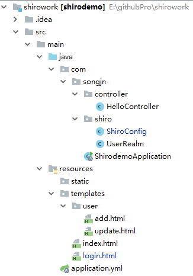

#  shiro 实现登录拦截
详情参考shirowork项目

## 1、引入shiro依赖
```
<dependency>
    <groupId>org.apache.shiro</groupId>
    <artifactId>shiro-spring</artifactId>
    <version>1.4.0</version>
</dependency>
```
## 2、shiro 目录结构展示



## 3、前端页面
index页面
```
<html lang="en" xmlns:th="http://www.thymeleaf.org">
<html lang="en">
<head>
    <meta charset="UTF-8">
    <title>index</title>
</head>
<body>
<h1>-----------shiro demo-----------</h1>
<hr>
<h3 th:text="${name}"></h3>
进入新增页面:<a href="add">add</a><br>
进入修改页面:<a href="update">update</a>
</body>
</html>
```
login页面
```
<html lang="en" xmlns:th="http://www.thymeleaf.org">
<html lang="en">
<head>
    <meta charset="UTF-8">
    <title>登录页面</title>
</head>
<body>
<h1>-----------login-----------</h1>
<hr><br>
<h3 th:text="${msg}" style="color: red"></h3>
<form method="post" action="/login">
    用户名：<input type="text" name="name"><br><br>
    密码：<input type="password" name="pwd"><br><br>
    记住我：<input type="checkbox" name="remember"><br><br>
    <input type="submit" value="login"><br><br>
</form>
</body>
</html>
```

## 4、控制器controller(部分接口省略)
```
import org.apache.shiro.SecurityUtils;
import org.apache.shiro.authc.IncorrectCredentialsException;
import org.apache.shiro.authc.UnknownAccountException;
import org.apache.shiro.authc.UsernamePasswordToken;
import org.springframework.stereotype.Controller;
import org.springframework.ui.Model;
import org.apache.shiro.subject.Subject;
import org.springframework.web.bind.annotation.RequestMapping;

@Controller
public class HelloController {
    @RequestMapping("/login")
    public String login(String name, String pwd, Model model) {
        System.out.println("-------controller  login  ------");
        System.out.println("用户名：" + name + "密码：" + pwd);

        /**
         * 使用Shiro编写认证操作
         */

        //1.获取Subject
        Subject subject = SecurityUtils.getSubject();

        //2.封装用户数据
        UsernamePasswordToken token = new UsernamePasswordToken(name, pwd);

        //3.执行登录方法
        try {
            subject.login(token);

            //登录成功
            //跳转到test.html
            return "redirect:test";
        } catch (UnknownAccountException e) {
            //登录失败:用户名不存在
            model.addAttribute("msg", "用户名不存在");
            return "login";
        } catch (IncorrectCredentialsException e) {
            //登录失败:密码错误
            model.addAttribute("msg", "密码错误");
            return "login";
        }
    }
    @RequestMapping("test")
    public String test(Model model) {
        System.out.println("-------controller  test  ------");
        model.addAttribute("name", "jaja");
        return "index";
    }
}
```
## 5、shiro的UserRealm类（shiro主类）
这个是shiro执行授权逻辑和认证逻辑的地方。
```
import org.apache.shiro.authc.*;
import org.apache.shiro.authz.AuthorizationInfo;
import org.apache.shiro.realm.AuthorizingRealm;
import org.apache.shiro.subject.PrincipalCollection;

public class UserRealm extends AuthorizingRealm {

    @Override
    protected AuthorizationInfo doGetAuthorizationInfo(PrincipalCollection principalCollection) {
        System.out.println("执行授权逻辑");
        return null;
    }

    @Override
    protected AuthenticationInfo doGetAuthenticationInfo(AuthenticationToken authenticationToken) throws AuthenticationException {
        System.out.println("执行认证逻辑");

        //假设数据库的用户名和密码
        String name = "1";
        String password = "1";

        //编写shiro判断逻辑，判断用户名和密码
        //1.判断用户名
        UsernamePasswordToken token = (UsernamePasswordToken) authenticationToken;
        if (!token.getUsername().equals(name)) {
            //用户名不存在
            return null;//shiro底层会抛出UnKnowAccountException
        }

        //2.判断密码
        return new SimpleAuthenticationInfo("", password, "");
    }
}
```
## 6、shiro的ShiroConfig配置类（shiro配置类）
shiro的配置类  
对url进行拦截的地方
>过程：创建UserRealm-->创建DefaultWebSecurityManager-->创建ShiroFilterFactoryBean
>然后通过shiroFilter进行URL的权限过滤
```
import org.apache.shiro.spring.web.ShiroFilterFactoryBean;
import org.apache.shiro.web.mgt.DefaultWebSecurityManager;
import org.springframework.beans.factory.annotation.Qualifier;
import org.springframework.context.annotation.Bean;
import org.springframework.context.annotation.Configuration;

import java.util.LinkedHashMap;

@Configuration
public class ShiroConfig {

    /**
     * 基本3、创建ShiroFilterFactoryBean
     */
    @Bean(name = "shiroFilter")
    public ShiroFilterFactoryBean shiroFilterFactoryBean(@Qualifier("securityManager") DefaultWebSecurityManager securityManager) {

        System.out.println("--------------shiroFilter----------------");
        ShiroFilterFactoryBean shiroFilterFactoryBean = new ShiroFilterFactoryBean();
        //设置安全管理器
        shiroFilterFactoryBean.setSecurityManager(securityManager);

        /**
         * shiro的内置过滤器可以实现权限的拦截
         *      常用过滤器：
         *          anno：无需认证登录可以直接访问
         *          authc：必须认证才能访问
         *          user：使用rememberMe功能可以直接访问
         *          perms：该资源必须得到资源权限才能访问
         *          role：该资源必须得到角色权限才能访问
         */
        LinkedHashMap<String, String> filterMap = new LinkedHashMap<>();
/*
        filterMap.put("/add", "authc");//必须认证才能访问
        filterMap.put("/update", "authc");//注意：路径必须有“/”
*/

        filterMap.put("/toLogin","anon");
        filterMap.put("/login","anon");

        filterMap.put("/*", "authc");//表示需要认证才可以访问

        shiroFilterFactoryBean.setLoginUrl("toLogin");

        shiroFilterFactoryBean.setFilterChainDefinitionMap(filterMap);

        return shiroFilterFactoryBean;
    }

    /**
     * 基本2、创建DefaultWebSecurityManager
     */
    @Bean(name = "securityManager")
    public DefaultWebSecurityManager securityManager(@Qualifier("userRealm") UserRealm userRealm) {
        System.out.println("--------------shiro已经加载----------------");
        DefaultWebSecurityManager securityManager = new DefaultWebSecurityManager();
        //关联realm
        securityManager.setRealm(userRealm);
        return securityManager;
    }

    /**
     * 基本1、创建UserRealm
     */
    @Bean(name = "userRealm")
    public UserRealm getRealm() {
        return new UserRealm();
    }
}
```

## 7、请求过程

前端访问"login"URL-->权限拦截器（设置白名单通过）-->login的controller-->封装用户数据token-->执行登录方法subject.login(token);-->UserRealm中进行认证（比对数据库中数据）-->根据返回是否异常进行页面的跳转