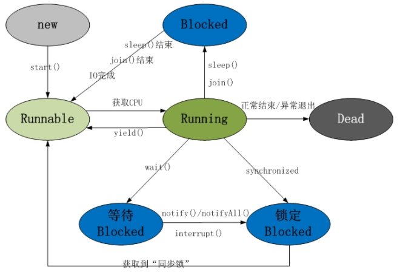

## 程序

“程序(Program)”是一个静态的概念，一般对应于操作系统中的一个可执行文件，比如：我们要启动酷狗听音乐，则对应酷狗的可执行程序。当我们双击酷狗，则加载程序到内存中，开始执行该程序，于是产生了“进程”。

## 进程

执行中的程序叫做进程(Process)，是一个动态的概念。现代的操作系统都可以同时启动多个进程。

## 线程

一个进程可以产生多个线程。同多个进程可以共享操作系统的某些资源一样，
同一进程的多个线程也可以共享此进程的某些资源(比如：代码、数据)，所以线程又被称为轻量级进程(lightweight process)。

## 线程和进程的区别

1. 每个进程都有独立的代码和数据空间(进程上下文)，进程间的切换会有较大的开销。

2. 线程可以看成是轻量级的进程，属于同一进程的线程共享代码和数据空间，每个线程有独立的运行栈和程序计数器(PC)，线程切换的开销小。

3. 线程和进程最根本的区别在于：进程是资源分配的单位，线程是调度和执行的单位。

4. 多进程: 在操作系统中能同时运行多个任务(程序)。

5. 多线程: 在同一应用程序中有多个顺序流同时执行。

6. 线程是进程的一部分，所以线程有的时候被称为轻量级进程。

7. 一个没有线程的进程是可以被看作单线程的，如果一个进程内拥有多个线程，进程的执行过程不是一条线(线程)的，而是多条线(线程)共同完成的。

8. 系统在运行的时候会为每个进程分配不同的内存区域，但是不会为线程分配内存(线程所使用的资源是它所属的进程的资源)，线程组只能共享资源。那就是说，除了CPU之外(线程在运行的时候要占用CPU资源)，计算机内部的软硬件资源的分配与线程无关，线程只能共享它所属进程的资源。

## 同步（Synchronous）与异步（Asynchronous）

同步和异步通常形容一次方法的调用。同步方法调用开始后调用者必须等到方法调用返回才能进行后续行为。异步方法则像一个消息的传递，调用方法后立即返回而方法体则在后台继续运行，调用者无需等待继续后续操作。

## 并发（Concurrency）和并行（Parallelism）

并发和并行都能表示两个或多个任务一起执行，但是并发偏重于任务交替执行，多个任务之间很可能是串行的，而并行是真正意义上的"同时执行"。

## 临界区

临界区用来表示一种公共资源或共享数据，可以被多个线程使用，但是一次只能有一个线程使用，一旦临界区资源被占用其他线程如果想要使用这个资源就必须等待。

## 阻塞（Blocking）和非阻塞（Non-Blocking）

    阻塞和非阻塞通常用来形容多线程的互相影响。当一个线程占用了临界区资源，那么其他需要这个资源的线程必须在这个临界区中进行等待。等待会导致线程挂起，这种情况就是阻塞。非阻塞与之相反，它强调没有一个线程可以妨碍其他线程执行，所有线程都会不断尝试向前执行。

## 死锁（Deadlock）、饥饿（Starvation）和活锁（Livelock）

死锁、饥饿和活锁都属于多线程活跃性问题。

死锁是指两个或两个以上的进程在执行过程中，由于竞争资源或者由于彼此通信而造成的一种阻塞的现象。

饥饿是指某一个或多个线程因为优先级等原因导致其无法获得所需要的资源，最终导致一直无法执行。

活锁则是线程之间一直将资源释放给其他线程，这会使资源不断在两个线程中跳动，而没有一个线程可以同时拿到所有资源而正常执行，这种情况就是活锁。

## 并发级别

由于临界区的存在，多线程之间的并发必须受到控制，根据并发的策略大致将并发的级别进行分为阻塞，无饥饿，无障碍，无锁，无等待几种。

1.阻塞（Blocking）

    一个线程是阻塞的那么在其他线程释放资源前，当前线程无法继续执行。当使用synchonized关键字或者重入锁时，得到的就是阻塞的线程。

    无论是synchonized关键字或者重入锁都会试图在执行后续代码前得到临界区的锁，如果得不到则会挂起等待，直到占有了所需要的资源为止。

2.无饥饿（Starvation-Free）

    如果线程之间有优先级，那么在线程调度的时候总会倾向于高优先级的线程。如果没有优先级，满足先来后到，则不会产生饥饿。

3.无障碍（Obstruction-Free）

    无障碍是最弱的的非阻塞调度。两个线程如果都是无障碍的执行，那么他们不会因为临界区的问题导致一方挂起。如果阻塞的控制方式是悲观策略，那么相对来说非阻塞的调度是一种乐观的策略。一种可行的无障碍实现是以来一个“一致性标记”来实现。线程在操作前先读取并保存这个标记，在操作完成后再读取检查这个标记是否被更改如果是一致的则表示资源没有访问冲天，否则表示有其他线程对此资源有过修改需要重试操作。而任何对资源有修改的线程在更改数据前需要更新这个一致性标记，表示数据不安全。

4.无锁（Lock-Free）

    无锁的并行都是无障碍的。在无锁的情况下，所有的线程都能尝试对临界区的访问，但是无锁的并发保证必然有一个线程能在有限步内完成操作离开临界区。（但是有可能总是不成功会出现类似饥饿的现象）

    在无锁的调用中，典型的特点是包含一个无穷循环，在这个循环中线程会不断尝试修改共享变量。如果没有冲突修改成功则程序退出，否则继续尝试修改。

4.无等待（Wait-Free）

    无等待是在无锁的基础上更近一步进行扩充，它要求所有线程都必须在有限步内完成，这样就不会引起饥饿问题。

    典型的无等待结构就是RCU（Rrad-Copy-Update）。它的基本思想是对数据的读不进行控制，所以所有的读线程都是无等待。但是写数据是会先取得源数据的副本，然后只修改副本数据，修改完成后在合适的时机回写数据。

## 有关并行的两个重要定律

1.Amdahl定律

加速比定义：加速比=优化前系统耗时/优化后系统耗时

根据Amdahl定律使用多核CPU对系统进行优化，优化的效果取决于CPU的熟练以及串行化程序的比重，CPU越多，串行化比重越低，则优化效果越好。仅提高CPU数量而不降低程序的串行化比重也无法提高系统性能。

2.Gustafson定律

如果串行化比例小，并行化比例大，那么加速比则是处理器个数。只要不断累加处理器就能更快。

Amdahl强调的是：当串行化比例一定时，加速比是有上限的，不管堆叠多少个CPU进行计算都不能突破上限。

Gustafson关心的是：如果可悲 并行化代码比重足够多，那么加速比能随着CPU的数量线性增长。

这两个定律并不矛盾，从极端角度来看，如果系统中没有可被串行化代码（F=1）那么对于两个定律来说加速比都是1。反之两个定律得到的加速比为n（处理器个数）。

## 什么是守护线程？

在有线程运行的情况下进行运行的线程

## 线程的5种状态

1）新建状态(New) : 线程对象被创建后，就进入了新建状态。例如，Thread thread = new Thread()。

2）就绪状态(Runnable): 也被称为“可执行状态”。线程对象被创建后，其它线程调用了该对象的start()方法，从而来启动该线程。例如，thread.start()。处于就绪状态的线程，随时可能被CPU调度执行。

3）运行状态(Running) : 线程获取CPU权限进行执行。需要注意的是，线程只能从就绪状态进入到运行状态。

4）阻塞状态(Blocked) : 阻塞状态是线程因为某种原因放弃CPU使用权，暂时停止运行。直到线程进入就绪状态，才有机会转到运行状态。阻塞的情况分三种：

(a) 等待阻塞 -- 通过调用线程的wait()方法，让线程等待某工作的完成。

(b) 同步阻塞 -- 线程在获取synchronized同步锁失败(因为锁被其它线程所占用)，它会进入同步阻塞状态。

(c) 其他阻塞 -- 通过调用线程的sleep()或join()或发出了I/O请求时，线程会进入到阻塞状态。当sleep()状态超时、join()等待线程终止或者超时、或者I/O处理完毕时，线程重新转入就绪状态。

5）死亡状态(Dead) : 线程执行完了或者因异常退出了run()方法，该线程结束生命周期。

## runnable 和 callable 有什么区别？

1、接口定义不同，callable可以有返回值（泛型），runnable不能有返回值

2、callable的cell()方法能够抛出异常，runnable的run()方法只能内部消化

## 创建线程有哪几种方式？

1、实现Runnable接口并实现run方法

2、继承Thread接口重写run方法

3、创建Thread对象时候通过匿名内部类实现

4、使用Callable和Future创建线程

