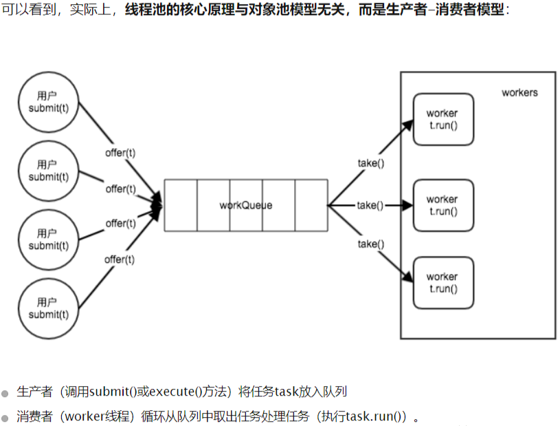
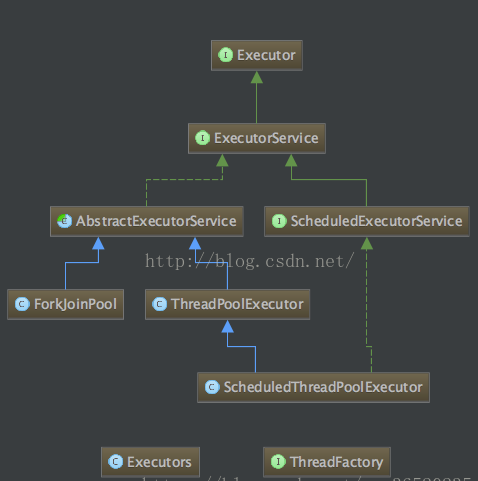

## 线程池是用来干嘛的？ 
如果并发的线程数量很多，并且每个线程都是执行一个时间很短的任务就结束了，这样频繁创建线程就会大大降低系统的效率，因为频繁创建线程和销毁线程需要时间。 
那么有没有一种办法使得线程可以复用，就是执行完一个任务，并不被销毁，而是可以继续执行其他的任务？ 

## 线程池的好处
1、降低资源消耗。重复利用已创建线程，降低线程创建与销毁的资源消耗。   
2、提高响应效率。任务到达时，不需等待创建线程就能立即执行。   
3、提高线程可管理性。   
4、防止服务器过载。内存溢出、CPU耗尽  

##  线程池的核心思想


## 类的关系结构 
   
Executor接口有一个子接口ExecutorService，ExecutorService的实现类为AbstracExecutorService，而ThreadPoolExcutor正是AbstrcExecutorService的子类。

## 线程池ThreadPoolExecutor讲解

```
public ThreadPoolExecutor(int corePoolSize,
                          int maximumPoolSize,
                          long keepAliveTime,
                          TimeUnit unit,
                          BlockingQueue<Runnable> workQueue,
                          ThreadFactory threadFactory,
                          RejectedExecutionHandler handler) {
    if (corePoolSize < 0 ||
        maximumPoolSize <= 0 ||
        maximumPoolSize < corePoolSize ||
        keepAliveTime < 0)
        throw new IllegalArgumentException();
    if (workQueue == null || threadFactory == null || handler == null)
        throw new NullPointerException();
    this.acc = System.getSecurityManager() == null ?
            null :
            AccessController.getContext();
    this.corePoolSize = corePoolSize;
    this.maximumPoolSize = maximumPoolSize;
    this.workQueue = workQueue;
    this.keepAliveTime = unit.toNanos(keepAliveTime);
    this.threadFactory = threadFactory;
    this.handler = handler;
}
```
### 参数说明
1、corePoolSize：核心线程池的大小，如果核心线程池有空闲位置，这是新的任务就会被核心线程池新建一个线程执行，执行完毕后不会销毁线程，线程会进入缓存队列等待再次被运行。

2、maximunPoolSize：线程池能创建最大的线程数量。如果核心线程池和缓存队列都已经满了，新的任务进来就会创建新的线程来执行。但是数量不能超过maximunPoolSize，否侧会采取拒绝接受任务策略，我们下面会具体分析。

3、keepAliveTime：非核心线程能够空闲的最长时间，超过时间，线程终止。这个参数默认只有在线程数量超过核心线程池大小时才会起作用。只要线程数量不超过核心线程大小，就不会起作用。

4、unit：时间单位，和keepAliveTime配合使用。
```
TimeUnit.DAYS;               //天
TimeUnit.HOURS;             //小时
TimeUnit.MINUTES;           //分钟
TimeUnit.SECONDS;           //秒
TimeUnit.MILLISECONDS;      //毫秒
TimeUnit.MICROSECONDS;      //微妙
TimeUnit.NANOSECONDS;       //纳秒
```

5、workQueue：缓存队列，用来存放等待被执行的任务。
* ArrayBlockingQueue;
* LinkedBlockingQueue;
* SynchronousQueue;  

6、threadFactory：线程工厂，用来创建线程，一般有三种选择策略。
```
public class ThreadFactoryMain implements ThreadFactory{
    private final String groupName;
    private AtomicInteger nextId = new AtomicInteger(1);
    
    public ThreadFactoryMain(String groupName) {
        this.groupName = "ThreadFactoryMain -" + groupName + "-worker-";
    }
 
    @Override
    public Thread newThread(@NotNull Runnable r) {
        String threadName = groupName + nextId.incrementAndGet();
        Thread thread = new Thread(null,r,threadName,0);
        return thread;
    }
 
    public static void main(String[] args){
        ThreadPoolExecutor threadPoolExecutor = new ThreadPoolExecutor(10,50,
                60L, TimeUnit.SECONDS,
                new LinkedBlockingQueue<Runnable>(20),
                new ThreadFactoryMain("zs.zhou"));
        Stream.iterate(0,n->n+1).limit(10).forEach(i->threadPoolExecutor.submit(new Runnable() {
            @Override
            public void run() {
                System.out.println(Thread.currentThread().getName() + " ::: --- " + i);
            }
        }));
        System.out.println("end");
        threadPoolExecutor.shutdown();
    }
}
```

7、handler：拒绝处理策略，线程数量大于最大线程数就会采用拒绝处理策略，四种策略为

* ThreadPoolExecutor.AbortPolicy:丢弃任务并抛出RejectedExecutionException异常。 
* ThreadPoolExecutor.DiscardPolicy：也是丢弃任务，但是不抛出异常。 
* ThreadPoolExecutor.DiscardOldestPolicy：丢弃队列最前面的任务，然后重新尝试执行任务（重复此过程）
* ThreadPoolExecutor.CallerRunsPolicy：由调用线程处理该任务 

#### 拓展一，关于队列：
1、 LinkedBlockingQueue;
>LinkedBlockingQueue是一个无界缓存等待队列。当前执行的线程数量达到corePoolSize的数量时，
剩余的元素会在阻塞队列里等待。（所以在使用此阻塞队列时maximumPoolSizes就相当于无效了），
每个线程完全独立于其他线程。生产者和消费者使用独立的锁来控制数据的同步，即在高并发的情况下可以并行操作队列中的数据。

2、ArrayBlockingQueue;
>ArrayBlockingQueue是一个有界缓存等待队列，可以指定缓存队列的大小，当正在执行的线程数等于corePoolSize时，
多余的元素缓存在ArrayBlockingQueue队列中等待有空闲的线程时继续执行，当ArrayBlockingQueue已满时，
加入ArrayBlockingQueue失败，会开启新的线程去执行，当线程数已经达到最大的maximumPoolSizes时，
再有新的元素尝试加入ArrayBlockingQueue时会报错。

3、SynchronousQueue;  
>SynchronousQueue没有容量，是无缓冲等待队列，是一个不存储元素的阻塞队列，会直接将任务交给消费者，必须等队列中的添加元素被消费后才能继续添加新的元素。

>拥有公平（FIFO）和非公平(LIFO)策略，非公平侧罗会导致一些数据永远无法被消费的情况？
 
>使用SynchronousQueue阻塞队列一般要求maximumPoolSizes为无界，避免线程拒绝执行操作。


### 线程池状态

>线程池和线程一样拥有自己的状态，在ThreadPoolExecutor类中定义了一个volatile变量runState来表示线程池的状态，线程池有四种状态，分别为RUNNING、SHURDOWN、STOP、TERMINATED。

* static final int RUNNING    = 0;
线程池创建后处于RUNNING状态。

* static final int SHUTDOWN   = 1;
调用shutdown后处于SHUTDOWN状态，线程池不能接受新的任务，会等待缓冲队列的任务完成。

* static final int STOP       = 2;
调用shutdownNow后处于STOP状态，线程池不能接受新的任务，并尝试终止正在执行的任务。

* static final int TERMINATED = 3;
当线程池处于SHUTDOWN或STOP状态，并且所有工作线程已经销毁，任务缓存队列已经清空或执行结束后，线程池被设置为TERMINATED状态。


### 线程池的关闭

ThreadPoolExecutor提供了两个方法，用于线程池的关闭，分别是shutdown()和shutdownNow()，其中：

shutdown()：不会立即终止线程池，而是要等所有任务缓存队列中的任务都执行完后才终止，但再也不会接受新的任务

shutdownNow()：立即终止线程池，并尝试打断正在执行的任务，并且清空任务缓存队列，返回尚未执行的任务

## 工具类Executors讲解
>Executors是一个工厂类，主要用来创建ExecutorService，ScheduledExecutorService等线程池。

>Java中创建线程池很简单，只需要调用Executors中相应的便捷方法即可，比如Executors.newFixedThreadPool(int nThreads)，但是便捷不仅隐藏了复杂性，也为我们埋下了潜在的隐患（OOM，线程耗尽）。
所以阿里编码规范不推荐用Executors来创建ThreadPoolExecutor

1、创建固定线程数目的线程池
>创建使用固定线程数的FixedThreadPool，适用于为了满足资源管理的需求，而需要限制当前线程数量的应用场景，它适用于负载比较重的服务器。
```
public static ExecutorService newFixedThreadPool(int nThreads) {
    return new ThreadPoolExecutor(nThreads, nThreads,
                                  0L, TimeUnit.MILLISECONDS,
                                  new LinkedBlockingQueue<Runnable>());//设定的阻塞队列是无界的
}
```

2、创建一个“工作窃取(work stealing)”ForkJoinPool线程池
```
public static ExecutorService newWorkStealingPool(int parallelism) {
    return new ForkJoinPool
        (parallelism,
         ForkJoinPool.defaultForkJoinWorkerThreadFactory,
         null, true);
}
```

3、创建缓存线程池
>创建一个会根据需要创建新线程的，适用于执行很多的短期异步任务的小程序，或者是负载较轻的服务器。
```
public static ExecutorService newCachedThreadPool() {
    return new ThreadPoolExecutor(0, Integer.MAX_VALUE,
                                  60L, TimeUnit.SECONDS,
                                  new SynchronousQueue<Runnable>());
}
```
4、创建单例线程池
>适用于需要保证顺序地执行各个任务；并且在任意时间点，不会有多个线程是活动的应用场景。
```
public static ExecutorService newSingleThreadExecutor() {
    return new FinalizableDelegatedExecutorService
        (new ThreadPoolExecutor(1, 1,
                                0L, TimeUnit.MILLISECONDS,
                                new LinkedBlockingQueue<Runnable>()));
}
```

5、定时线程池
>它主要用来在给定的延迟之后运行任务，或者定期执行任务，例如定时轮询数据库中的表的数据.
```
public static ScheduledExecutorService newScheduledThreadPool(
        int corePoolSize, ThreadFactory threadFactory) {
    return new ScheduledThreadPoolExecutor(corePoolSize, threadFactory);
}
```


## Runnable和Callable

可以向线程池提交的任务有两种：Runnable和Callable，二者的区别如下：

* 方法签名不同，void Runnable.run(), V Callable.call() throws Exception
* 是否允许有返回值，Callable允许有返回值
* 是否允许抛出异常，Callable允许抛出异常。

|提交方式|是否关心返回结果|
---|---
Future<T> submit(Callable<T> task)|是
void execute(Runnable command)|否
Future<?> submit(Runnable task)|否，虽然返回Future，但是其get()方法总是返回null

## 如何正确使用线程池

### 第一步，正确构造线程池
```
int poolSize = Runtime.getRuntime().availableProcessors() * 2;
BlockingQueue<Runnable> queue = new ArrayBlockingQueue<>(512);
RejectedExecutionHandler policy = new ThreadPoolExecutor.DiscardPolicy();
executorService = new ThreadPoolExecutor(poolSize, poolSize,0, TimeUnit.SECONDS,queue,policy);
```

### 第二步，获取结果

* 获取单个结果
过submit()向线程池提交任务后会返回一个Future，调用V Future.get()方法能够阻塞等待执行结果，V get(long timeout, TimeUnit unit)方法可以指定等待的超时时间。

* 获取多个结果
如果向线程池提交了多个任务，要获取这些任务的执行结果，可以依次调用Future.get()获得。
但对于这种场景，我们更应该使用ExecutorCompletionService，该类的take()方法总是阻塞等待某一个任务完成，
然后返回该任务的Future对象。向CompletionService批量提交任务后，只需调用相同次数的CompletionService.take()方法，
就能获取所有任务的执行结果，获取顺序是任意的，取决于任务的完成顺序：
```
void solve(Executor executor, Collection<Callable<Result>> solvers)
   throws InterruptedException, ExecutionException {
   
   CompletionService<Result> ecs = new ExecutorCompletionService<Result>(executor);// 构造器
   
   for (Callable<Result> s : solvers)// 提交所有任务
       ecs.submit(s);
       
   int n = solvers.size();
   for (int i = 0; i < n; ++i) {// 获取每一个完成的任务
       Result r = ecs.take().get();
       if (r != null)
           use(r);
   }
}
```
### 第三步，超时时间
单个任务的超时时间
V Future.get(long timeout, TimeUnit unit)方法可以指定等待的超时时间，超时未完成会抛出TimeoutException。

多个任务的超时时间
等待多个任务完成，并设置最大等待时间，可以通过CountDownLatch完成：
```
public void testLatch(ExecutorService executorService, List<Runnable> tasks) 
    throws InterruptedException{
      
    CountDownLatch latch = new CountDownLatch(tasks.size());
      for(Runnable r : tasks){
          executorService.submit(new Runnable() {
              @Override
              public void run() {
                  try{
                      r.run();
                  }finally {
                      latch.countDown();// countDown
                  }
              }
          });
      }
      latch.await(10, TimeUnit.SECONDS); // 指定超时时间
  }
```

## SpringBoot 使用线程池

1、线程池的创建
```
@Configuration
public class TreadPoolConfig {
    /**
     * 消费队列线程
     * @return
     */
    @Bean(value = "consumerQueueThreadPool")
    public ExecutorService buildConsumerQueueThreadPool(){
        ThreadFactory namedThreadFactory = new ThreadFactoryBuilder()
                .setNameFormat("consumer-queue-thread-%d").build();

        ExecutorService pool = new ThreadPoolExecutor(5, 5, 0L, TimeUnit.MILLISECONDS,
                new ArrayBlockingQueue<Runnable>(5),namedThreadFactory,new ThreadPoolExecutor.AbortPolicy());

        return pool ;
    }
}
```
2、线程池的使用
```
    @Resource(name = "consumerQueueThreadPool")
    private ExecutorService consumerQueueThreadPool;


    @Override
    public void execute() {

        //消费队列
        for (int i = 0; i < 5; i++) {
            consumerQueueThreadPool.execute(new ConsumerQueueThread());
        }

    }
```

## 监控线程池
谈到了 SpringBoot，也可利用它 actuator 组件来做线程池的监控。

如果在系统中大量使用线程池,则有必要对线程池进行监控,方便在出现问题时,可以根据线程池的使用状况快速定位问题.可通过线程池提供的参数进行监控,在监控线程池的时候可以使用以下属性:
```
taskCount：线程池需要执行的任务数量
completedTaskCount：线程池在运行过程中已完成的任务数量，小于或等于taskCount。
largestPoolSize：线程池里曾经创建过的最大线程数量.通过这个数据可以知道线程池是否曾经满过.如该数值等于线程池的最大大小,则表示线程池曾经满过.
getPoolSize：线程池的线程数量.如果线程池不销毁的话,线程池里的线程不会自动销毁，所以这个大小只增不减.
getActiveCount：获取活动的线程数.
通过扩展线程池进行监控.可以通过继承线程池来自定义线程池,重写线程池的
beforeExecute、afterExecute和terminated方法,
也可以在任务执行前、执行后和线程池关闭前执行一些代码来进行监控.例如,监控任务的平均执行时间、最大执行时间和最小执行时间等.
这几个方法在线程池里是空方法.

protected void beforeExecute(Thread t, Runnable r) { }

```
## 线程池隔离
如果我们很多业务都依赖于同一个线程池,当其中一个业务因为各种不可控的原因消耗了所有的线程，导致线程池全部占满。

这样其他的业务也就不能正常运转了，这对系统的打击是巨大的。

通常的做法是按照业务进行划分：

比如下单的任务用一个线程池，获取数据的任务用另一个线程池。这样即使其中一个出现问题把线程池耗尽，那也不会影响其他的任务运行。


## hystrix 隔离

这样的需求 Hystrix 已经帮我们实现了。

Hystrix 是一款开源的容错插件，具有依赖隔离、系统容错降级等功能。

下面来看看 Hystrix 简单的应用：

首先需要定义两个线程池，分别用于执行订单、处理用户。

```
/**
 * Function:订单服务
 *
 * @author crossoverJie
 *         Date: 2018/7/28 16:43
 * @since JDK 1.8
 */
public class CommandOrder extends HystrixCommand<String> {

    private final static Logger LOGGER = LoggerFactory.getLogger(CommandOrder.class);

    private String orderName;

    public CommandOrder(String orderName) {


        super(Setter.withGroupKey(
                //服务分组
                HystrixCommandGroupKey.Factory.asKey("OrderGroup"))
                //线程分组
                .andThreadPoolKey(HystrixThreadPoolKey.Factory.asKey("OrderPool"))

                //线程池配置
                .andThreadPoolPropertiesDefaults(HystrixThreadPoolProperties.Setter()
                        .withCoreSize(10)
                        .withKeepAliveTimeMinutes(5)
                        .withMaxQueueSize(10)
                        .withQueueSizeRejectionThreshold(10000))

                .andCommandPropertiesDefaults(
                        HystrixCommandProperties.Setter()
                                .withExecutionIsolationStrategy(HystrixCommandProperties.ExecutionIsolationStrategy.THREAD))
        )
        ;
        this.orderName = orderName;
    }


    @Override
    public String run() throws Exception {

        LOGGER.info("orderName=[{}]", orderName);

        TimeUnit.MILLISECONDS.sleep(100);
        return "OrderName=" + orderName;
    }
}


/**
 * Function:用户服务
 *
 * @author crossoverJie
 *         Date: 2018/7/28 16:43
 * @since JDK 1.8
 */
public class CommandUser extends HystrixCommand<String> {

    private final static Logger LOGGER = LoggerFactory.getLogger(CommandUser.class);

    private String userName;

    public CommandUser(String userName) {


        super(Setter.withGroupKey(
                //服务分组
                HystrixCommandGroupKey.Factory.asKey("UserGroup"))
                //线程分组
                .andThreadPoolKey(HystrixThreadPoolKey.Factory.asKey("UserPool"))

                //线程池配置
                .andThreadPoolPropertiesDefaults(HystrixThreadPoolProperties.Setter()
                        .withCoreSize(10)
                        .withKeepAliveTimeMinutes(5)
                        .withMaxQueueSize(10)
                        .withQueueSizeRejectionThreshold(10000))

                //线程池隔离
                .andCommandPropertiesDefaults(
                        HystrixCommandProperties.Setter()
                                .withExecutionIsolationStrategy(HystrixCommandProperties.ExecutionIsolationStrategy.THREAD))
        )
        ;
        this.userName = userName;
    }

    @Override
    public String run() throws Exception {

        LOGGER.info("userName=[{}]", userName);

        TimeUnit.MILLISECONDS.sleep(100);
        return "userName=" + userName;
    }
}
```

然后模拟运行：
```
    public static void main(String[] args) throws Exception {
        CommandOrder commandPhone = new CommandOrder("手机");
        CommandOrder command = new CommandOrder("电视");


        //阻塞方式执行
        String execute = commandPhone.execute();
        LOGGER.info("execute=[{}]", execute);

        //异步非阻塞方式
        Future<String> queue = command.queue();
        String value = queue.get(200, TimeUnit.MILLISECONDS);
        LOGGER.info("value=[{}]", value);


        CommandUser commandUser = new CommandUser("张三");
        String name = commandUser.execute();
        LOGGER.info("name=[{}]", name);
    }
```

可以看到两个任务分成了两个线程池运行，他们之间互不干扰。

获取任务任务结果支持同步阻塞和异步非阻塞方式，可自行选择。

它的实现原理其实容易猜到：

利用一个 Map 来存放不同业务对应的线程池。

通过刚才的构造函数也能证明：


还要注意的一点是：

自定义的 Command 并不是一个单例，每次执行需要 new 一个实例，不然会报 This instance can only be executed once. Please instantiate a new instance. 异常。


## 如何选择线程池数量
线程池的大小决定着系统的性能，过大或者过小的线程池数量都无法发挥最优的系统性能。

当然线程池的大小也不需要做的太过于精确，只需要避免过大和过小的情况。一般来说，确定线程池的大小需要考虑CPU的数量，内存大小，任务是计算密集型还是IO密集型等因素

NCPU = CPU的数量

UCPU = 期望对CPU的使用率 0 ≤ UCPU ≤ 1

W/C = 等待时间与计算时间的比率

如果希望处理器达到理想的使用率，那么线程池的最优大小为：

线程池大小=NCPU *UCPU(1+W/C)

在Java中使用

int ncpus = Runtime.getRuntime().availableProcessors();

## 手动创建线程池有几个注意点
1.任务独立。如何任务依赖于其他任务，那么可能产生死锁。例如某个任务等待另一个任务的返回值或执行结果，那么除非线程池足够大，否则将发生线程饥饿死锁。

2.合理配置阻塞时间过长的任务。如果任务阻塞时间过长，那么即使不出现死锁，线程池的性能也会变得很糟糕。在Java并发包里可阻塞方法都同时定义了限时方式和不限时方式。例如

Thread.join,BlockingQueue.put,CountDownLatch.await等，如果任务超时，则标识任务失败，然后中止任务或者将任务放回队列以便随后执行，这样，无论任务的最终结果是否成功，这种办法都能够保证任务总能继续执行下去。

3.设置合理的线程池大小。只需要避免过大或者过小的情况即可，上文的公式线程池大小=NCPU *UCPU(1+W/C)。

4.选择合适的阻塞队列。newFixedThreadPool和newSingleThreadExecutor都使用了无界的阻塞队列，无界阻塞队列会有消耗很大的内存，如果使用了有界阻塞队列，它会规避内存占用过大的问题，但是当任务填满有界阻塞队列，新的任务该怎么办？在使用有界队列是，需要选择合适的拒绝策略，队列的大小和线程池的大小必须一起调节。对于非常大的或者无界的线程池，可以使用SynchronousQueue来避免任务排队，以直接将任务从生产者提交到工作者线程。

下面是Thrift框架处理socket任务所使用的一个线程池，可以看一下FaceBook的工程师是如何自定义线程池的。
```
    private static ExecutorService createDefaultExecutorService(Args args) {
        SynchronousQueue executorQueue = new SynchronousQueue();

        return new ThreadPoolExecutor(args.minWorkerThreads, args.maxWorkerThreads, 60L, TimeUnit.SECONDS,
                executorQueue);
    }
```


