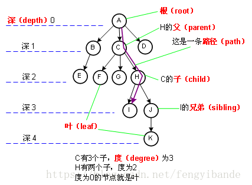
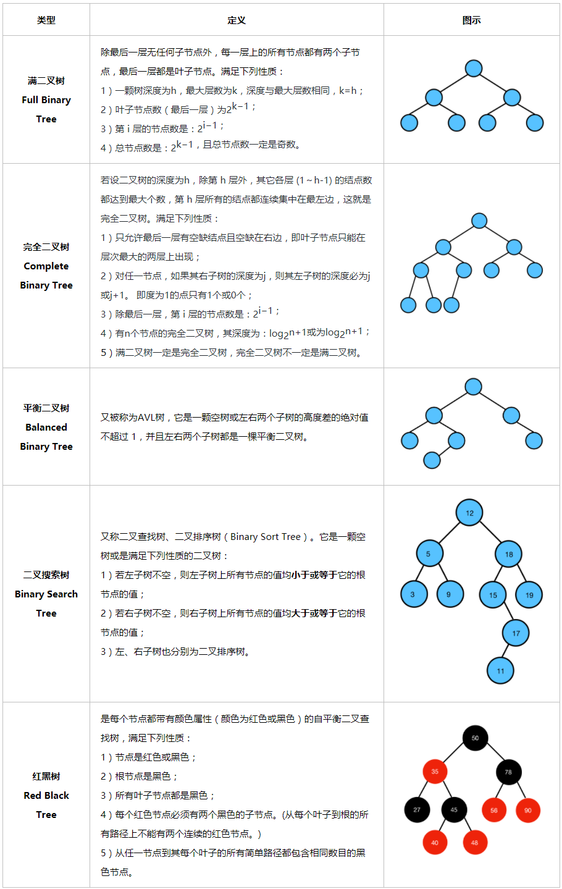

# 算法数据结构 --- 树

## 第一节  树的相关概念


1)节点<node>
>树中每个元素都叫节点

2)根节点或树根<root>
>树顶端的节点称之为根节点，也叫树根

3)子树<subTree>
>除根节点之外，其他节点可以分为多个树的集合，叫做子树，在上图中，K这个节点可以称之为一颗子树，而H、K、L三个节点组合起来也可以叫做一颗子树

4)节点的度
>一个节点直接含有的子树的个数，称之为节点的度。比如上图中B节点的度为3，C节点的度是2，I、J、K、L节点的度是0

5)叶子节点、叶节点、终端节点
>度为0的节点叫做叶子节点，也叫叶节点、终端节点，其实就是没有 子节点的节点，或者说没有子树的节点

6)双亲节点、父节点
>父节点就是一个节点上头的那个节点，如果一个节点包含若干子节点，那么这个节点就是这些子节点的父节点，也叫双亲节点

7)兄弟节点
>拥有相同父节点的节点互称为兄弟节点

8)树的度
>一棵树中最大节点的度称之为树的度，即树中哪个节点的子节点最多，那么这个节点的度也就是树的度

9)节点的层次
>从根这一层开始，根算1层，根的子节点算2层，一直到最下面一层

10)树的高度、深度
>树的深度是从根节点开始、自顶向下逐层累加（根节点的高度是1）助记：深度从上到下
树的高度是从叶节点开始、自底向上逐层累加（叶节点的高度是1）助记：高度由下向上
虽然树的高度和深度一样，但是具体到某个节点上，其高度和深度通常是不一样的。

11)堂兄弟节点
>堂兄弟节点是同一层，父节点不同，或者说双亲节点在同一层的节点称之为堂兄弟节点

12)节点的祖先
>从根节点到某一节点一路顺下来的除了该节点的所有节点都是该节点的祖先节点

13)节点的子孙
>以某节点为根的子树中，任何一个节点都是其子孙，也就是说这个节点下面与这个节点有关的节点都是这个节点的子孙

14)森林
>由m棵不相交的树组成的集合，叫做森林

## 第二节  树的种类



## 第三节  二叉树  


### 二叉树：

二叉树是n个结点的有限集合，该集合或者为空集（称为空二叉树），或者由一个根结点和两个互不相交的、分别称为根结点的左子树和右子树的二叉树组成。


### 二叉树的五种基本形态：

1，空二叉树2，只有一个根结点3，根结点只有左子树4，根结点只有右子树5，根结点既有左子树又有右子树。

斜树：左斜树和右斜树

左斜树：所有结点只有左子树的二叉树。

右斜树：所有结点只有右子树的二叉树。

线性结构可以理解为树的一种极其特殊的表现形式。

### 二叉树特点：

1，每个结点最多有两颗子树，所以二叉树中不存在度大于2的结点。

2，左子树和右子树是有顺序的，次序不能颠倒。

3，即使树中某结点只有一颗子树也要区分是左子树还是右子树。

### 二叉树的性质：

1） 在非空二叉树中，第i层的结点总数不超过2i-1, i>=1;

2） 深度为h的二叉树最多有2h-1个结点(h>=1)，最少有h个结点;

3） 对于任意一棵二叉树，如果其叶结点数为N0，而度数为2的结点总数为N2，则N0=N2+1;

4）具有n个结点的完全二叉树的深度为log2(n+1);

5）有N个结点的完全二叉树各结点如果用顺序方式存储，则结点之间有如下关系：

若I为结点编号则 如果I>1，则其父结点的编号为I/2；

如果2I<=N，则其左儿子（即左子树的根结点）的编号为2I；若2I>N，则无左儿子；

如果2I+1<=N，则其右儿子的结点编号为2I+1；若2I+1>N，则无右儿子。

6）给定N个节点，能构成h(N)种不同的二叉树，其中h(N)为卡特兰数的第N项，h(n)=C(2*n, n)/(n+1)。

7）设有i个枝点，I为所有枝点的道路长度总和，J为叶的道路长度总和J=I+2i。

 ### 遍历
 ```
1.中序遍历   
左子树——》根节点——》右子树
        (1)调用自身遍历节点的左子树
        (2)访问这个节点
        (3)调用自身遍历节点的右子树
2.前序遍历
根节点——》左子树——》右子树
        (1)访问这个节点
        (2)调用自身遍历节点的左子树
        (3)调用自身遍历节点的右子树
3.后序遍历  
左子树——》右子树——》根节点
        (1)调用自身遍历节点的左子树
        (2)调用自身遍历节点的右子树
        (3)访问这个节点
```