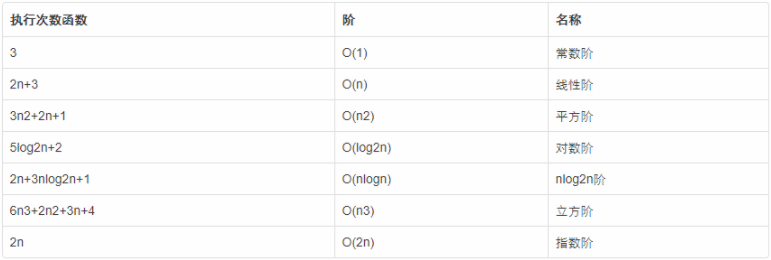
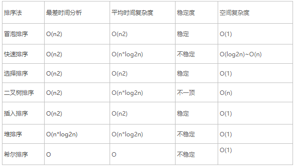

# 数据结构算法笔记

## 第一章 数据结构和算法简介
**程序设计=数据结构+算法**

###  第一节  数据结构简介

 **数据结构：** 就是数据之间存在的一种或者多种特定关系的集合

分为 **逻辑结构** 和 **物理结构**

1、四大逻辑结构

* 集合

* 线性结构 

* 树形结构 

* 图形结构

2、物理结构

* 链式存储结构

* 顺序存储结构  

3、常见数据结构:
```
线性：数组 (Array)、栈 (Stack)、队列 (Queue)、链表 (Linked List)、块状数组（数组+链表） 
树： 堆(heap)、二叉搜索树(binary search tree)、Merkle Tree(Hash Tree)、B-/B+ Tree、AVL树、红黑树、二叉树、哈夫曼树 
图 (Graph) 
散列表 (Hash)
```
###  第二节  算法简介

**算法** 是为求解一个问题需要遵循的、被清楚指定的简单指令的集合。

常见算法
```
基础：枚举，递归，分治，模拟，贪心，动态规划，剪枝，回溯 
排序：冒泡、快速、直接选择和堆、直接插入和希尔排序、归并排序 
查找：顺序查找、二分查找、索引查找、二叉排序树、哈希查找 
图算法：深度优先遍历与广度优先遍历， 最短路径，最小生成树，拓扑排序
```


## 第二章 时间复杂度和空间复杂度

### 第一节  时间复杂度说明
  
时间复杂度：

（1）时间频度 

       一个算法中的语句执行次数称为语句频度或时间频度。记为T(n)。

       n称为问题的规模，当n不断变化时，时间频度T(n)也会不断变化。

（2）时间复杂度

      一般情况下，算法中基本操作重复执行的次数是问题规模n的某个函数，用T(n)表示，若有某个辅助函数f(n),使得当n趋近于无穷大时，T（n)/f(n)的极限值为不等于零的常数，则称f(n)是T(n)的同数量级函数。记作T(n)=O(f(n)),称O(f(n)) 为算法的渐进时间复杂度，简称时间复杂度。 

      按数量级递增排列，常见的时间复杂度有：常数阶O(1),对数阶O(log2n),线性阶O(n), 线性对数阶O(nlog2n),平方阶O(n2)，立方阶O(n3),...， k次方阶O(nk),指数阶O(2n)。

     算法中语句执行次数为一个常数，则时间复杂度为O(1)

（3）时间复杂度的取值

 　　主要用算法时间复杂度的数量级评价一个算法的时间性能。


### 第二节  时间复杂度计算
 

* 用常数1取代运行时间中的所有加法常数。
* 在修改后的运行次数函数中，只保留最高阶项。
* 如果最高阶项存在且不是1，则去除与这个项相乘的常数。
* 得到的最后结果就是大O阶。
**常数阶：**
```
int sum = 0 ; n = 100;        /*执行一次*/
sum = (1+n)*n/2;             /*执行一次*/
printf("%d",sum);            /*执行一次*/
```
这个算法的运行次数f(n) = 3,根据推导大O阶的方法，第一步是将3改为1，在保留最高阶项是，它没有最高阶项，因此这个算法的时间复杂度为O(1);
 
**线性阶：**

线性阶的循环结构会复杂一些，要确定某个算法的阶次，需要确定特定语句或某个语句集运行的次数。因此要分析算法的复杂度，关键是要分析循环结构的运行情况。
```
int i;
for(i = 0 ; i < n ; i++){
  /*时间复杂度为O(1)的程序*/      
}
 ```

**对数阶：**
```
int count = 1;
while(count < n){
  count = count * 2;
  /*时间复杂度为O(1)的程序*/    
}
```

因为每次count*2后，距离结束循环更近了。也就是说有多少个2 相乘后大于n，退出循环。

数学公式：2x = n    -->     x = log2n

因此这个循环的时间复杂度为O(logn)

 

**平方阶：**
```
int i;
for(i = 0 ; i < n ; i++){
   for(j = 0 ; j < n ; j++){
    /*时间复杂度为O(1)的程序*/  
    }    
}
``` 

上面的程序中，对于对于内层循环，它的时间复杂度为O(n)，但是它是包含在外层循环中，再循环n次，因此这段代码的时间复杂度为O(n2)。
```
int i;
for(i = 0 ; i < n ; i++){
   for(j = 0 ; j < m ; j++){
    /*时间复杂度为O(1)的程序*/  
    }    
}
```

但是，如果内层循环改成了m次，时间复杂度就为O(n*m)

 

再来看一段程序：
```
int i;
for(i = 0 ; i < n ; i++){
   for(j = i ; j < n ; j++){
    /*时间复杂度为O(1)的程序*/  
    }    
}
```

注意：上面的内层循环j = i ;而不是0

因为i = 0时，内层循环执行了n次，当i=1时，执行了n-1次……当i=n-1时，执行了1次，所以总的执行次数为：

n+(n-1)+(n-1)+...+1 = n(n+1)/2  =  n2/2 + n/2

根据大O推导方法，保留最高阶项，n2/2 ，然后去掉这个项相乘的常数，1/2

因此，这段代码的时间复杂度为O(n2)

 

下面，分析调用函数时的时间复杂度计算方法：

首先，看一段代码：

```
int i,j;

void function(int count){
  print(count);  
}

for(i = 0 ; i < n ; i++){
  function (i)  
}
```
 

函数的时间复杂度是O(1)，因此整体的时间复杂度为O(n)。

假如function是这样的：
```
void function(int count){
  int j;
  for(j = count ; j < n ;j++){
        /*时间复杂度为O(1)的程序*/
 }
}
```

和第一个的不同之处在于把嵌套内循环放到了函数中，因此最终的时间复杂度为O(n2)

 

再来看一个比价复杂的语句:

```
n++;                                      /*执行次数为1*/
function(n);                              /*执行次数为n*/
int i,j;
for(i = 0 ; i < n ; i++){                 /*执行次数为nXn*/
  function(i);  
}
for(i = 0 ; i < n ; i++){                /*执行次数为n(n+1)/2*/
  for(j = i ; j < n ; j++){
      /*时间复杂度为O(1)的程序*/  
  }  
}    
```
 

它的执行次数f(n) = 1 + n + n2 + n(n+1)/2 + 3/2n2+3/2 n+1,

根据推导大O阶的方法，最终它的时间复杂度为：O(n2)


 ### 第三节 空间复杂度

空间复杂度与时间复杂度类似，空间复杂度是指算法在计算机内执行时所需存储空间的度量。记作: S(n)=O(f(n)) 我们一般所讨论的是除正常占用内存开销外的辅助存储单元规模。 

空间复杂度(Space Complexity)是对一个算法在运行过程中临时占用存储空间大小的量度。一个算法在计算机存储器上所占用的存储空间，包括存储算法本身所占用的存储空间，算法的输入输出数据所占用的存储空间和算法在运行过程中临时占用的存储空间这三个方面。

当一个算法的空间复杂度为一个常量，即不随被处理数据量n的大小而改变时，可表示为O(1)。

 ### 第四节 常用的算法的时间复杂度和空间复杂度
 
 
常见的算法时间复杂度由小到大依次为：Ο(1)＜Ο(log2n)＜Ο(n)＜Ο(nlog2n)＜Ο(n2)＜Ο(n3)＜…＜Ο(2n)＜Ο(n!)


