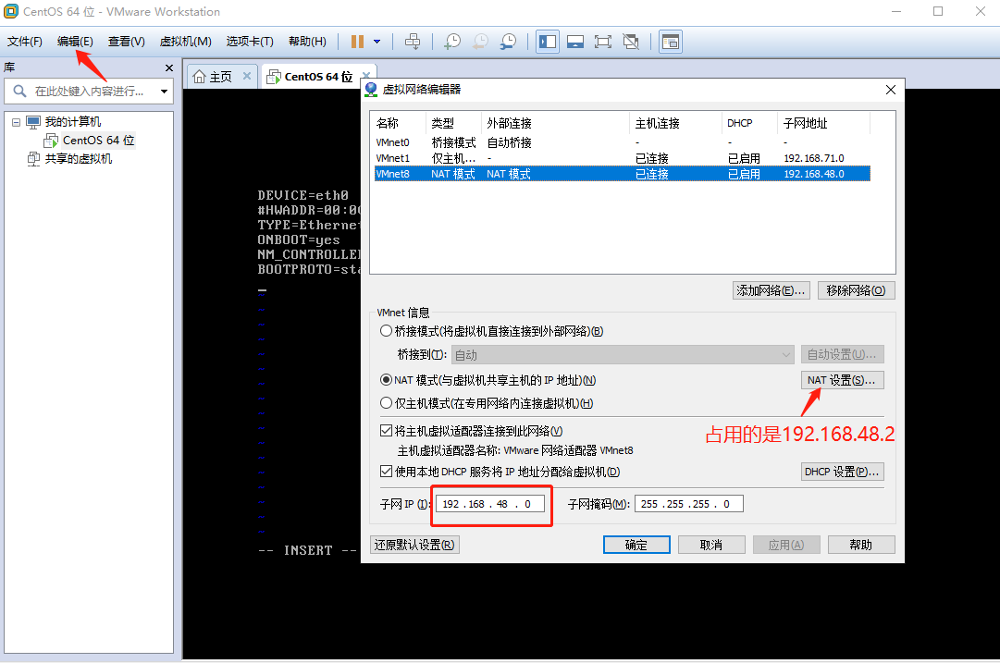

# linux环境的搭建

##第一节  安装VMware和linux虚拟机

1、自定义安装  

2、稍后安装系统

3、CentOS 64位

4、一个处理器，一个核心数量

5、内存1024M

6、使用网络地址转换（NAT），
不能使用桥接，因为人多的时候使用桥接，每个linux主机都需要一个ip地址，可能产生地址冲突。
使用地址转换，多个linux转换使用的是win主机的一个ip进行联网。

7、磁盘大小200G

8、选择自己的ios光盘，进行启动


##第二节  安装Linux系统

1、启动，选择第一项，install进行linux系统的安装

2、【OK】【Skip】检查硬盘是否完整，坏道等问题，选择Skip

3、主机名Linux_BigDB

4、时区：上海

5、密码：Passw0rd

6、硬盘分区，选择最后一个自定义分区

7、硬盘分区说明
```
- Hard Drives
  - sda       //sd硬盘，a第一块硬盘，b第二块硬盘
    - free 122879   //磁盘大小122879M
```
8、先创【引导分区】 /boot ,放内核

create-> Standard Partition -> /boot -> 200M -> OK

```
- Hard Drives
  - sda       //sd硬盘，a第一块硬盘，b第二块硬盘
    -sda1    200  /boot    ext4
    - free 122879   //磁盘大小122879M
```


9、创建运行时需要交换磁盘的【交换分区】


9、创建根目录，将剩余所有空间全部给到根目录


10、最后目录展示


11、最后格式化，写到磁盘

12、安装引导程序（默认）

13、重启，安装完成

##第二节  配置网卡并完成克隆
```[root@root~]# cd /etc/sysconfig/network-scripts/```
文件`ifcfg-eth0`  

1、注释网卡的硬件地址（生产环境是不允许这样做的），`#HWARDDR=...`
因为需要克隆4台机器，VM在克隆的时候需要将网卡地址换成新的，维护多个机器之间没有冲突。
这样在克隆的时候文件中地址和新的网卡地址对应不上，就会出现问题。
因此，注释掉，让其克隆的时候不能生成新的网卡，保证文件的一致性。


2、删除`UUID=...`

3、修改网卡为可用，将`ONBOOT=no`修改为`ONBOOT=yes`

4、`BOOTPROTO=dhcp`中，dhcp：自动获取IP地址。将其修改为静态的，直接定好IP地址，`BOOTPROTO=static`

5、设置linux主机地址`IPADDR=...`,设置之前需要在VM上查看可以设置地址的区间。
   
可以使用的网络区间为192.168.48.3-192.168.48.254

然后将网络设置为`IPADDR=192.168.48.99`

6、设置子网掩码`NETMASK=255.255.255.0`

7、设置网关`GATEWAY=192.168.48.2`

8、设置DNS，linux可以设置两个DNS。`DNS1=114.114.114.114`

9、重启服务`service network restart`  

10、查看网络：`ifconfig`，如图，配置正确。  
  

11、关闭防火墙,因为要做测试用，所以防火墙关闭状态（生产环境不能随意关闭）。  
1）关闭防火墙：
`service iptables stop`  
2）禁止开机启动
`chkconfig iptables off`  
3）查看是否禁止启动成功
`chkconfig`  
  


12、修改`/etc/selinux/config`文件,关闭安全策略。  
`vi /etc/selinux/config`中改为`SELINUX=disabled`

13、以为之后要多台机器进行通信，因此，需要修改hosts文件    
`vi /etc/hosts`添加以后通信的主机名称映射如下：  
  

14、实验环境删除文件（生产环境不能做）,里面记录了**网卡-eth0**的映射关系。
如果不删除，其他克隆物理机是不能使用自己的eth0配置文件的。
`/etc/udev/rules.d/70-persistent-net.rules`  
执行命令 `rm -rf /etc/udev/rules.d/70-persistent-net.rules`  
  


15、关机，保存快照。克隆4台虚拟机，克隆的时候一定要选择快照进行克隆，
否则克隆的时候后包含70-persistent-net.rules文件。影响配置。
  


##第三节  将克隆主机个性化

1、启动克隆的主机修改每个主机的主机IP地址,将地址依次改为192.168.48.101/102/103/104.  
`vi /etc/sysconfig/network-scripts/ifcfg-eth0`

2、修改主机名称  
`vi /etc/sysconfig/network`  
将`HOSTNAME=basic`改为`HOSTNAME=node01`

并依次完成其他主机的修改，并关机，拍快照。

**注意：修改完主机名后，要重新启动，内核才能重新加载新名称。**

3、将四台主机全部启动，然后查看主机名和ip地址是否正确。
然后利用ping命令看是否和其他主机正常通信。也要ping百度一下，看是否连通外网。
  

##第四节  linux命令基本命令
1、type  返回命令位置以及类型  
用法：type+命令  
```
[root@node01 ~]# type vi
vi is /bin/vi           //二进制文件命令

[root@node01 ~]# type yum
yum is hashed (/usr/bin/yum)     //脚本命令

[root@node01 ~]# type cd
cd is a shell builtin       //内部命令
```

2、file  查看文件类型
```
[root@node01 ~]# file /bin/vi
/bin/vi: ELF 64-bit LSB executable, x86-64, version 1 (SYSV), dynamically linked (uses shared libs), for GNU/Linux 2.6.18, stripped
说明：
ELF：二进制文件程序的编码格式，说明vi是变编译完的二进制程序

[root@node01 ~]# file /usr/bin/yum
/usr/bin/yum: a /usr/bin/python script text executable
说明：
text：文本文件
```

3、yum  安装程序的命令
```
[root@node01 ~]# yum install man
Loaded plugins: fastestmirror
```

**总结：命令就是程序，分为两类，内部命令和外部命令。内部命令如cd等。外部命令如yum等。
外部命令分为二进制文件程序和文本文件程序，文本文件程序也是通过二进制程序进行解析执行的。**

4、help  查看内部命令的使用方法
```
[root@node01 ~]# help cd
cd: cd [-L|-P] [dir]
    Change the shell working directory.
...
```
也可以通过help查询全部内部命令  
```
[root@node01 ~]# help 
```

5、man  查看命令的说明文档  
```
[root@node01 ~]# man bash
```

6、echo  输出参数命令
```
[root@node01 ~]# echo "hello"
hello                                       //输出换行
[root@node01 ~]# echo -n "hello word"       //输出不换行
hello word[root@node01 ~]# 
[root@node01 ~]# echo $PATH                  //输出PATH环境变量
/usr/local/sbin:/usr/local/bin:/sbin:/bin:/usr/sbin:/usr/bin:/root/bin
[root@node01 ~]# 
[root@node01 ~]# echo "$PATH"                //双引号弱引用
/usr/local/sbin:/usr/local/bin:/sbin:/bin:/usr/sbin:/usr/bin:/root/bin
[root@node01 ~]# echo '$PATH'                //单引号强引用
$PATH
```
7、df  显示操作系统分区以及用量情况
```
[root@node01 ~]# df -h
Filesystem      Size  Used Avail Use% Mounted on
/dev/sda3       116G  830M  110G   1% /
tmpfs           491M     0  491M   0% /dev/shm
/dev/sda1       194M   28M  157M  15% /boot
说明：linux目录是树形结构，然后不同的目录在不同的盘符上。标准的linux系统目录结构是相同的。
挂载一块硬盘  dev/sdb1  ，然后其他目录只需要做映射即可。  
```
8、mount  挂载文件
```
#将光驱挂载到mnt目录下
[root@node01 ~]# mount /dev/cdrom/  /mnt
#此刻当访问/mnt目录的时候会看见光驱里面的文件信息。


[root@node01 ~]# umount  /mnt
```
9、du  统计命令
```
统计usr目录下每个文件大小
[root@node01 usr]# du -sh ./*
19M	./bin
4.0K	./etc
4.0K	./games
40K	./include
98M	./lib
```

10、ls  列表   ls -l 及ll

```
[root@node01 usr]# ls -l
total 60
dr-xr-xr-x.  2 root root 12288 Jun 17 05:48 bin
drwxr-xr-x.  2 root root  4096 Sep 23  2011 etc
drwxr-xr-x.  2 root root  4096 Sep 23  2011 games
drwxr-xr-x.  3 root root  4096 Jun  4 08:12 include
dr-xr-xr-x.  9 root root  4096 Jun  4 08:12 lib
dr-xr-xr-x. 24 root root 12288 Jun 17 05:41 lib64
drwxr-xr-x.  9 root root  4096 Jun 17 05:41 libexec
drwxr-xr-x. 12 root root  4096 Jun  4 08:11 local
dr-xr-xr-x.  2 root root  4096 Jun 17 05:41 sbin
drwxr-xr-x. 61 root root  4096 Jun  4 08:12 share
drwxr-xr-x.  4 root root  4096 Jun  4 08:11 src
lrwxrwxrwx.  1 root root    10 Jun  4 08:11 tmp -> ../var/tmp

说明：
dr-xr-xr-x.  2 root root 12288 Jun 17 05:48 bin
dr-xr-xr-x
1:类型   d 目录 ，- 普通文件，b 字节设备，c 字符设备, l 链接，s 套接字，p 管道

2-10：前三个使用者（第一个root）访问权限，
中间三个使用者所在的组（第二个root）的访问权限，
后三个  其他人的使用权限
r 读，w 写，x 执行（目录可以进入，文件可以打开）

中间数字2：硬链接次数。

12288：文件大小

Jun 17 05:48：修改时间

bin：名称
```

11、ps -fe 查看进程

```
[root@node01 /]# ps -fe
UID         PID   PPID  C STIME TTY          TIME CMD
root          1      0  0 05:16 ?        00:00:01 /sbin/init
root          2      0  0 05:16 ?        00:00:00 [kthreadd]
root          3      2  0 05:16 ?        00:00:00 [migration/0]
root          4      2  0 05:16 ?        00:00:00 [ksoftirqd/0]
root          5      2  0 05:16 ?        00:00:00 [migration/0]
root          6      2  0 05:16 ?        00:00:00 [watchdog/0]
root          7      2  0 05:16 ?        00:00:04 [events/0]
```


##第五节  linux主要目录介绍
```
[root@node01 /]# ll
total 94
dr-xr-xr-x.  2 root root  4096 Jun  4 08:12 bin
dr-xr-xr-x.  5 root root  1024 Jun  4 08:13 boot
drwxr-xr-x  18 root root  3680 Jun 18 05:16 dev
drwxr-xr-x. 61 root root  4096 Jun 18 05:16 etc
drwxr-xr-x.  2 root root  4096 Sep 23  2011 home
dr-xr-xr-x.  8 root root  4096 Jun  4 08:12 lib
dr-xr-xr-x.  9 root root 12288 Jun  4 08:12 lib64
drwx------.  2 root root 16384 Jun  4 08:10 lost+found
drwxr-xr-x.  2 root root  4096 Sep 23  2011 media
drwxr-xr-x.  2 root root  4096 Sep 23  2011 mnt
drwxr-xr-x.  2 root root  4096 Sep 23  2011 opt
dr-xr-xr-x  84 root root     0 Jun 18 05:16 proc
dr-xr-x---.  2 root root  4096 Jun 17 06:27 root
dr-xr-xr-x.  2 root root 12288 Jun  4 08:12 sbin
drwxr-xr-x.  2 root root  4096 Jun  4 08:11 selinux
drwxr-xr-x.  2 root root  4096 Sep 23  2011 srv
drwxr-xr-x  13 root root     0 Jun 18 05:16 sys
drwxrwxrwt.  3 root root  4096 Jun 18 06:41 tmp
drwxr-xr-x. 13 root root  4096 Jun  4 08:11 usr
drwxr-xr-x. 17 root root  4096 Jun  4 08:11 var

```
1、bin和sbin  存放可执行程序目录  
2、lib和lib64  存放linux系统的拓展库  
3、boot 存放引导程序和内核  
4、dev  所有io设备  
5、etc  配置文件，约等于win的控制面板  
6、home  用户的家目录  
7、media和mnt  挂载用，可以看见U盘和DVD内容  
8、usr 安装的第三方程序  
9、var 存放所有程序产生的数据  
10、opt 空目录，安装第三方厂商的产品，会单独产生一个目录，然后维护。  
11、proc linux内核映射  


```

```


```

```


```

```


```

```


```

```


##第五节  linux命令之内部命令和外部命令
