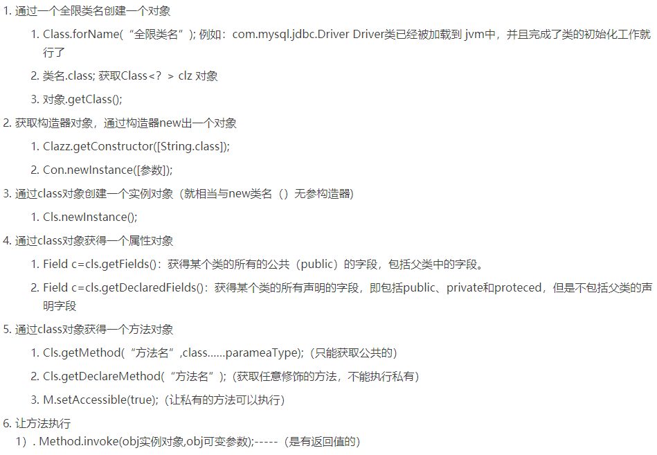

## Question list：
* 反射概念
* 反射的应用场景
* 反射的优缺点
* 获取Class对象的三种方法
* 创建对象的两种方法
* 拓展一：序列化
* 拓展二：动态代理

## 反射机制概念 （运行状态中知道类所有的属性和方法）
在 Java 中的反射机制是指在运行状态中，对于任意一个类都能够知道这个类所有的属性和方法；
并且对于任意一个对象，都能够调用它的任意一个方法；这种动态获取信息以及动态调用对象方法的功能成为 Java 语言的反射机制。

## 哪里用到反射机制？
*   JDBC中，利用反射动态加载了数据库驱动程序。
*   Web服务器中利用反射调用了Sevlet的服务方法。
*   Eclispe等开发工具利用反射动态刨析对象的类型与结构，动态提示对象的属性和方法。
*   很多框架都用到反射机制，注入属性，调用方法，如Spring。

##  Java反射机制的作用
在运行时判断任意一个对象所属的类  
在运行时构造任意一个类的对象  
在运行时判断任意一个类所具有的成员变量和方法  
在运行时调用任意一个对象的方法

## 反射机制的优缺点？
优点：可以动态执行，在运行期间根据业务功能动态执行方法、访问属性，最大限度发挥了java的灵活性。  
缺点：对性能有影响，这类操作总是慢于直接执行java代码。

 ## Java 反射 API
 反射 API 用来生成 JVM 中的类、接口或则对象的信息。
 * Class 类：反射的核心类，可以获取类的属性，方法等信息。
 * Field 类：Java.lang.reflec 包中的类，表示类的成员变量，可以用来获取和设置类之中的属性值。
 * Method 类： Java.lang.reflec 包中的类，表示类的方法，它可以用来获取类中的方法信息或者执行方法。
 * Constructor 类： Java.lang.reflec 包中的类，表示类的构造方法。

## 获取 Class 对象的 3 种方法
调用某个对象的 getClass()方法Person p=new Person();Class clazz=p.getClass();
调用某个类的 class 属性来获取该类对应的 Class 对象Class clazz=Person.class;
使用 Class 类中的 forName()静态方法(最安全/性能最好)Class clazz=Class.forName("类的全路径"); (最常用)
当我们获得了想要操作的类的 Class 对象后，可以通过 Class 类中的方法获取并查看该类中的方法和属性。

## 创建对象的两种方法
Class 对象的 newInstance()使用 Class 对象的 newInstance()方法来创建该 Class 对象对应类的实例，
但是这种方法要求该 Class 对象对应的类有默认的空构造器。

调用 Constructor 对象的 newInstance()先使用 Class 对象获取指定的 Constructor 对象，
再调用 Constructor 对象的 newInstance()方法来创建 Class 对象对应类的实例,通过这种方法可以选定构造方法创建实例。

## 反射使用步骤（获取 Class 对象、调用对象方法）
 *  获取想要操作的类的 Class 对象，他是反射的核心，通过 Class 对象我们可以任意调用类的方法。
 *  调用 Class 类中的方法，既就是反射的使用阶段。
 *  使用反射 API 来操作这些信息
 
## 如何使用Java的反射?

## 什么叫对象序列化，什么是反序列化，实现对象序列化需要做哪些工作？
*   对象序列化，将对象中的数据编码为字节序列的过程。
*   反序列化；将对象的编码字节重新反向解码为对象的过程。
>   JAVA提供了API实现了对象的序列化和反序列化的功能，使用这些API时需要遵守如下约定：
被序列化的对象类型需要实现序列化接口，此接口是标志接口，没有声明任何的抽象方法，
JAVA编译器识别这个接口，自动的为这个类添加序列化和反序列化方法。
为了保持序列化过程的稳定，建议在类中添加序列化版本号。
不想让字段放在硬盘上就加transient
* 以下情况需要使用 Java 序列化：  
想把的内存中的对象状态保存到一个文件中或者数据库中时候；
想用套接字在网络上传送对象的时候；
想通过RMI（远程方法调用）传输对象的时候。

## 动态代理是什么？有哪些应用？
动态代理是运行时动态生成代理类。  
动态代理的应用有 Spring AOP数据查询、测试框架的后端 mock、rpc，Java注解对象获取等

##  怎么实现动态代理？
JDK 原生动态代理和 cglib 动态代理。  
JDK 原生动态代理是基于接口实现的，而 cglib 是基于继承当前类的子类实现的。

