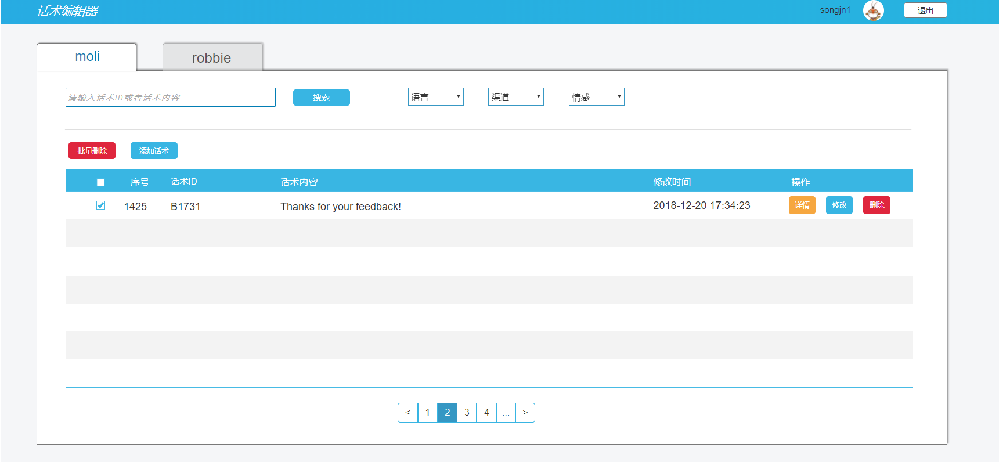
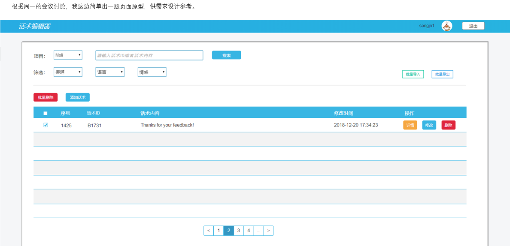

# 话术编辑器项目
当你痛苦的时候，说明你正在成长，记录话术编辑器设计的整个历程。

## 1、前言
流程编辑器做完后，老大看暂时没有工作，然后和大老大申请了话术编辑器的项目。
这个项目之前其他组做过，但是效果理想。开始想来这就是个小项目，只有自己用，
当我们和业务、solution碰头的时候，他们一直说要直接推到线上。我瞬间脸就绿了！
然后，自己选择的坑，跪着也要爬完。

## 2、前期需求讨论
前期需求讨论的话，我们是在2019年7月1日开的第一次和业务以及solution碰头的会。
然后和业务沟通，PRD由业务那边先出。我们互相沟通了一下我们的需求，
因为话术编辑这个工作一直由我们开发人员做。所以前期我们是主要用户，所以对需求比较清楚。
业务出PRD前我做了项目的预研工作，包括分页，excel导入导出，动态数据源等。
也用Axure出了一页原型(当时也不知道咋想的，还自己觉得挺好看)。然后我将我的设计的页面给业务邮件过去，
用作参考。

这个是讨论后给业务发过去的，上一个是人生第一版；

## 3、PRD下来后
业务PRD下来后，看了后直接吐血！完全是在之前失败的版本上面进行了一个增量。只能感叹，大联想还有这么不负责任的业务!
然后我们多次组内进行讨论自己出了一版PRD（但是不能直接写PRD，名字写的《话术编辑器设计思路》）。期间用Axure又重新设计
了一版原型。就这样，七月份匆匆而过。月末的时候和大老大开会的时候我做了自我总结（好事），然后没有总结好。
对了，月末的时候大老大安排个业务过来（欣然），负责我们的PRD，心理顿时轻松很多，这个月，我发现我不适合做设计，主要是没有经验。
月末的时候我出了ppt以后，老大将ppt发给了大老大。结果被大老大驳回。ppt在下面《DM话术后台管理系统设计思路.pptx》。

## 4、和大老大碰头
因为邮件说不清楚大老大的驳回原因，然后业务拉了个会。大老大的想法是我们做的没有分类分层。么有充分站在用户的角度进行思考（这是会后知道的）。
开完会的我一脸萌。虽然了解了大老大的意思，但是，完全不知道怎样用页面去呈现（我以为就我自己不知道怎样去呈现，其实其他人也不知道怎样去展示）。
现在已经到了8月2号。然后，就有点上火（原因，深刻认识到自身的不足）。

## 5、业务出的PRD大老大还是不满意
8月9号早上，和老大跑步的时候，老大说我们讨论的PRD被大老大改了好多。然后业务拉会，和大老大沟通想法。最后从用户的角度出发。
定下了一个版本《DM话术后台管理系统设计思路_v0.4.pptx》。大老大明确了时间节点，9月末。然后就有点上火，因为，数据库表的设计，
项目的架构、完全没有思路。知道会有人兜底，可是当一件事情不在你掌握之中的时候。自己就会很难受。在此，记录下这个项目的完整过程，
用作以后成功的基石。未完待续。。。

