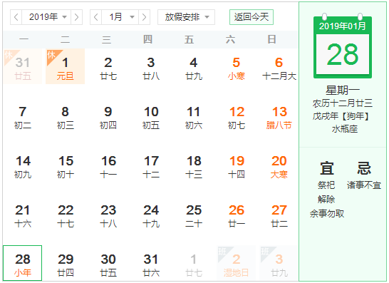
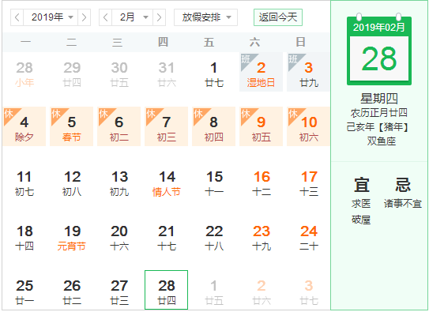
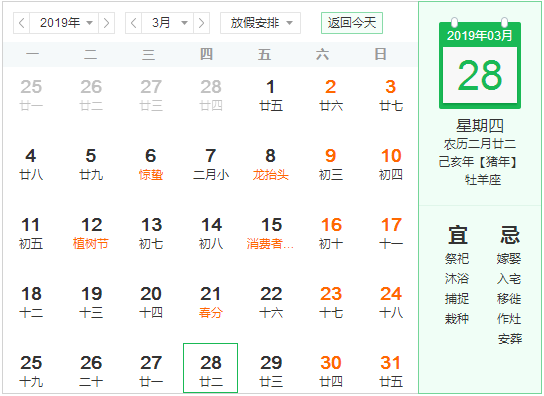
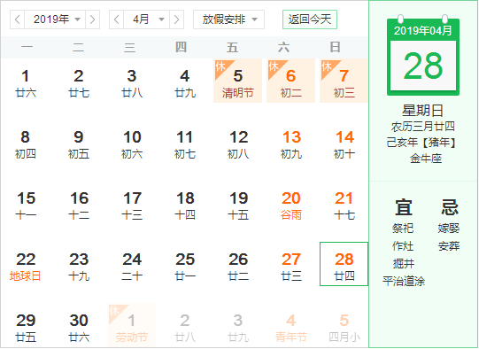
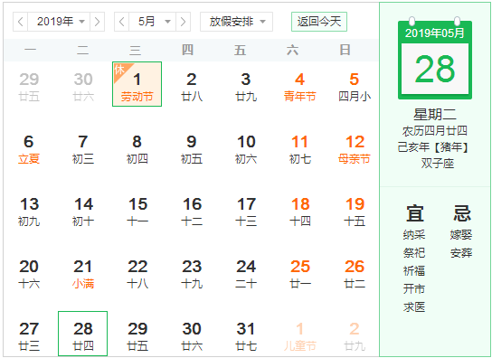

## 1、规划概要
第一年、前期阶段是对公司项目haha、知识体系、基础的提升。完成这些以后还有**算法数据**结构，**java源码**。  
第二年、对自身的项目拓展。

## 2、规划细则
第一季度，
>（1）haha业务要搞清楚，能自己写一些简单的业务实现  
>（2）完成springboot和springcloud的进击工作
>（3）如果有精力将进击《从入门到放弃》  


第二季度，
>（1）主要对haha进行一些列的整改。其中也许会涉及到一些设计模式。  
>（2）必须完成《从入门到放弃》的修炼。  
>（3）有精力进击springboot。  
>（4）还有精力的话去搞设计模式。  
>（5）个人网站的初期设计和实现  

第三季度，
>（1）工作趋于稳定。  
>（2）结合书籍将springboot整体走一遍。  
>（3）有精力进击springcloud。  
>（4）还有精力去做设计模式。  
>（5）必须搞定个人网站。  

第四季度，
>（1）工作第一位。  
>（2）总结回顾前三个季度有什么没完成的进行及时总结和后续补刀。  
>（3）springcloud结合书籍必须全部搞定。  
>（4）完善设计模式。  
>（5）对个人网站的更新和维护。  

## 3、一季度每月规划
一月份：
````
（1）工作上继续熟悉haha，然后及时提出业务问题，并进行积极有效沟通。
    目标：每天10问。
（2）配合绘制业务流程图。
（3）进击hibernate，对其进行代码洗礼和笔记总结。
 (5）进击springboot。
（4）做个人网站的规划和调研。
（6）《从入门到放弃》
````


**节点一：** 2019.1.13，一月份第二周，结束hibernate。  
````
时间：  
每晚2小时*8  
元旦2天+两个周末2天，四整天时间。  
评估：工作量有还好
````
任务完成情况:  
1）2019-01-06，hibernate结束。
2）2019-01-20，jpa整理结束（分页没整理完，有点乱，不完美）。


**节点二：** 2019.1.31，一月份结束。springboot三分之一。
````
时间：  
每晚2小时*14   
两个周末2整天。
评估：工作量有点小。  
将《编程思想》加进来
````
任务完成情况:  springboot完成了1/3，《java编程思想200左右》，工作进度偏慢，心不够静。

一月份工作总结： 
```
一月份工作不是很满足，前期工作进度还好，后期动力严重不足。 和临近假期有关。
``` 
    

二月份：
````
（1）工作上，继续熟悉haha业务
 (2）springboot完
````
 
 
**节点：** 02.28 spring完

目标：二月份回家过年，回来已经是2.11，调整工作状态，还有事。进展时间不多，将springboot搞完就行。
  
二月份工作总结：
节点3.3号，将springboot第一部分看完了，代码还没敲。
3.5号，敲代码，进度有点慢，不过庆幸的是，有进度。


三月份：
````
（1）工作上主要解决编辑器的问题
（2）解决好编辑器之后，深入探索haha业务
（3）在3.17完成springboot的第一部分的代码整理。
（4）3.18-3.31继续springboot的后半部分
（5）副线任务英语语法月末争取学完
````


**节点一：** 3.17任务完成情况


**节点二：** 3.31任务完成情况
预计在4.7号将springboot的全部内容，搞完。


## 4、二季度每月规划
四月份：   
```
（1）工作上主要robbie业务
（2）辅助编辑器页面
（3）在4.7之前完成springboot的代码。
（4）继续算法和数据结构
（5）副线任务英语语法月末争取学完
```


任务计划，

1）工作上，不忙的话看haha代码，然后给自己列出来一个试题清单，最后来逐个击破（进击新技术）。

2）月末之前，将数据结构看完。

3）5.18前，需要将语法书看完。


五月份：   

六月份：   
## 5、三季度每月规划
七月份：   
八月份：   
九月份：   
## 6、四季度每月规划
十月份：   
十一月份：   
十二月份：   
