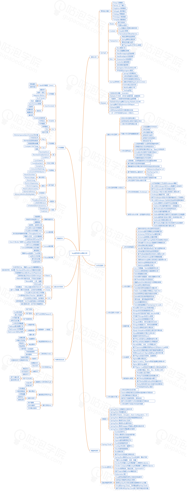

# 如何成为架构师

首先是基础，在成为java架构师之前首先你需要是一个java高级工程师，
对java的各种实现原理要比较明确，对各种微服务、缓存技术、各种分布式架构都要了解其底层原理

## 1、工作上熟悉更多的业务，无论是不是你的，熟悉更多的代码。

这样做有很多好处，举几个简单的例子：

需求分析的时候更加准确，能够在需求阶段就识别风险、影响、难点

问题处理的时候更加快速，因为相关的业务和代码都熟悉，能够快速的判断问题可能的原因并进行排查处理。

方案设计的时候考虑更加周全，由于有对全局业务的理解，能够设计出更好的方案

## 2、阅读源码

先打好内功基础，了解大牛是如何写代码的，从而吸收大牛的代码功力。

## 3、要有一套完整系统化的学习体系给自己学习

jvm虚拟机原理、调优，懂得jvm能让你写出性能更好的代码；池技术，什么对象池，连接池，线程池……Java反射技术，写框架必备的技术，
遇到有严重的性能问题，替代方案java字节码技术；nio，没什么好说的，值得注意的是"直接内存"的特点，使用场景；java多线程同步异步；
java各种集合对象的实现原理，了解这些可以让你在解决问题时选择合适的数据结构，高效的解决问题。

而Java学到极致势必涉及到设计模式，算法和数据结构，多线程，文件及网络IO，数据库及ORM，不一而足。这些概念放之一切语言都适用。

